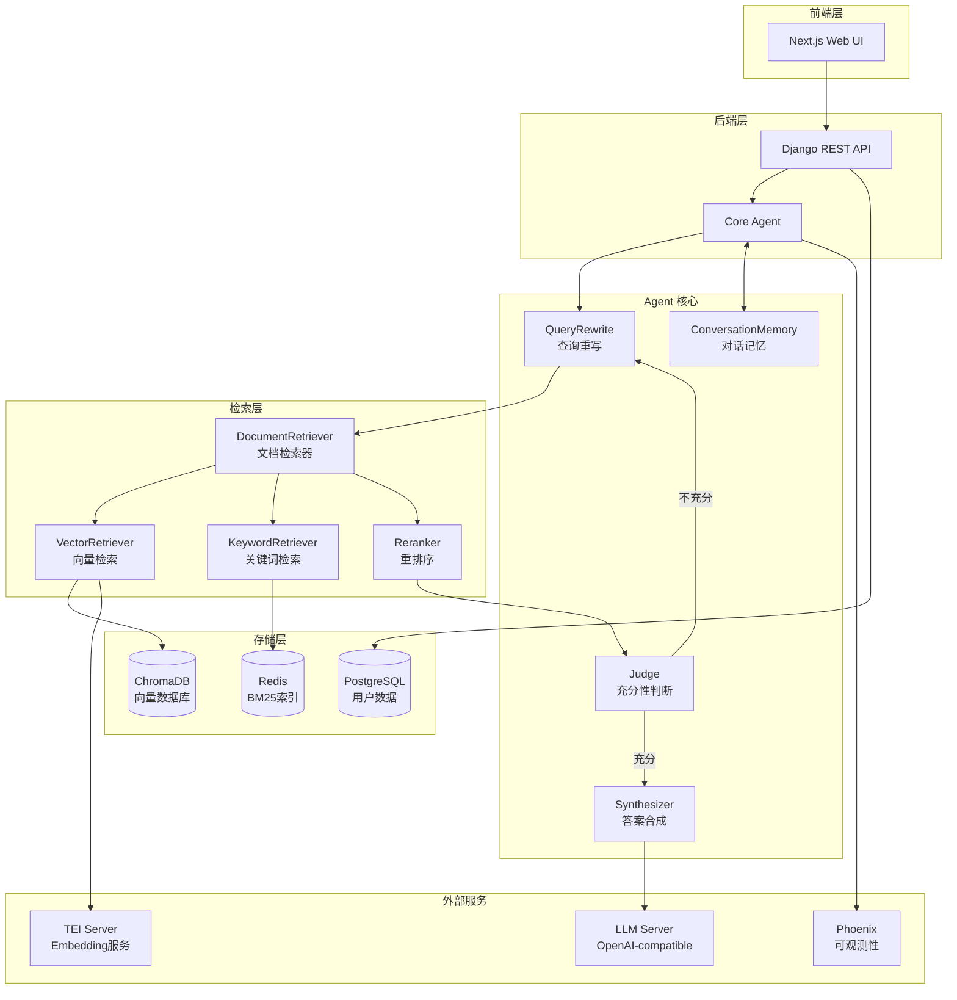
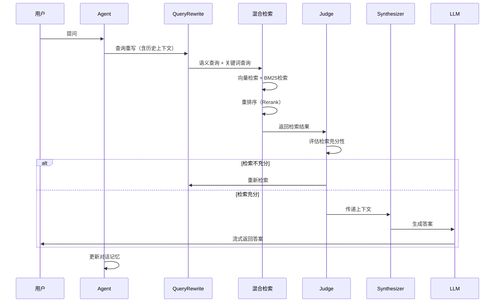

# ChatDKU

<div align="center">

**智能校园问答系统 | Agentic RAG System**

[](./video/chatdku-promo-video.mp4)

[](https://www.python.org/downloads/)
[](LICENSE)
[](https://www.docker.com/)

[English](./README_EN.md) | [中文文档](./README.md)

</div>

---

## 📖 项目简介

ChatDKU 是一个面向杜克昆山大学（Duke Kunshan University）师生的**检索增强生成（RAG）智能问答系统**。系统采用 Agentic RAG 架构，能够从校内政策、课程信息、学术资源等多源数据中检索相关内容，并通过大语言模型生成准确、可引用的回答。

### 🎯 核心特性

- **🤖 Agentic RAG 架构**：基于 DSPy 的智能 Agent，支持多轮检索与推理
- **🔍 混合检索系统**：结合向量检索（ChromaDB）和关键词检索（Redis BM25）
- **🧠 智能判断机制**：自动评估检索充分性，按需迭代检索
- **💬 对话记忆管理**：支持长对话上下文压缩与记忆保持
- **📊 可观测性**：集成 Phoenix (Arize) 实现全链路追踪
- **🚀 灵活部署**：支持 Agent-Only（CLI）和 Full（Web 应用）两种模式

---

## 🏗️ 系统架构

### 整体架构图



### 数据流程



---

## 🛠️ 技术栈

### 核心框架

| 组件 | 技术 | 版本 | 用途 |
|------|------|------|------|
| **Agent 框架** | DSPy | 3.0.3 | LLM 程序化编排与优化 |
| **检索框架** | LlamaIndex | 0.13.1 | 文档索引与检索 |
| **向量数据库** | ChromaDB | 1.0.15 | 语义向量存储 |
| **缓存/索引** | Redis | 5.2.1 | BM25 关键词索引 |
| **后端框架** | Django | 5.2.3 | REST API 与用户管理 |
| **前端框架** | Next.js | 15+ | React 服务端渲染 |
| **任务队列** | Celery | 5.5.3 | 异步任务处理 |
| **可观测性** | Phoenix (Arize) | 11.36.0 | 链路追踪与监控 |

### 技术亮点

#### 1. DSPy 驱动的 Agent 架构

使用 DSPy 实现可优化的 LLM 程序：
- **QueryRewrite**：结合对话历史重写查询
- **Judge**：评估检索结果充分性（Chain-of-Thought）
- **Synthesizer**：基于上下文生成答案
- **ConversationMemory**：智能压缩对话历史

#### 2. 混合检索 + 重排序

```python
# 检索流程
向量检索（ChromaDB） + 关键词检索（Redis BM25）
    ↓
候选文档合并（top_k=20）
    ↓
重排序（Reranker, top_k=5）
    ↓
Judge 判断充分性
```

#### 3. 迭代式检索

通过 Judge 模块实现闭环检索：
- 检索不充分 → 重写查询 → 再次检索（最多 3 轮）
- 检索充分 → 进入答案生成

---

## 🚀 快速开始

### 前置要求

- **Docker** & **Docker Compose** (推荐)
- **Python 3.11+** (本地开发)
- **LLM 服务**：OpenAI API 或兼容服务（如 sglang、vLLM）
- **Embedding 服务**：TEI (Text Embeddings Inference) 或兼容服务

### 方式一：Docker 快速部署（推荐）

#### Agent-Only 版本（5 分钟）

适合快速测试、CLI 交互、API 集成：

```bash
# 1. 克隆项目
git clone https://github.com/your-org/ChatDKU.git
cd ChatDKU

# 2. 配置环境变量
cp .env.example .env
# 编辑 .env 文件，配置 LLM_BASE_URL、LLM_API_KEY、TEI_URL 等

# 3. 启动服务（Redis + ChromaDB + Agent）
docker compose -f docker-compose.agent.yml up --build

# 4. 初始化数据
bash scripts/setup_agent_data.sh

# 5. 使用 CLI 交互
docker compose -f docker-compose.agent.yml exec agent python -m chatdku.core.agent
```

📖 详细文档：[Agent-Only 快速开始](./Documentations/Agent-Only-Quick-Start_ZH.md)

#### Full 版本（完整 Web 应用）

包含前端、后端、用户管理、文件上传等完整功能：

```bash
# 1. 配置环境变量
cp .env.example .env
# 配置数据库、Redis、LLM 等服务

# 2. 启动完整服务栈
docker compose up --build

# 3. 访问 Web 界面
# http://localhost:3005
```

📖 详细文档：[Full 版本部署指南](./Documentations/Full-Deployment-Guide_ZH.md)

---

## 📦 部署版本对比

| 特性 | Agent-Only | Full |
|------|-----------|------|
| **部署时间** | 5-10 分钟 | 30-60 分钟 |
| **资源需求** | 2C4G | 8C16G+ |
| **交互方式** | CLI / API | Web UI |
| **用户管理** | ❌ | ✅ |
| **文件上传** | ❌ | ✅ |
| **反馈系统** | ❌ | ✅ |
| **异步任务** | ❌ | ✅ (Celery) |
| **适用场景** | 测试、开发、集成 | 生产环境 |

---

## 💡 使用示例

### CLI 交互

```bash
$ python -m chatdku.core.agent

ChatDKU Agent (输入 'quit' 退出)
> 请介绍一下数据科学专业的核心课程

[检索中...]
根据检索到的课程信息，数据科学专业的核心课程包括：
1. COMPSCI 201 - 数据结构与算法
2. STATS 210 - 概率论与统计推断
3. COMPSCI 316 - 数据库系统
...

> 这些课程的先修要求是什么？

[检索中...]
根据课程大纲：
- COMPSCI 201 需要先修 COMPSCI 101
- STATS 210 需要先修 MATH 105 或同等课程
...
```

### Python API 调用

```python
from chatdku.core.agent import Agent

# 初始化 Agent
agent = Agent()

# 单轮对话
response = agent.query("DKU 的学术诚信政策是什么？")
print(response)

# 多轮对话
conversation_id = "user_123"
agent.query("介绍一下计算机科学专业", conversation_id=conversation_id)
agent.query("这个专业有哪些方向？", conversation_id=conversation_id)
```

### REST API 调用

```bash
# 发送问题
curl -X POST http://localhost:8007/api/chat/ \
  -H "Content-Type: application/json" \
  -d '{
    "message": "DKU 有哪些研究中心？",
    "session_id": "session_123"
  }'

# 流式响应
curl -X POST http://localhost:8007/api/chat/stream/ \
  -H "Content-Type: application/json" \
  -d '{"message": "介绍一下环境科学专业"}' \
  --no-buffer
```

---

## 📊 数据准备

### 数据格式

支持多种文档格式：
- 📄 PDF、Word (`.docx`)、PowerPoint (`.pptx`)
- 📝 Markdown (`.md`)、纯文本 (`.txt`)
- 🌐 HTML 网页

### 数据导入流程

```bash
# 1. 将文档放入 data/ 目录
cp your_documents/* ./data/

# 2. 运行数据处理脚本
cd chatdku/chatdku/ingestion
python update_data.py --data_dir ./data --user_id Chat_DKU -v True

# 3. 加载到向量数据库
python load_chroma.py --nodes_path ./data/nodes.json --collection_name chatdku_docs

# 4. 加载到 Redis（BM25 索引）
python -m chatdku.ingestion.load_redis --nodes_path ./data/nodes.json --index_name chatdku
```

📖 详细文档：[数据导入指南](./data/README.md)

---

## 🔧 配置说明

### 环境变量

关键配置项（`.env` 文件）：

```bash
# LLM 服务
LLM_BASE_URL=http://your-llm-server:18085/v1
LLM_API_KEY=your_api_key
LLM_MODEL=Qwen/Qwen3.5-4B

# Embedding 服务
TEI_URL=http://your-tei-server:8080
EMBEDDING_MODEL=BAAI/bge-m3

# 向量数据库
CHROMA_HOST=chromadb
CHROMA_DB_PORT=8010

# Redis
REDIS_HOST=redis
REDIS_PORT=6379
REDIS_PASSWORD=your_redis_password

# Agent 配置
MAX_ITERATIONS=3          # 最大检索轮数
CONTEXT_WINDOW=4096       # LLM 上下文窗口
LLM_TEMPERATURE=0.1       # 生成温度

# 前端配置（Full 版本）
NEXT_PUBLIC_API_BASE_URL=http://localhost:8007
```

完整配置参考：[.env.example](./.env.example)

---

## 📚 文档导航

- 📖 [Agent-Only 快速开始](./Documentations/Agent-Only-Quick-Start_ZH.md)
- 📖 [Agent-Only 完整部署](./Documentations/Agent-Only-Deployment_ZH.md)
- 📖 [Full 版本部署指南](./Documentations/Full-Deployment-Guide_ZH.md)
- 📖 [架构与端口说明](./Documentations/Architecture-Ports_ZH.md)
- 📖 [技术报告（中文）](./技术报告_中文.md)
- 📖 [Technical Report (English)](./Technical_Report_EN.md)

---

## 🔍 监控与调试

### Phoenix 可观测性

系统集成 Arize Phoenix 实现全链路追踪：

```bash
# 访问 Phoenix UI
http://localhost:6006

# 查看内容：
# - Agent 执行轨迹
# - 检索结果质量
# - LLM 调用详情
# - 性能瓶颈分析
```

### 日志查看

```bash
# Docker 日志
docker compose logs -f agent
docker compose logs -f backend

# 本地日志
tail -f logs/backend_$(date +%Y%m%d).log
```

---

## 🤝 贡献指南

欢迎贡献代码、报告问题或提出建议！

1. Fork 本仓库
2. 创建特性分支 (`git checkout -b feature/AmazingFeature`)
3. 提交更改 (`git commit -m 'Add some AmazingFeature'`)
4. 推送到分支 (`git push origin feature/AmazingFeature`)
5. 提交 Pull Request

详见：[CONTRIBUTING.md](./CONTRIBUTING.md)

---

## 📄 开源协议

本项目采用 MIT 协议开源 - 详见 [LICENSE](./LICENSE) 文件

---

## 👥 团队

- **Mingxi Li** - 项目负责人
- **Yuxiang Lin** - 核心开发者
- **Cody Qin** - 核心开发者
- **Ningyuan Yang** - 核心开发者

---

## 🙏 致谢

感谢以下开源项目：
- [DSPy](https://github.com/stanfordnlp/dspy) - LLM 程序化框架
- [LlamaIndex](https://github.com/run-llama/llama_index) - 数据框架
- [ChromaDB](https://github.com/chroma-core/chroma) - 向量数据库
- [Phoenix](https://github.com/Arize-ai/phoenix) - LLM 可观测性

---

## 📮 联系方式

- 📧 Email: theta.lin@yandex.com
- 🐛 Issues: [GitHub Issues](https://github.com/your-org/ChatDKU/issues)
- 💬 Discussions: [GitHub Discussions](https://github.com/your-org/ChatDKU/discussions)

---

<div align="center">

**⭐ 如果这个项目对你有帮助，请给我们一个 Star！**

Made with ❤️ by ChatDKU Team

</div>
