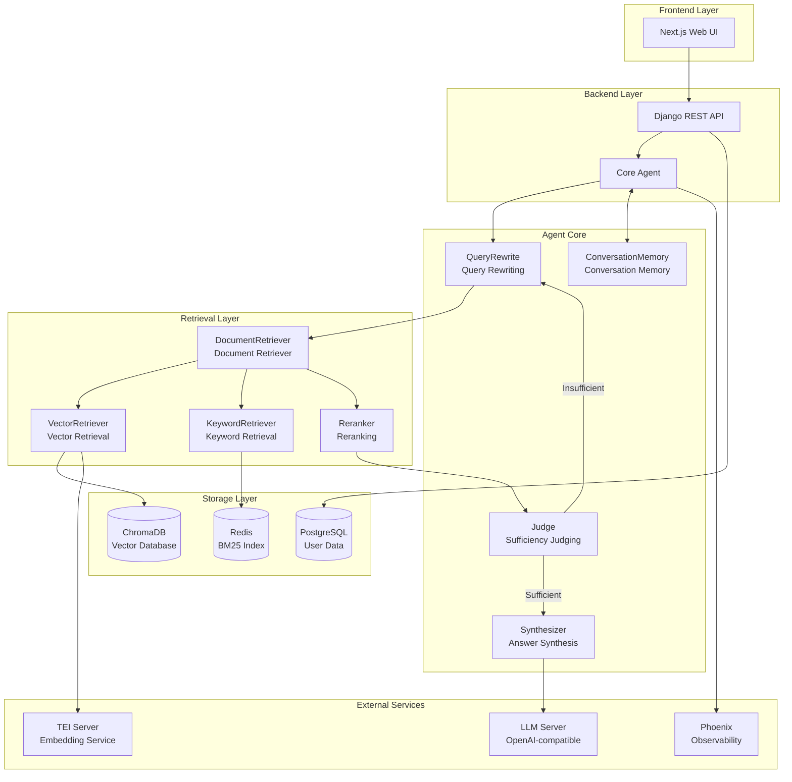
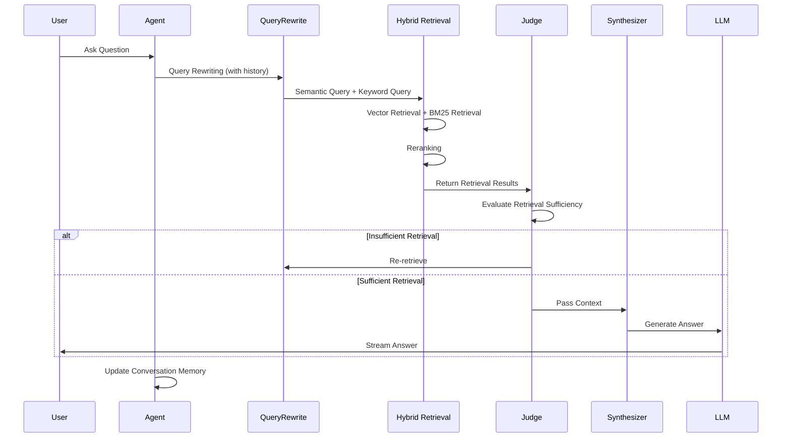

# ChatDKU
<div align="center">

**Intelligent Campus Q&A System | Agentic RAG System**

[](./video/chatdku-promo-video.mp4)

[](https://www.python.org/downloads/)
[](LICENSE)
[](https://www.docker.com/)

[English](./README_EN.md) | [中文文档](./README.md)

</div>

---

## Overview

ChatDKU is a **Retrieval-Augmented Generation (RAG) intelligent Q&A system** designed for Duke Kunshan University (DKU) faculty and students. The system adopts an Agentic RAG architecture, capable of retrieving relevant content from multi-source data including campus policies, course information, and academic resources, and generating accurate, citable answers through large language models.

- [Core](./chatdku/core): Core agent and RAG logic. 
  - [chatdku.core.agent](chatdku/core/agent.py): The main agent class.
  - `chatdku.core.compile`: (WIP) Uses DSPy for automatic prompt optimization.
  - `chatdku.core.tools`: The vector retriever uses ChromaDB, while the keyword retriever directly uses Redis (should consider putting it into a separate module).
  - `chatdku.core.dspy_common`: Helpers for interacting with DSPy.
  - `chatdku.core.utils`: Utility functions.

- [Flask Backend](./chatdku/backend): Backend Flask apps. 
  - `backend.stt_app`: Speech-to-Text app
  - `backend.whisper_model`: Whisper API using Flask
- [Django Backend](./chatdku/django) : Django-based backend and apps

---

## 🏗️ System Architecture

### Overall Architecture



### Data Flow



---

## 🛠️ Tech Stack

### Core Frameworks

| Component | Technology | Version | Purpose |
|-----------|-----------|---------|---------|
| **Agent Framework** | DSPy | 3.0.3 | LLM programmatic orchestration and optimization |
| **Retrieval Framework** | LlamaIndex | 0.13.1 | Document indexing and retrieval |
| **Vector Database** | ChromaDB | 1.0.15 | Semantic vector storage |
| **Cache/Index** | Redis | 5.2.1 | BM25 keyword index |
| **Backend Framework** | Django | 5.2.3 | REST API and user management |
| **Frontend Framework** | Next.js | 15+ | React server-side rendering |
| **Task Queue** | Celery | 5.5.3 | Asynchronous task processing |
| **Observability** | Phoenix (Arize) | 11.36.0 | Chain tracing and monitoring |

### Technical Highlights

#### 1. DSPy-Driven Agent Architecture

Implement optimizable LLM programs using DSPy:
- **QueryRewrite**: Rewrite queries with conversation history
- **Judge**: Evaluate retrieval result sufficiency (Chain-of-Thought)
- **Synthesizer**: Generate answers based on context
- **ConversationMemory**: Intelligently compress conversation history

#### 2. Hybrid Retrieval + Reranking

```python
# Retrieval Pipeline
Vector Retrieval (ChromaDB) + Keyword Retrieval (Redis BM25)
    ↓
Merge Candidate Documents (top_k=20)
    ↓
Reranking (Reranker, top_k=5)
    ↓
Judge Sufficiency
```

#### 3. Iterative Retrieval

Implement closed-loop retrieval through Judge module:
- Insufficient retrieval → Rewrite query → Re-retrieve (max 3 rounds)
- Sufficient retrieval → Proceed to answer generation

---

## 🚀 Quick Start

### Prerequisites

- **Docker** & **Docker Compose** (recommended)
- **Python 3.11+** (local development)
- **LLM Service**: OpenAI API or compatible service (e.g., sglang, vLLM)
- **Embedding Service**: TEI (Text Embeddings Inference) or compatible service

### Method 1: Docker Quick Deployment (Recommended)

#### Agent-Only Version (5 minutes)

Suitable for quick testing, CLI interaction, API integration:

```bash
# 1. Clone project
git clone https://github.com/Edge-Intelligence-Lab/ChatDKU.git
cd ChatDKU

# 2. Configure environment variables
cp .env.example .env
# Edit .env file, configure LLM_BASE_URL, LLM_API_KEY, TEI_URL, etc.

# 3. Start services (Redis + ChromaDB + Agent)
docker compose -f docker-compose.agent.yml up --build

# 4. Initialize data
bash scripts/setup_agent_data.sh

# 5. Use CLI interaction
docker compose -f docker-compose.agent.yml exec agent python -m chatdku.core.agent
```

📖 Detailed documentation: [Agent-Only Quick Start](./Documentations/Agent-Only-Quick-Start_EN.md)

#### Full Version (Complete Web Application)

Includes frontend, backend, user management, file upload, and other complete features:

```bash
# 1. Configure environment variables
cp .env.example .env
# Configure database, Redis, LLM, and other services

# 2. Start complete service stack
docker compose up --build

# 3. Access Web interface
# http://localhost:3005
```

📖 Detailed documentation: [Full Version Deployment Guide](./Documentations/Full-Deployment-Guide_EN.md)

---

## 📦 Deployment Version Comparison

| Feature | Agent-Only | Full |
|---------|-----------|------|
| **Deployment Time** | 5-10 minutes | 30-60 minutes |
| **Resource Requirements** | 2C4G | 8C16G+ |
| **Interaction Method** | CLI / API | Web UI |
| **User Management** | ❌ | ✅ |
| **File Upload** | ❌ | ✅ |
| **Feedback System** | ❌ | ✅ |
| **Async Tasks** | ❌ | ✅ (Celery) |
| **Use Cases** | Testing, Development, Integration | Production Environment |

---

## 💡 Usage Examples

### CLI Interaction

```bash
$ python -m chatdku.core.agent

ChatDKU Agent (type 'quit' to exit)
> Please introduce the core courses of the Data Science major

[Retrieving...]
According to the retrieved course information, the core courses of the Data Science major include:
1. COMPSCI 201 - Data Structures and Algorithms
2. STATS 210 - Probability and Statistical Inference
3. COMPSCI 316 - Database Systems
...

> What are the prerequisites for these courses?

[Retrieving...]
According to the course syllabus:
- COMPSCI 201 requires COMPSCI 101 as prerequisite
- STATS 210 requires MATH 105 or equivalent
...
```

### Python API Call

```python
from chatdku.core.agent import Agent

# Initialize Agent
agent = Agent()

# Single-turn conversation
response = agent.query("What is DKU's academic integrity policy?")
print(response)

# Multi-turn conversation
conversation_id = "user_123"
agent.query("Introduce the Computer Science major", conversation_id=conversation_id)
agent.query("What are the tracks in this major?", conversation_id=conversation_id)
```

### REST API Call

```bash
# Send question
curl -X POST http://localhost:8007/api/chat/ \
  -H "Content-Type: application/json" \
  -d '{
    "message": "What research centers does DKU have?",
    "session_id": "session_123"
  }'

# Streaming response
curl -X POST http://localhost:8007/api/chat/stream/ \
  -H "Content-Type: application/json" \
  -d '{"message": "Introduce the Environmental Science major"}' \
  --no-buffer
```

---

## 📊 Data Preparation

### Data Formats

Supports multiple document formats:
- 📄 PDF, Word (`.docx`), PowerPoint (`.pptx`)
- 📝 Markdown (`.md`), Plain text (`.txt`)
- 🌐 HTML web pages

### Data Import Process

```bash
# 1. Place documents in data/ directory
cp your_documents/* ./data/

# 2. Run data processing script
cd chatdku/chatdku/ingestion
python update_data.py --data_dir ./data --user_id Chat_DKU -v True

# 3. Load to vector database
python load_chroma.py --nodes_path ./data/nodes.json --collection_name chatdku_docs

# 4. Load to Redis (BM25 index)
python -m chatdku.ingestion.load_redis --nodes_path ./data/nodes.json --index_name chatdku
```

📖 Detailed documentation: [Data Import Guide](./data/README.md)

---

## 🔧 Configuration

### Environment Variables

Key configuration items (`.env` file):

```bash
# LLM Service
LLM_BASE_URL=http://your-llm-server:18085/v1
LLM_API_KEY=your_api_key
LLM_MODEL=Qwen/Qwen3.5-4B

# Embedding Service
TEI_URL=http://your-tei-server:8080
EMBEDDING_MODEL=BAAI/bge-m3

# Vector Database
CHROMA_HOST=chromadb
CHROMA_DB_PORT=8010

# Redis
REDIS_HOST=redis
REDIS_PORT=6379
REDIS_PASSWORD=your_redis_password

# Agent Configuration
MAX_ITERATIONS=3          # Maximum retrieval rounds
CONTEXT_WINDOW=4096       # LLM context window
LLM_TEMPERATURE=0.1       # Generation temperature

# Frontend Configuration (Full version)
NEXT_PUBLIC_API_BASE_URL=http://localhost:8007
```

Complete configuration reference: [.env.example](./.env.example)

---

## 📚 Documentation Navigation

- 📖 [Agent-Only Quick Start](./Documentations/Agent-Only-Quick-Start_EN.md)
- 📖 [Agent-Only Complete Deployment](./Documentations/Agent-Only-Deployment_EN.md)
- 📖 [Full Version Deployment Guide](./Documentations/Full-Deployment-Guide_EN.md)
- 📖 [Architecture and Port Documentation](./Documentations/Architecture-Ports_EN.md)
- 📖 [Technical Report (English)](./Technical_Report_EN.md)
- 📖 [技术报告（中文）](./技术报告_中文.md)

---

## 🔍 Monitoring and Debugging

### Phoenix Observability

System integrates Arize Phoenix for full-chain tracing:

```bash
# Access Phoenix UI
http://localhost:6006

# View content:
# - Agent execution traces
# - Retrieval result quality
# - LLM call details
# - Performance bottleneck analysis
```

### Log Viewing

```bash
# Docker logs
docker compose logs -f agent
docker compose logs -f backend

# Local logs
tail -f logs/backend_$(date +%Y%m%d).log
```

---

## 🤝 Contributing

Contributions, issue reports, and suggestions are welcome!

1. Fork this repository
2. Create feature branch (`git checkout -b feature/AmazingFeature`)
3. Commit changes (`git commit -m 'Add some AmazingFeature'`)
4. Push to branch (`git push origin feature/AmazingFeature`)
5. Submit Pull Request

See: [CONTRIBUTING.md](./CONTRIBUTING.md)

---

## 📄 License

This project is open-sourced under the MIT License - see [LICENSE](./LICENSE) file for details

---

## 🙏 Acknowledgments

Thanks to the following open-source projects:
- [DSPy](https://github.com/stanfordnlp/dspy) - LLM programmatic framework
- [LlamaIndex](https://github.com/run-llama/llama_index) - Data framework
- [ChromaDB](https://github.com/chroma-core/chroma) - Vector database
- [Phoenix](https://github.com/Arize-ai/phoenix) - LLM observability

---

## 📮 Contact

- 📧 Email: te100@duke.edu
- 🐛 Issues: [GitHub Issues](https://github.com/Edge-Intelligence-Lab/ChatDKU/issues)
- 💬 Discussions: [GitHub Discussions](https://github.com/Edge-Intelligence-Lab/ChatDKU/discussions)

---

<div align="center">

**⭐ If this project helps you, please give us a Star!**

Made with ❤️ by ChatDKU Team

</div>
