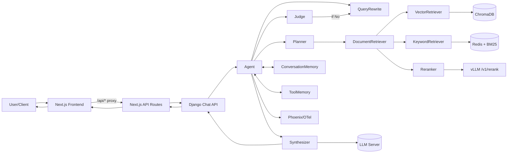
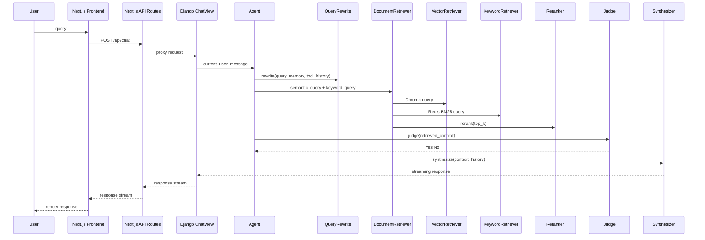
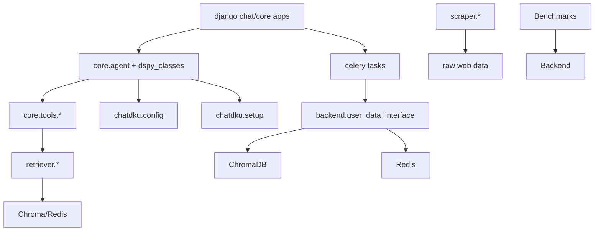

# Technical Report (EN): ChatDKU Agent RAG System

**Project**: ChatDKU
**Date**: 2026-02-23
**Scope**: Static analysis of `/Users/glitterc/Desktop/CodeX_codes/ChatDKU_2_23`
**Security Note**: All keys/tokens are redacted as `[REDACTED]`. The report explicitly recommends centralizing secrets in a single managed file.

---

## Chapter 1: Project Overview & Motivation

ChatDKU is an agentic Retrieval-Augmented Generation (RAG) system built for Duke Kunshan University (DKU) stakeholders. Its core goal is to answer DKU-specific questions using curated institutional data with traceable references, while controlling latency and maintaining response quality. The codebase reveals a hybrid retrieval stack (vector + BM25), a DSPy-driven agent loop, and production-aware backend features (auth, rate limiting, observability, and user-upload indexing).

On the client side, a new Next.js frontend at `chatdku/chatdku/frontend/ChatDKU-web` serves as the primary UI. In development it proxies `/api` and `/user` via Next rewrites, while production uses `next build` with static export (`output: 'export'`), decoupling UI delivery from the Django API.

The primary research and engineering challenges are: retrieving correct domain-specific evidence at scale, resolving ambiguous short queries, compressing long multi-turn context without losing fidelity, and coordinating tool calls safely under real operational constraints. Within the RAG and LLM-Agent landscape, ChatDKU positions itself as a **lightweight, production-oriented agentic RAG**, focusing on “retrieval sufficiency judgment” rather than multi-agent autonomy.

Relative to existing paradigms:
1. Compared with Naive RAG, ChatDKU adds hybrid retrieval, reranking, and a judge-controlled retrieval loop.
2. Compared with Advanced RAG (Self-RAG/Adaptive/CRAG), it provides a judge-driven re-retrieval path but lacks explicit factuality scoring.
3. Compared with full Agentic RAG frameworks, tool planning is present but only one tool is currently active.

**Takeaway**: ChatDKU is an engineered, campus-specific agentic RAG prototype that bridges research ideas with deployable system constraints.

---

## Chapter 2: System Architecture

The system consists of a Next.js frontend, a Django API layer, a DSPy-based agent core, a hybrid retrieval stack (ChromaDB + Redis), external LLM/embedding services, and observability/monitoring utilities. The frontend proxies requests to Django via Next.js API routes and development rewrites. The end-to-end flow is: user query → query rewrite → retrieval → judge → synthesis → memory update.





**Design patterns**: Chain-of-Thought (Planner/Judge), Tool-Use, Plan-and-Execute (lightweight), Judge-gated iterative retrieval. There is no explicit multi-agent communication; all orchestration is in-process.

**End-to-end example (from tests)**: “How often should I visit my advisor?” is rewritten by `QueryRewrite`, retrieved via hybrid search, re-ranked, judged for sufficiency, and synthesized with memory and references.

---

## Chapter 3: Core Components Deep Dive

### 3.1 Agent (`Agent`)
**Responsibility**: Orchestrates the full loop of rewrite → plan → retrieve → judge → synthesize, with memory handling and streaming output. Manages `internal_memory` for deduplication.
**Interface**: `Agent.forward(current_user_message, question_id="", user_id="Chat_DKU", search_mode=0, files=None)` returns `dspy.Prediction` or a generator.
**Internal logic**:
```pseudo
initialize memories and tools
for each iteration:
  plan = Planner(...)
  execute tool calls
  update ToolMemory and internal_memory
  if Judge == Yes: break
  if rewrite_query: query = QueryRewrite(...)
response = Synthesizer(...)
update ConversationMemory
return response
```
**Design choice**: Judge-gated looping reduces unnecessary context while keeping recall high.
**Dependencies**: DSPy, OpenTelemetry/Phoenix, retrievers, config.
**Code quality**: Clean modular design, but references to `CustomClient` are unresolved in repo.

### 3.2 Planner (`Planner`)
**Responsibility**: Produces tool call plans given question and memory context.
**Interface**: `Planner.forward(current_user_message, tools, conversation_memory, tool_memory, max_calls=5)`.
**Logic**: `dspy.ChainOfThought` + `dspy.Refine` validates tool names.
**Design choice**: Refinement rejects invalid tool calls to reduce runtime errors.
**Dependencies**: DSPy, ToolMemory, ConversationMemory.
**Code quality**: Well-structured but underutilized due to single-tool setup.

### 3.3 QueryRewrite (`QueryRewrite`)
**Responsibility**: Cleans and contextualizes the query to improve retrieval.
**Interface**: `QueryRewrite.forward(current_user_message, conversation_memory, tool_memory)`.
**Logic**: Injects history and tool summaries, then truncates by token budget.
**Design choice**: Token ratio budgeting protects context window.
**Dependencies**: DSPy, memory modules.
**Code quality**: Clear, but effectiveness depends on prompt quality.

### 3.4 Judge (`Judge`)
**Responsibility**: Decides whether retrieved context is sufficient.
**Interface**: `Judge.forward(current_user_message, conversation_memory, tool_memory)`.
**Logic**: CoT + `Refine` enforces Yes/No; defaults to No on repeated failure.
**Design choice**: LLM-based sufficiency avoids hard-coded thresholds.
**Dependencies**: DSPy, memory modules.
**Code quality**: Robust parsing; still prompt-dependent.

### 3.5 Synthesizer (`Synthesizer` + `ResponseGen`)
**Responsibility**: Generates the final answer with DKU-specific constraints and references.
**Interface**: `Synthesizer.forward(current_user_message, conversation_memory, tool_memory, streaming, final=False)`.
**Logic**: Builds prompt, optionally streams via `dspy.streamify`, logs spans.
**Design choice**: Enforces reference formatting and forbids tool mentions.
**Dependencies**: DSPy, OpenTelemetry, LLM API.
**Code quality**: Strong guardrails, but long prompts may increase latency.

### 3.6 ToolMemory (`ToolMemory`)
**Responsibility**: Stores tool call history and summarizes overflow.
**Interface**: `ToolMemory.forward(current_user_message, conversation_memory, call, result, max_history_size)`.
**Logic**: Append history, compress old entries via LLM summarization.
**Design choice**: Summarization trades recall for context budget stability.
**Dependencies**: DSPy, ConversationMemory.
**Code quality**: Effective but uses fixed history size override.

### 3.7 ConversationMemory (`ConversationMemory`)
**Responsibility**: Manages chat history and summary for long conversations.
**Interface**: `ConversationMemory.forward(role, content, max_history_size=1000)`.
**Logic**: Append and summarize when exceeding token limit.
**Design choice**: Summary + recent history balances context limits.
**Dependencies**: DSPy.
**Code quality**: Reasonable, but summary accuracy is LLM-dependent.

### 3.8 Retrieval Entrypoint (`DocRetrieverOuter`)
**Responsibility**: Coordinates vector + keyword retrieval and reranking.
**Interface**: `DocumentRetriever(semantic_query, keyword_query="")`.
**Logic**: Runs both retrievers, reranks, merges results, returns ids.
**Design choice**: Hybrid retrieval improves coverage for short and long queries.
**Dependencies**: VectorRetriever, KeywordRetriever, Reranker, timeout.
**Code quality**: Good error handling; mixed output types complicate downstream.

### 3.9 VectorRetriever
**Responsibility**: Semantic search via ChromaDB + TEI embeddings.
**Interface**: `VectorRetriever.query(query)`.
**Logic**: Chroma query with metadata filters for user/file scope.
**Design choice**: `search_mode` enables per-user isolation.
**Dependencies**: ChromaDB, TEI.
**Code quality**: Clear filtering logic; external service dependency is strong.

### 3.10 KeywordRetriever
**Responsibility**: BM25 keyword search in Redis.
**Interface**: `KeywordRetriever.query(query)`.
**Logic**: NLTK tokenization + keyword combination boosting.
**Design choice**: Weighted combinations improve multi-term precision.
**Dependencies**: Redis, NLTK, redisvl schema.
**Code quality**: Effective but parameterized heuristics are fixed.

### 3.11 Reranker
**Responsibility**: Calls vLLM `/v1/rerank` and reorders results.
**Interface**: `rerank(nodes, query, reranker_top_n)`.
**Logic**: Send prompt+docs, sort by relevance scores, fallback on error.
**Design choice**: Backup to top-n by embedding scores ensures robustness.
**Dependencies**: vLLM rerank endpoint.
**Code quality**: Useful, but lacks explicit timeout and retries.

### 3.12 Base Retriever (`BaseDocRetriever` / `NodeWithScore`)
**Responsibility**: Shared tracing wrapper and node structure.
**Interface**: `query_with_tell` wraps `query` with OTEL spans.
**Logic**: Adds OpenInference-compliant document metadata to spans.
**Design choice**: Built-in telemetry for retrieval analysis.
**Dependencies**: OpenTelemetry/OpenInference.
**Code quality**: Clean and instrumented.

### 3.13 Config & Setup (`config.py`, `setup.py`)
**Responsibility**: Central configuration and initialization.
**Interface**: `Config` singleton with `.get/.set/.update`; `setup()` loads embedding and tokenizer.
**Logic**: Reads env vars, provides defaults, enforces write-protected views.
**Design choice**: Discourages direct mutation of config dicts.
**Dependencies**: dotenv, LlamaIndex, Transformers.
**Code quality**: Solid, but hard-coded paths reduce portability.

### 3.14 DSPy Patch (`dspy_patch.py`, `dspy_common.py`)
**Responsibility**: Patch DSPy template formatting and backtracking.
**Interface**: Monkey-patches DSPy internals; `get_template` builds final prompt.
**Logic**: Custom system/user framing and error handling.
**Design choice**: Practical workaround for DSPy limitations.
**Dependencies**: DSPy internals.
**Code quality**: Powerful but brittle across DSPy updates.

### 3.15 Ingestion Pipeline (`ingestion/*`)
**Responsibility**: Parse, chunk, and index documents into vector stores.
**Interface**: `update_data.update`, `load_chroma.load_chroma`, `load_redis.load_redis`.
**Logic**: LlamaParse for PDFs, UnstructuredReader for HTML/CSV/XLSX, chunk size 1024 overlap 20.
**Design choice**: Incremental updates via `log.json` reduce recomputation.
**Dependencies**: LlamaParse, Unstructured, Chroma, Redis, LlamaIndex.
**Code quality**: Functional but contains hard-coded API keys (redacted here).

### 3.16 User Upload Indexing (`backend/user_data_interface.py`)
**Responsibility**: Index user-uploaded files into Chroma and Redis.
**Interface**: `update(data_dir, user_id)`.
**Logic**: Same chunking logic with user-scoped metadata filters.
**Design choice**: Enables personal corpus retrieval via `search_mode`.
**Dependencies**: Chroma, Redis, LlamaParse.
**Code quality**: Overlaps with ingestion code; could be refactored.

### 3.17 Django Backend (Primary)
**Responsibility**: Auth, chat API, file upload, rate limiting, Celery tasks.
**Interface**: `/api/chat`, `/api/feedback`, `/user/upload`, `/user/health`.
**Logic**: NetID middleware, Redis locks for uploads, streaming responses from Agent.
**Design choice**: Treat Django as primary production layer.
**Dependencies**: Django, DRF, Celery, Redis, Prometheus.
**Code quality**: Production-ready but testing coverage is thin.

### 3.18 Flask Backend (Legacy/Auxiliary)
**Responsibility**: Legacy chat endpoints and SocketIO STT flow.
**Interface**: `/chat`, `/feedback`, `/upload`, `audio_data`.
**Logic**: Agent instance per request, Whisper-based transcription.
**Design choice**: Retained for backward compatibility and STT handling.
**Dependencies**: Flask, SocketIO, Whisper.
**Code quality**: Functional but redundant with Django.

### 3.19 Tools Ecosystem
**Responsibility**: Search tools, email tools, Python execution, GraphRAG, SQL course tool.
**Interface**: `DuckDuckGo`, `GoogleSearch`, `EmailTools`, `GraphragTool`, `QueryCurriculumDB`.
**Logic**: Mostly wrappers around external APIs; not yet integrated into Planner.
**Design choice**: Tool extensibility planned, but integration incomplete.
**Dependencies**: External APIs and services.
**Code quality**: Mixed completeness; some missing imports.

### 3.20 Scraper
**Responsibility**: Crawl DKU web pages and build raw corpus.
**Interface**: `scraper.py` CLI, `filter_llm.filter_page`.
**Logic**: Async crawl with retry and optional LLM-based filtering.
**Design choice**: LLM filtering reduces noisy pages.
**Dependencies**: aiohttp, BeautifulSoup, OpenAI SDK.
**Code quality**: Useful but SSL verification is disabled.

### 3.21 Benchmarks & Monitoring
**Responsibility**: Load testing and monitoring integration.
**Interface**: k6 scripts, locust tasks, Prometheus/Phoenix docs.
**Logic**: Weekly/daily test runs plus alert emails.
**Design choice**: Embeds observability in system lifecycle.
**Dependencies**: k6, locust, Prometheus, Phoenix.
**Code quality**: Tooling is adequate, but depends on external datasets.

---

### 3.22 Frontend Layer (Next.js / ChatDKU-web)
**Responsibility**: Provides the ChatDKU web UI including sessions, chat rendering, uploads, and feedback entry points, while proxying backend requests through Next.js API routes.
**Interface**: `app/api/chat/route.ts` proxies chat, `app/api/feedback/route.ts` proxies feedback, and `app/api/get_session/route.ts` / `app/user/route.ts` provide development mock session/user data.
**Internal logic**: `ChatPage.tsx` renders the streaming chat UI, parses Markdown, and strips `<think>` blocks; `lib/convosNew.ts` manages session storage and history; `components/*` compose the UI via shadcn/ui primitives.
**Design decisions**: Static export in production (`output: 'export'`), with rewrites or API routes handling SSL/CORS proxying in development.
**Dependencies**: Next.js, React, TypeScript, Tailwind CSS, shadcn/ui, Radix UI, Jest.
**Code quality**: Clean component structure with growing test coverage, but backend endpoints are still hard-coded and should be configuration-driven.

## Chapter 4: Retrieval Pipeline

**Ingestion & preprocessing**: `update_data.py` parses PDF/HTML/CSV/XLSX, then chunks with `SentenceSplitter(chunk_size=1024, chunk_overlap=20)`. PDFs are handled by `LlamaParse`; non-PDF uses `UnstructuredReader`. Custom filetype detection and partition logic address HTML misclassification issues.

**Embedding & indexing**: TEI serves embeddings (default `BAAI/bge-m3`). ChromaDB hosts vector embeddings, Redis hosts BM25 (and vector index in some flows). `custom_schema.yaml` defines fields and vector dimensions.

**Query processing**: QueryRewrite performs spelling/context cleanup. There is no explicit query decomposition, but the judge loop enables iterative re-retrieval.

**Retrieval strategy**: `DocRetrieverOuter` concurrently queries vector and keyword stores, optionally re-ranks with vLLM.

**Context assembly**: Results are converted to `{text, metadata}` and stored with `internal_memory` ids to avoid duplication.

**Non-standard/innovative aspects**: keyword combination boosting, judge-gated re-retrieval, reranker fallback on failure.

---

## Chapter 5: Agent Framework & Reasoning

The agent implements a lightweight Plan-and-Execute loop with judge gating. `Planner` produces tool calls, `Judge` decides if more retrieval is needed, and `Synthesizer` renders the final answer. Memory is managed through `ConversationMemory` and `ToolMemory` with LLM-based compression.

Tools include `DocumentRetriever` as the primary one; other tools exist but are not wired into the planner. No multi-agent architecture is implemented.

---

## Chapter 6: Prompt Engineering

Key prompts/templates include: `SynthesizerSignature` (system role and DKU constraints), `QueryRewriteSignature`, `PlannerSignature`, `JudgeSignature`, memory compression signatures, feedback summarization prompt, title generation prompt, crawler filter prompt, and SQL generation prompts.

Dynamic variables include `current_user_message`, `conversation_history`, `tool_history`, summaries, and `current_date`. Prompt chaining is explicit: rewrite → plan → tool calls → judge → synthesize.

Strengths include strict reference formatting and DKU contextualization; weaknesses include long prompts and lack of automatic prompt evaluation.

---

The frontend renderer strips `<think>` blocks before Markdown rendering to avoid exposing internal reasoning to users, acting as a UI-side safety guard.

## Chapter 7: Technology Stack & Infrastructure

**Stack (with versions)**: LlamaIndex `0.13.1`, DSPy `~3.0.3`, ChromaDB `~1.0.15`, Redis + redisvl, OpenTelemetry/OpenInference/Phoenix, Django `5.2.3`, Flask `3.0.3`, Celery, Whisper, locust, k6. Frontend: Next.js `^16.1.6`, React `^19`, TypeScript `^5`, Tailwind CSS `^4`, shadcn/ui, Radix UI, Jest/Testing Library, next-themes.

**Configuration**: Central `Config` in `chatdku/chatdku/config.py`, plus Django/Flask config files. Environment variables in `.env` are assumed.

**Deployment**: TEI + vLLM via Docker; Django on gunicorn/Apache; Phoenix for tracing.

**Performance**: Streaming responses, caching via DSPy cache, ingestion batching, and asynchronous scraping.

---

## Chapter 8: Error Handling & Robustness

There are explicit timeouts around retrieval (`timeout` wrapper), reranker fallbacks, and backend-level error handling. Judge defaults to “No” if output is malformed, reducing false early exits.

Potential failures include missing definitions (`CustomClient`, `DocumentSummarizer`), hard-coded API keys (redacted), and external dependency brittleness. Token budgets are controlled via ratio-based truncation and memory summarization.

**Conclusion**: The system is resilient in retrieval layers but lacks robust hallucination detection or answer faithfulness checks.

---

## Chapter 9: Evaluation & Experiments

Existing evaluation consists of retriever tests, load tests, and benchmark scripts: `test_retriever.py`, `test_load_retriever.py`, k6 backend benchmark, and locust-based Django load tests. The frontend uses Jest (`jest.config.js`, `jest.setup.js`) with integration tests such as `integration/chat-flow.test.tsx`, component/unit tests, and a `production-readiness-reporter.js` for coverage gates. These focus on latency and throughput rather than answer correctness.

Missing evaluation: no systematic faithfulness/correctness metrics or retrieval quality metrics. Recommended metrics include Recall@k, nDCG, faithfulness, answer correctness, and latency distributions. Suggested frameworks include RAGAS or Phoenix evaluations.

---

## Chapter 10: Novelty & Technical Contributions

**Contribution 1: Judge-gated iterative retrieval with deduplication**
The `Judge` loop controls re-retrieval and uses `internal_memory` ids to avoid repeated evidence. This delivers adaptive retrieval without multi-agent complexity.

**Contribution 2: Practical hybrid retrieval + rerank with fallback**
Parallel vector and keyword retrieval are re-ranked with vLLM; failures gracefully fall back to top-N vector results. This improves robustness relative to single-strategy RAG.

**Contribution 3: Memory compression and prompt budget governance**
Conversation and tool memories are summarized with LLMs and constrained by token ratios, keeping long sessions stable. DSPy patches enforce predictable prompt formatting.

---

## Chapter 11: Limitations & Future Work

Limitations include underutilized planning (single tool), incomplete evaluation, missing tool integrations, and hard-coded secrets/paths. Future work should integrate multiple tools, add factuality scoring, unify ingestion pipelines, and centralize secret management into a single secure file or service.

---

## Chapter 12: Comparison with Related Work

| Dimension | Naive RAG | Advanced RAG | Agent Methods | This System | Differentiator |
|---|---|---|---|---|---|
| Retrieval | Single vector | Adaptive/iterative | Tool-driven | Hybrid + rerank | Strong hybrid fusion |
| Iteration | No | Partial | Yes | Yes (Judge loop) | Judge-controlled loop |
| Tools | None | Few | Many | One (expandable) | Tool-ready but limited |
| Memory | Minimal | Compressed | Long-term | Conversation/Tool memory | Production-ready memory |
| Ops | Low | Medium | Medium | High | Phoenix + Prometheus + locust |

---

# Appendix

## A. File-Level Summaries (2–3 sentences each)

All paths are absolute to guarantee full coverage.

| File | Summary |
|---|---|
| `/Users/glitterc/Desktop/CodeX_codes/ChatDKU_2_23/README.md` | Declares the repository as a monorepo and points to subprojects. It serves as a navigation entry rather than implementation detail. |
| `/Users/glitterc/Desktop/CodeX_codes/ChatDKU_2_23/TODO.md` | Tracks pending integration of the SQL syllabi tool with the planner. It documents current gaps in the roadmap. |
| `/Users/glitterc/Desktop/CodeX_codes/ChatDKU_2_23/manage.py` | Loads `.env` at the repo root. Acts as a lightweight environment initializer. |
| `/Users/glitterc/Desktop/CodeX_codes/ChatDKU_2_23/GUIDE.md` | Onboarding guide with dependency explanations and team roles. It highlights DSPy, LlamaIndex, Chroma, and Redis usage. |
| `/Users/glitterc/Desktop/CodeX_codes/ChatDKU_2_23/Documentations/Database-Documentation.md` | Documents Redis and ChromaDB setup with Docker. Includes usage notes and password guidance. |
| `/Users/glitterc/Desktop/CodeX_codes/ChatDKU_2_23/Documentations/Embedding-Server-Documentation.md` | Describes TEI embedding server setup and nginx routing. Lists valid model endpoints and metrics paths. |
| `/Users/glitterc/Desktop/CodeX_codes/ChatDKU_2_23/Documentations/Prometheus-Monitoring-Documentation.md` | Explains Prometheus architecture, configuration paths, and sample queries. Details target services and alert setup. |
| `/Users/glitterc/Desktop/CodeX_codes/ChatDKU_2_23/Documentations/Shibboleth.md` | Describes Shibboleth authentication integration and Apache config location. Emphasizes safe modification practices. |
| `/Users/glitterc/Desktop/CodeX_codes/ChatDKU_2_23/utils/README.md` | Summarizes utility scripts in the utils directory. It is purely descriptive. |
| `/Users/glitterc/Desktop/CodeX_codes/ChatDKU_2_23/utils/test_backend.sh` | Curl-based test script for `/chat` endpoint. Accepts port and optional query content. |
| `/Users/glitterc/Desktop/CodeX_codes/ChatDKU_2_23/utils/test_feedback.sh` | Curl-based test script for feedback endpoint. Intended for quick API checks. |
| `/Users/glitterc/Desktop/CodeX_codes/ChatDKU_2_23/utils/data_count_size.sh` | Bash script to count files by extension and total size. Useful for data directory audits. |
| `/Users/glitterc/Desktop/CodeX_codes/ChatDKU_2_23/utils/generate_redis_schema.py` | Generates a sample Redis index schema via redisvl. Used for test indexing scenarios. |
| `/Users/glitterc/Desktop/CodeX_codes/ChatDKU_2_23/utils/save_tokenizer.py` | Downloads and saves Hugging Face tokenizer/config to disk. Enables offline or consistent tokenizer usage. |
| `/Users/glitterc/Desktop/CodeX_codes/ChatDKU_2_23/utils/visualization/dataVisualizer.py` | Implements 2D/3D visualization utilities using Matplotlib/Seaborn/Plotly. Includes example usage. |
| `/Users/glitterc/Desktop/CodeX_codes/ChatDKU_2_23/utils/visualization/README.md` | Explains how to use the DataVisualizer class. Provides example plotting calls. |
| `/Users/glitterc/Desktop/CodeX_codes/ChatDKU_2_23/utils/test_redis/bm25_search.py` | Simple BM25 search test in Redis. Demonstrates grouping filters. |
| `/Users/glitterc/Desktop/CodeX_codes/ChatDKU_2_23/utils/test_redis/bm25_search_improved.py` | Enhanced BM25 test with keyword combinations and highlights. Helps tune search weights. |
| `/Users/glitterc/Desktop/CodeX_codes/ChatDKU_2_23/utils/test_redis/chinese.py` | Tests Redis search with Chinese language mode. Shows summarize/highlight behavior. |
| `/Users/glitterc/Desktop/CodeX_codes/ChatDKU_2_23/utils/test_redis/load.py` | Minimal example that loads documents into RedisVectorStore. Uses TEI embeddings and a custom schema. |
| `/Users/glitterc/Desktop/CodeX_codes/ChatDKU_2_23/utils/test_redis/vector_retriever.py` | Demonstrates LlamaIndex retrieval from Redis with metadata filters. Provides a test retrieval function. |
| `/Users/glitterc/Desktop/CodeX_codes/ChatDKU_2_23/benchmarks/README.md` | Documents k6 and vLLM benchmark workflows. Notes data requirements and output locations. |
| `/Users/glitterc/Desktop/CodeX_codes/ChatDKU_2_23/benchmarks/backend.js` | k6 load test targeting `/chat`. Generates an HTML report using k6-reporter. |
| `/Users/glitterc/Desktop/CodeX_codes/ChatDKU_2_23/benchmarks/visualize_vllm.py` | Parses vLLM benchmark JSON and plots TTFT/TPOT/throughput. Outputs SVG plots. |
| `/Users/glitterc/Desktop/CodeX_codes/ChatDKU_2_23/benchmarks/nohup.out` | Runtime log artifact from prior benchmark executions. Not an executable source file. |
| `/Users/glitterc/Desktop/CodeX_codes/ChatDKU_2_23/scraper/README.md` | Usage guide for the DKU web scraper. Explains recursion, output, and progress reporting. |
| `/Users/glitterc/Desktop/CodeX_codes/ChatDKU_2_23/scraper/pyproject.toml` | Dependency manifest for the scraper package. Separates scraper requirements from core. |
| `/Users/glitterc/Desktop/CodeX_codes/ChatDKU_2_23/scraper/scraper/__init__.py` | Package marker for scraper module. Contains no logic. |
| `/Users/glitterc/Desktop/CodeX_codes/ChatDKU_2_23/scraper/scraper/utils.py` | Defines download status enum and data structures. Provides summary printing. |
| `/Users/glitterc/Desktop/CodeX_codes/ChatDKU_2_23/scraper/scraper/report.py` | Reads CSV download info and prints status summary. Used for crawl reporting. |
| `/Users/glitterc/Desktop/CodeX_codes/ChatDKU_2_23/scraper/scraper/filter_llm.py` | Uses an LLM to keep/drop pages based on a strict prompt. Supports rate limiting and parsing heuristics. |
| `/Users/glitterc/Desktop/CodeX_codes/ChatDKU_2_23/scraper/scraper/scraper.py` | Main async crawler with aiohttp and SAML login handling. Includes delay, retry, and URL normalization. |
| `/Users/glitterc/Desktop/CodeX_codes/ChatDKU_2_23/chatdku/README.md` | Project overview and setup steps for LLM/embedding services. Notes Phoenix observability usage. |
| `/Users/glitterc/Desktop/CodeX_codes/ChatDKU_2_23/chatdku/pyproject.toml` | Main dependency list and versions for ChatDKU. Declares Django, Flask, LlamaIndex, DSPy, etc. |
| `/Users/glitterc/Desktop/CodeX_codes/ChatDKU_2_23/chatdku/chatdku/config.py` | Defines a singleton configuration with defaults and safe mutation controls. Central for all endpoints and paths. |
| `/Users/glitterc/Desktop/CodeX_codes/ChatDKU_2_23/chatdku/chatdku/setup.py` | Initializes embedding model and tokenizer in LlamaIndex Settings. Also registers Phoenix tracing. |
| `/Users/glitterc/Desktop/CodeX_codes/ChatDKU_2_23/chatdku/chatdku/core/README.md` | Explains the agent pipeline and DSPy submodules. Notes Planner is currently disabled for full agentic behavior. |
| `/Users/glitterc/Desktop/CodeX_codes/ChatDKU_2_23/chatdku/chatdku/core/agent.py` | Implements the core agent loop and streaming response handling. Manages tool memory, conversation memory, and internal ids. |
| `/Users/glitterc/Desktop/CodeX_codes/ChatDKU_2_23/chatdku/chatdku/core/compile.py` | DSPy compilation script for prompt optimization. References `CustomClient`, which is missing in the repo. |
| `/Users/glitterc/Desktop/CodeX_codes/ChatDKU_2_23/chatdku/chatdku/core/utils.py` | Token truncation and helper utilities for prompt budgeting. Includes function-to-model mapping and conversation loading. |
| `/Users/glitterc/Desktop/CodeX_codes/ChatDKU_2_23/chatdku/chatdku/core/dspy_common.py` | Utilities for constructing DSPy prompt templates. Provides custom rationale field. |
| `/Users/glitterc/Desktop/CodeX_codes/ChatDKU_2_23/chatdku/chatdku/core/dspy_patch.py` | Monkey-patches DSPy templates and backtracking. Enables custom prompt formatting and assertion handling. |
| `/Users/glitterc/Desktop/CodeX_codes/ChatDKU_2_23/chatdku/chatdku/core/dspy_classes/prompt_settings.py` | Defines shared prompt fields and role prompt text. Centralizes description strings. |
| `/Users/glitterc/Desktop/CodeX_codes/ChatDKU_2_23/chatdku/chatdku/core/dspy_classes/conversation_memory.py` | Implements conversation memory with LLM-based summarization. Maintains both history and summary. |
| `/Users/glitterc/Desktop/CodeX_codes/ChatDKU_2_23/chatdku/chatdku/core/dspy_classes/tool_memory.py` | Implements tool memory and compression of tool history. Stores tool calls and results. |
| `/Users/glitterc/Desktop/CodeX_codes/ChatDKU_2_23/chatdku/chatdku/core/dspy_classes/query_rewrite.py` | Query rewrite DSPy module. Injects conversation and tool context into rewritten query. |
| `/Users/glitterc/Desktop/CodeX_codes/ChatDKU_2_23/chatdku/chatdku/core/dspy_classes/plan.py` | Planner module using Chain-of-Thought and refinement. Produces tool call plans. |
| `/Users/glitterc/Desktop/CodeX_codes/ChatDKU_2_23/chatdku/chatdku/core/dspy_classes/judge.py` | Judge module that outputs Yes/No for retrieval sufficiency. Filters reasoning tags from outputs. |
| `/Users/glitterc/Desktop/CodeX_codes/ChatDKU_2_23/chatdku/chatdku/core/dspy_classes/synthesizer.py` | Synthesizer module with DKU-specific response rules. Supports streaming via ResponseGen. |
| `/Users/glitterc/Desktop/CodeX_codes/ChatDKU_2_23/chatdku/chatdku/core/tools/llama_index.py` | Wrapper around vector and keyword retrievers. Returns merged results and internal ids for deduplication. |
| `/Users/glitterc/Desktop/CodeX_codes/ChatDKU_2_23/chatdku/chatdku/core/tools/retriever/base_retriever.py` | Base retriever class with OpenTelemetry instrumentation. Defines `NodeWithScore` structure. |
| `/Users/glitterc/Desktop/CodeX_codes/ChatDKU_2_23/chatdku/chatdku/core/tools/retriever/vector_retriever.py` | Queries ChromaDB with TEI embeddings and metadata filters. Implements search_mode logic. |
| `/Users/glitterc/Desktop/CodeX_codes/ChatDKU_2_23/chatdku/chatdku/core/tools/retriever/keyword_retriever.py` | Performs Redis BM25 search with weighted keyword combinations. Builds RediSearch query strings. |
| `/Users/glitterc/Desktop/CodeX_codes/ChatDKU_2_23/chatdku/chatdku/core/tools/retriever/reranker.py` | Calls vLLM rerank endpoint and applies fallback on error. Emits retrieval spans. |
| `/Users/glitterc/Desktop/CodeX_codes/ChatDKU_2_23/chatdku/chatdku/core/tools/utils.py` | Provides timeout context manager and URL mapping helpers. Converts NodeWithScore to dictionaries. |
| `/Users/glitterc/Desktop/CodeX_codes/ChatDKU_2_23/chatdku/chatdku/core/tools/calculator.py` | Math utility class with JSON responses. Covers add/subtract/multiply/divide and optional functions. |
| `/Users/glitterc/Desktop/CodeX_codes/ChatDKU_2_23/chatdku/chatdku/core/tools/campus_service.py` | Excel lookup tool for campus services. Returns a dict of matched fields. |
| `/Users/glitterc/Desktop/CodeX_codes/ChatDKU_2_23/chatdku/chatdku/core/tools/pythonTool.py` | Executes or saves Python code within constraints. Includes file operations and pip install helpers. |
| `/Users/glitterc/Desktop/CodeX_codes/ChatDKU_2_23/chatdku/chatdku/core/tools/search/duckduckgo.py` | Wrapper for DuckDuckGo search and news. Returns JSON text results. |
| `/Users/glitterc/Desktop/CodeX_codes/ChatDKU_2_23/chatdku/chatdku/core/tools/search/python_googlesearch.py` | Google search wrapper via `googlesearch-python`. Supports language normalization. |
| `/Users/glitterc/Desktop/CodeX_codes/ChatDKU_2_23/chatdku/chatdku/core/tools/search/api_google_search.py` | Google Custom Search API wrapper. Returns LlamaIndex Document objects. |
| `/Users/glitterc/Desktop/CodeX_codes/ChatDKU_2_23/chatdku/chatdku/core/tools/search/brave_search.py` | Brave Search API wrapper sketch. Missing imports suggest incomplete implementation. |
| `/Users/glitterc/Desktop/CodeX_codes/ChatDKU_2_23/chatdku/chatdku/core/tools/email/email_tool.py` | SMTP email utility with attachments and inline images. Used for operational notifications. |
| `/Users/glitterc/Desktop/CodeX_codes/ChatDKU_2_23/chatdku/chatdku/core/tools/email/resend_tool.py` | Resend API email tool. Reads API key from environment variables. |
| `/Users/glitterc/Desktop/CodeX_codes/ChatDKU_2_23/chatdku/chatdku/core/tools/graphrag.py` | GraphRAG tool wrapper for global community search. References `DocumentSummarizer`, which is missing. |
| `/Users/glitterc/Desktop/CodeX_codes/ChatDKU_2_23/chatdku/chatdku/core/tools/redis_listener/redis_listener.py` | Listens for Redis key deletion/expiry and sends alert summaries. Maintains buffered notifications. |
| `/Users/glitterc/Desktop/CodeX_codes/ChatDKU_2_23/chatdku/chatdku/core/tools/redis_listener/redis_hanging_detector.py` | Detects Redis hanging via ping latency. Sends alerts when thresholds are exceeded. |
| `/Users/glitterc/Desktop/CodeX_codes/ChatDKU_2_23/chatdku/chatdku/core/tools/syllabi_tool/sql_agent.py` | DSPy-based SQL generation with table/column selection and sanitization. Prevents destructive queries. |
| `/Users/glitterc/Desktop/CodeX_codes/ChatDKU_2_23/chatdku/chatdku/core/tools/syllabi_tool/query_curriculum_db.py` | Executes SQL queries against the curriculum database. Returns natural language summaries. |
| `/Users/glitterc/Desktop/CodeX_codes/ChatDKU_2_23/chatdku/chatdku/core/tools/syllabi_tool/local_ingest.py` | Local ingestion tool for PDF/DOCX to structured data via SGLang. Includes schema validation and logging. |
| `/Users/glitterc/Desktop/CodeX_codes/ChatDKU_2_23/chatdku/chatdku/core/tools/syllabi_tool/update_db.py` | Uses LlamaExtract to parse syllabi PDFs and insert into PostgreSQL. Contains batch upsert logic. |
| `/Users/glitterc/Desktop/CodeX_codes/ChatDKU_2_23/chatdku/chatdku/core/tools/syllabi_tool/get_schema.py` | Reads and prints DB schema for `classes` table. Useful for debugging SQL generation. |
| `/Users/glitterc/Desktop/CodeX_codes/ChatDKU_2_23/chatdku/chatdku/core/tools/syllabi_tool/create_table.sql` | SQL schema definition for the syllabi database. Establishes course metadata fields. |
| `/Users/glitterc/Desktop/CodeX_codes/ChatDKU_2_23/chatdku/chatdku/core/tools/syllabi_tool/classes_schema.json` | JSON schema for syllabi extraction. Must stay synchronized with database. |
| `/Users/glitterc/Desktop/CodeX_codes/ChatDKU_2_23/chatdku/chatdku/core/tools/syllabi_tool/run_local_ingest.sh` | Shell runner for local ingestion. Encapsulates command-line usage. |
| `/Users/glitterc/Desktop/CodeX_codes/ChatDKU_2_23/chatdku/chatdku/core/tools/syllabi_tool/syllabi-dev.zip` | Binary dataset/asset for syllabi tool development. Not executable code. |
| `/Users/glitterc/Desktop/CodeX_codes/ChatDKU_2_23/chatdku/chatdku/ingestion/README.md` | Ingestion pipeline documentation. Describes update_data, load_chroma, and load_redis. |
| `/Users/glitterc/Desktop/CodeX_codes/ChatDKU_2_23/chatdku/chatdku/ingestion/update_data.py` | Incrementally updates nodes.json based on file changes. Handles PDF and non-PDF parsing. |
| `/Users/glitterc/Desktop/CodeX_codes/ChatDKU_2_23/chatdku/chatdku/ingestion/load_chroma.py` | Loads nodes into ChromaDB with batch buffering. Supports custom collection names. |
| `/Users/glitterc/Desktop/CodeX_codes/ChatDKU_2_23/chatdku/chatdku/ingestion/load_redis.py` | Loads nodes into RedisVectorStore with a custom schema. Supports cache and reset. |
| `/Users/glitterc/Desktop/CodeX_codes/ChatDKU_2_23/chatdku/chatdku/ingestion/custom_filetype_detect.py` | Overrides Unstructured filetype detection for HTML edge cases. Improves MIME classification. |
| `/Users/glitterc/Desktop/CodeX_codes/ChatDKU_2_23/chatdku/chatdku/ingestion/custom_partation.py` | Adjusts Unstructured partition strategy to hi-res and HTML trimming. Enhances parse quality. |
| `/Users/glitterc/Desktop/CodeX_codes/ChatDKU_2_23/chatdku/chatdku/ingestion/documents_reprocess.py` | Cleans and reprocesses parsed documents. References a config object inconsistently. |
| `/Users/glitterc/Desktop/CodeX_codes/ChatDKU_2_23/chatdku/chatdku/ingestion/menu2doc.ipynb` | Notebook for experimental data conversion. Not in the production pipeline. |
| `/Users/glitterc/Desktop/CodeX_codes/ChatDKU_2_23/chatdku/chatdku/custom_schema.yaml` | Redis schema file with vector index parameters. Used by retrieval and ingestion. |
| `/Users/glitterc/Desktop/CodeX_codes/ChatDKU_2_23/chatdku/chatdku/hash.pkl` | Binary hash cache artifact. Likely used for state tracking. |
| `/Users/glitterc/Desktop/CodeX_codes/ChatDKU_2_23/chatdku/tests/test_retriever.py` | Unit tests for retriever correctness and timeouts. Requires external services to pass. |
| `/Users/glitterc/Desktop/CodeX_codes/ChatDKU_2_23/chatdku/tests/test_load_retriever.py` | Concurrent load test for retriever performance. Prints latency statistics. |
| `/Users/glitterc/Desktop/CodeX_codes/ChatDKU_2_23/chatdku/chatdku/backend/readme.md` | Flask backend documentation and deployment notes. Covers Whisper and HTTPS setup. |
| `/Users/glitterc/Desktop/CodeX_codes/ChatDKU_2_23/chatdku/chatdku/backend/main.py` | Dev entry point to run Flask with Agent. Not intended for production. |
| `/Users/glitterc/Desktop/CodeX_codes/ChatDKU_2_23/chatdku/chatdku/backend/agent_app_parellel.py` | Parallel Flask app with Whisper and Agent streaming. Maintains legacy endpoints. |
| `/Users/glitterc/Desktop/CodeX_codes/ChatDKU_2_23/chatdku/chatdku/backend/stt_app.py` | SocketIO-based STT server with HTTPS. Routes audio to Whisper service. |
| `/Users/glitterc/Desktop/CodeX_codes/ChatDKU_2_23/chatdku/chatdku/backend/whisper_model.py` | Whisper inference API with audio preprocessing. Provides `/process_audio` and `/transcribe`. |
| `/Users/glitterc/Desktop/CodeX_codes/ChatDKU_2_23/chatdku/chatdku/backend/config.py` | Flask config for DB, secret key, and limits. Parallel to Django settings. |
| `/Users/glitterc/Desktop/CodeX_codes/ChatDKU_2_23/chatdku/chatdku/backend/user_data_interface.py` | Indexes user uploads into Chroma and Redis. Mirrors ingestion logic for user data. |
| `/Users/glitterc/Desktop/CodeX_codes/ChatDKU_2_23/chatdku/chatdku/backend/user_data_interface_readme.md` | Instructions for user data interface usage and search modes. Clarifies parameter semantics. |
| `/Users/glitterc/Desktop/CodeX_codes/ChatDKU_2_23/chatdku/chatdku/backend/app/__init__.py` | Initializes Flask app, SocketIO, DB, and Agent. Sets logging and admin configuration. |
| `/Users/glitterc/Desktop/CodeX_codes/ChatDKU_2_23/chatdku/chatdku/backend/app/routes.py` | Defines Flask routes for chat, feedback, upload, and audio. Streams responses from Agent. |
| `/Users/glitterc/Desktop/CodeX_codes/ChatDKU_2_23/chatdku/chatdku/backend/app/models.py` | SQLAlchemy models for feedback, requests, users, and uploads. Supports basic analytics. |
| `/Users/glitterc/Desktop/CodeX_codes/ChatDKU_2_23/chatdku/chatdku/backend/app/admin.py` | Flask-Admin views with Plotly charts for requests. Used in the admin dashboard. |
| `/Users/glitterc/Desktop/CodeX_codes/ChatDKU_2_23/chatdku/chatdku/backend/app/utils.py` | Helper functions for Shibboleth headers and allowed file extensions. Used in upload flow. |
| `/Users/glitterc/Desktop/CodeX_codes/ChatDKU_2_23/chatdku/chatdku/backend/app/templates/admin.html` | Jinja template for admin dashboard with Plotly graphs. Extends Flask-Admin base template. |
| `/Users/glitterc/Desktop/CodeX_codes/ChatDKU_2_23/chatdku/chatdku/backend/migrations/README` | Alembic migration readme. Documents database migration usage. |
| `/Users/glitterc/Desktop/CodeX_codes/ChatDKU_2_23/chatdku/chatdku/backend/migrations/alembic.ini` | Alembic configuration file for migrations. Used by Flask backend. |
| `/Users/glitterc/Desktop/CodeX_codes/ChatDKU_2_23/chatdku/chatdku/backend/migrations/env.py` | Migration environment configuration for Alembic. Loads app context. |
| `/Users/glitterc/Desktop/CodeX_codes/ChatDKU_2_23/chatdku/chatdku/backend/migrations/script.py.mako` | Template for Alembic migration scripts. Used when generating new migrations. |
| `/Users/glitterc/Desktop/CodeX_codes/ChatDKU_2_23/chatdku/chatdku/backend/migrations/versions/ef34fed121b6_initial_migration.py` | Initial migration creating base tables. Defines core schema. |
| `/Users/glitterc/Desktop/CodeX_codes/ChatDKU_2_23/chatdku/chatdku/backend/migrations/versions/72e7656c297a_request_table.py` | Migration for request table adjustments. Supports request counting. |
| `/Users/glitterc/Desktop/CodeX_codes/ChatDKU_2_23/chatdku/chatdku/backend/migrations/versions/225612aaf33f_date_removed.py` | Migration that adjusts date-related fields. Ensures schema compatibility. |
| `/Users/glitterc/Desktop/CodeX_codes/ChatDKU_2_23/chatdku/chatdku/backend/migrations/versions/ae3073ac5fd4_time.py` | Migration that modifies time fields. Used for request time tracking. |
| `/Users/glitterc/Desktop/CodeX_codes/ChatDKU_2_23/chatdku/chatdku/backend/migrations/versions/cb48e322485c_.py` | Migration with truncated filename, indicating schema change. Needs Alembic history for detail. |
| `/Users/glitterc/Desktop/CodeX_codes/ChatDKU_2_23/chatdku/chatdku/django/readme.md` | Comprehensive Django backend documentation. Covers env vars, deployment, and Celery. |
| `/Users/glitterc/Desktop/CodeX_codes/ChatDKU_2_23/chatdku/chatdku/django/chatdku_django/manage.py` | Django management entry point. Runs server and admin commands. |
| `/Users/glitterc/Desktop/CodeX_codes/ChatDKU_2_23/chatdku/chatdku/django/chatdku_django/chatdku_django/__init__.py` | Django project package marker. No logic. |
| `/Users/glitterc/Desktop/CodeX_codes/ChatDKU_2_23/chatdku/chatdku/django/chatdku_django/chatdku_django/asgi.py` | ASGI configuration for Django. Used in async deployments. |
| `/Users/glitterc/Desktop/CodeX_codes/ChatDKU_2_23/chatdku/chatdku/django/chatdku_django/chatdku_django/wsgi.py` | WSGI configuration for Django. Used in production gunicorn deployments. |
| `/Users/glitterc/Desktop/CodeX_codes/ChatDKU_2_23/chatdku/chatdku/django/chatdku_django/chatdku_django/settings.py` | Django settings including DB, cache, rate limits, and localization. Core production config. |
| `/Users/glitterc/Desktop/CodeX_codes/ChatDKU_2_23/chatdku/chatdku/django/chatdku_django/chatdku_django/urls.py` | Root URL configuration for Django and API routes. Includes schema and Prometheus endpoints. |
| `/Users/glitterc/Desktop/CodeX_codes/ChatDKU_2_23/chatdku/chatdku/django/chatdku_django/chatdku_django/views.py` | Empty placeholder views file. No routes implemented here. |
| `/Users/glitterc/Desktop/CodeX_codes/ChatDKU_2_23/chatdku/chatdku/django/chatdku_django/chatdku_django/celery.py` | Celery configuration with Redis broker and scheduled tasks. Defines periodic load tests. |
| `/Users/glitterc/Desktop/CodeX_codes/ChatDKU_2_23/chatdku/chatdku/django/chatdku_django/locustfile.py` | Locust test script simulating chat traffic. Validates response length thresholds. |
| `/Users/glitterc/Desktop/CodeX_codes/ChatDKU_2_23/chatdku/chatdku/django/chatdku_django/locust_daily.conf` | Locust daily configuration file. Defines users, spawn rate, and runtime. |
| `/Users/glitterc/Desktop/CodeX_codes/ChatDKU_2_23/chatdku/chatdku/django/chatdku_django/locust_weekly.conf` | Locust weekly configuration for scheduled tests. Includes CSV output. |
| `/Users/glitterc/Desktop/CodeX_codes/ChatDKU_2_23/chatdku/chatdku/django/chatdku_django/start_locust_bg.sh` | Script to launch locust master/worker in background. Supports multi-worker setup. |
| `/Users/glitterc/Desktop/CodeX_codes/ChatDKU_2_23/chatdku/chatdku/django/chatdku_django/schema.yml` | OpenAPI schema configuration for drf-spectacular. Used for docs generation. |
| `/Users/glitterc/Desktop/CodeX_codes/ChatDKU_2_23/chatdku/chatdku/django/chatdku_django/core/__init__.py` | Core app package marker. No logic. |
| `/Users/glitterc/Desktop/CodeX_codes/ChatDKU_2_23/chatdku/chatdku/django/chatdku_django/core/apps.py` | Core app startup initializes DSPy and Phoenix. Enables caching for performance. |
| `/Users/glitterc/Desktop/CodeX_codes/ChatDKU_2_23/chatdku/chatdku/django/chatdku_django/core/admin.py` | Django admin registration for users and uploads. Enforces superuser-only edits. |
| `/Users/glitterc/Desktop/CodeX_codes/ChatDKU_2_23/chatdku/chatdku/django/chatdku_django/core/models.py` | User and UploadedFile models with NetID hashing. Includes file deletion hook. |
| `/Users/glitterc/Desktop/CodeX_codes/ChatDKU_2_23/chatdku/chatdku/django/chatdku_django/core/serializers.py` | Upload serializer validating PDF and size. Limits files to 10MB. |
| `/Users/glitterc/Desktop/CodeX_codes/ChatDKU_2_23/chatdku/chatdku/django/chatdku_django/core/views.py` | Upload and health endpoints. Uploads enqueue Celery tasks. |
| `/Users/glitterc/Desktop/CodeX_codes/ChatDKU_2_23/chatdku/chatdku/django/chatdku_django/core/urls.py` | Routes for upload and health endpoints. Attached under `/user/`. |
| `/Users/glitterc/Desktop/CodeX_codes/ChatDKU_2_23/chatdku/chatdku/django/chatdku_django/core/utils.py` | Slugify helper and admin email lookup. Used in uploads and notifications. |
| `/Users/glitterc/Desktop/CodeX_codes/ChatDKU_2_23/chatdku/chatdku/django/chatdku_django/core/middleware.py` | NetID authentication middleware. Injects user into request. |
| `/Users/glitterc/Desktop/CodeX_codes/ChatDKU_2_23/chatdku/chatdku/django/chatdku_django/core/rate_limit_middleware.py` | Sliding-window rate limiter with path-based policies. Adds rate limit headers. |
| `/Users/glitterc/Desktop/CodeX_codes/ChatDKU_2_23/chatdku/chatdku/django/chatdku_django/core/set_enqueue.py` | Queues user tasks in Redis and triggers Celery. Prevents parallel uploads. |
| `/Users/glitterc/Desktop/CodeX_codes/ChatDKU_2_23/chatdku/chatdku/django/chatdku_django/core/set_lock.py` | Redis lock helper for mutual exclusion. Used by ingestion tasks. |
| `/Users/glitterc/Desktop/CodeX_codes/ChatDKU_2_23/chatdku/chatdku/django/chatdku_django/core/tasks.py` | Celery tasks for user indexing, cleanup, and load tests. Includes retry logic. |
| `/Users/glitterc/Desktop/CodeX_codes/ChatDKU_2_23/chatdku/chatdku/django/chatdku_django/core/signals.py` | Placeholder for Django signals. Currently unused. |
| `/Users/glitterc/Desktop/CodeX_codes/ChatDKU_2_23/chatdku/chatdku/django/chatdku_django/core/tests.py` | Placeholder test file for core app. No implemented tests. |
| `/Users/glitterc/Desktop/CodeX_codes/ChatDKU_2_23/chatdku/chatdku/django/chatdku_django/core/migrations/0001_initial.py` | Initial migration for user and upload models. Defines primary schema. |
| `/Users/glitterc/Desktop/CodeX_codes/ChatDKU_2_23/chatdku/chatdku/django/chatdku_django/core/migrations/0002_activelm.py` | Migration adding ActiveLM or related model. Supports model switching logic. |
| `/Users/glitterc/Desktop/CodeX_codes/ChatDKU_2_23/chatdku/chatdku/django/chatdku_django/core/migrations/0003_delete_activelm_usermodel_email.py` | Migration removing ActiveLM and altering UserModel fields. Reflects model evolution. |
| `/Users/glitterc/Desktop/CodeX_codes/ChatDKU_2_23/chatdku/chatdku/django/chatdku_django/core/migrations/__init__.py` | Migration package marker. No logic. |
| `/Users/glitterc/Desktop/CodeX_codes/ChatDKU_2_23/chatdku/chatdku/django/chatdku_django/chat/__init__.py` | Chat app package marker. No logic. |
| `/Users/glitterc/Desktop/CodeX_codes/ChatDKU_2_23/chatdku/chatdku/django/chatdku_django/chat/apps.py` | Chat app config. No additional logic. |
| `/Users/glitterc/Desktop/CodeX_codes/ChatDKU_2_23/chatdku/chatdku/django/chatdku_django/chat/models.py` | Defines chat sessions, messages, and feedback models. Includes Prometheus mixins. |
| `/Users/glitterc/Desktop/CodeX_codes/ChatDKU_2_23/chatdku/chatdku/django/chatdku_django/chat/serializer.py` | Serializers for chat messages, sessions, and feedback. Computes search_mode from sources. |
| `/Users/glitterc/Desktop/CodeX_codes/ChatDKU_2_23/chatdku/chatdku/django/chatdku_django/chat/views.py` | Django chat API with streaming responses. Persists messages in database and handles uploads. |
| `/Users/glitterc/Desktop/CodeX_codes/ChatDKU_2_23/chatdku/chatdku/django/chatdku_django/chat/utils.py` | Feedback summarization, title generation, and LLM ping helpers. Contains async title generation. |
| `/Users/glitterc/Desktop/CodeX_codes/ChatDKU_2_23/chatdku/chatdku/django/chatdku_django/chat/tasks.py` | Scheduled tasks for load testing and email reporting. Uses locust configs and thresholds. |
| `/Users/glitterc/Desktop/CodeX_codes/ChatDKU_2_23/chatdku/chatdku/django/chatdku_django/chat/urls.py` | Routes for chat and feedback endpoints. Registers session routes via DRF router. |
| `/Users/glitterc/Desktop/CodeX_codes/ChatDKU_2_23/chatdku/chatdku/django/chatdku_django/chat/tests.py` | Placeholder test file for chat app. No test cases defined. |
| `/Users/glitterc/Desktop/CodeX_codes/ChatDKU_2_23/chatdku/chatdku/django/chatdku_django/chat/admin.py` | Admin registration for chat models. Enforces read-only behavior. |
| `/Users/glitterc/Desktop/CodeX_codes/ChatDKU_2_23/chatdku/chatdku/django/chatdku_django/chat/mail.py` | Email utility for weekly reports and alerts. Supports HTML content and inline logo. |
| `/Users/glitterc/Desktop/CodeX_codes/ChatDKU_2_23/chatdku/chatdku/django/chatdku_django/chat/migrations/0001_initial.py` | Initial migration for chat app models. Sets up session and message tables. |
| `/Users/glitterc/Desktop/CodeX_codes/ChatDKU_2_23/chatdku/chatdku/django/chatdku_django/chat/migrations/0002_alter_feedback_question_id.py` | Adjusts Feedback question ID field. Ensures schema correctness. |
| `/Users/glitterc/Desktop/CodeX_codes/ChatDKU_2_23/chatdku/chatdku/django/chatdku_django/chat/migrations/0003_usersession_chatmessages.py` | Migration altering session-message relationships. Supports message history. |
| `/Users/glitterc/Desktop/CodeX_codes/ChatDKU_2_23/chatdku/chatdku/django/chatdku_django/chat/migrations/0004_alter_usersession_user.py` | Migration updating UserSession foreign key. Aligns with auth changes. |
| `/Users/glitterc/Desktop/CodeX_codes/ChatDKU_2_23/chatdku/chatdku/django/chatdku_django/chat/migrations/__init__.py` | Migration package marker. No logic. |
| `/Users/glitterc/Desktop/CodeX_codes/ChatDKU_2_23/chatdku/chatdku/django/chatdku_django/chat/templates/email/weekly_report.html` | HTML template for weekly load-test email. Rendered by Django templates. |
| `/Users/glitterc/Desktop/CodeX_codes/ChatDKU_2_23/chatdku/chatdku/django/chatdku_django/chat/templates/images/edge-intelligence.png` | Embedded logo asset for emails. Binary resource file. |


| /Users/glitterc/Desktop/CodeX_codes/ChatDKU_2_23/chatdku/chatdku/frontend/ChatDKU-web/.gitignore | Frontend file used by the Next.js application. Provides UI, config, or assets for the web client. |
| /Users/glitterc/Desktop/CodeX_codes/ChatDKU_2_23/chatdku/chatdku/frontend/ChatDKU-web/README.md | Frontend developer documentation describing stack, workflow, and deployment steps. Emphasizes static export and testing before production. |
| /Users/glitterc/Desktop/CodeX_codes/ChatDKU_2_23/chatdku/chatdku/frontend/ChatDKU-web/app/about/page.tsx | About page route for the frontend. Provides informational content about the project/team. |
| /Users/glitterc/Desktop/CodeX_codes/ChatDKU_2_23/chatdku/chatdku/frontend/ChatDKU-web/app/api/chat/route.test.ts | Frontend test case for route behavior. Validates UI logic, API routes, or utility functions. |
| /Users/glitterc/Desktop/CodeX_codes/ChatDKU_2_23/chatdku/chatdku/frontend/ChatDKU-web/app/api/chat/route.ts | Next.js API route that proxies chat requests to the backend service. Used to avoid browser SSL limitations by server-side forwarding. |
| /Users/glitterc/Desktop/CodeX_codes/ChatDKU_2_23/chatdku/chatdku/frontend/ChatDKU-web/app/api/feedback/route.test.ts | Frontend test case for route behavior. Validates UI logic, API routes, or utility functions. |
| /Users/glitterc/Desktop/CodeX_codes/ChatDKU_2_23/chatdku/chatdku/frontend/ChatDKU-web/app/api/feedback/route.ts | Next.js API route that validates feedback payloads and forwards them to the backend. Returns structured error responses on failure. |
| /Users/glitterc/Desktop/CodeX_codes/ChatDKU_2_23/chatdku/chatdku/frontend/ChatDKU-web/app/api/get_session/route.ts | Development-only API route that returns mock session data. Supports local UI testing without backend dependencies. |
| /Users/glitterc/Desktop/CodeX_codes/ChatDKU_2_23/chatdku/chatdku/frontend/ChatDKU-web/app/dev/page.tsx | Development page route for local testing. Used for internal tooling or debug UI. |
| /Users/glitterc/Desktop/CodeX_codes/ChatDKU_2_23/chatdku/chatdku/frontend/ChatDKU-web/app/favicon-small.png | Static asset for frontend UI/branding. This is a binary image/document file with no executable logic. |
| /Users/glitterc/Desktop/CodeX_codes/ChatDKU_2_23/chatdku/chatdku/frontend/ChatDKU-web/app/favicon.ico | Static asset for frontend UI/branding. This is a binary image/document file with no executable logic. |
| /Users/glitterc/Desktop/CodeX_codes/ChatDKU_2_23/chatdku/chatdku/frontend/ChatDKU-web/app/globals.css | Global CSS for the frontend. Establishes baseline styles and Tailwind layers. |
| /Users/glitterc/Desktop/CodeX_codes/ChatDKU_2_23/chatdku/chatdku/frontend/ChatDKU-web/app/icon.ico | Static asset for frontend UI/branding. This is a binary image/document file with no executable logic. |
| /Users/glitterc/Desktop/CodeX_codes/ChatDKU_2_23/chatdku/chatdku/frontend/ChatDKU-web/app/landing/page.tsx | Landing page route shown before entering chat. Typically used for terms or onboarding. |
| /Users/glitterc/Desktop/CodeX_codes/ChatDKU_2_23/chatdku/chatdku/frontend/ChatDKU-web/app/layout.tsx | Root layout for Next.js app, including metadata, fonts, and theme provider. Wraps all pages with global layout. |
| /Users/glitterc/Desktop/CodeX_codes/ChatDKU_2_23/chatdku/chatdku/frontend/ChatDKU-web/app/page.tsx | Main entry page for the chat experience. Renders the `ChatPage` component. |
| /Users/glitterc/Desktop/CodeX_codes/ChatDKU_2_23/chatdku/chatdku/frontend/ChatDKU-web/app/team-credits/page.tsx | Team credits page route. Displays contributors and acknowledgements. |
| /Users/glitterc/Desktop/CodeX_codes/ChatDKU_2_23/chatdku/chatdku/frontend/ChatDKU-web/app/user/route.ts | Development-only API route that returns mock user profiles. Also accepts POST to update mock profile data. |
| /Users/glitterc/Desktop/CodeX_codes/ChatDKU_2_23/chatdku/chatdku/frontend/ChatDKU-web/components.json | shadcn/ui configuration file describing component paths and settings. Guides UI component generation and conventions. |
| /Users/glitterc/Desktop/CodeX_codes/ChatDKU_2_23/chatdku/chatdku/frontend/ChatDKU-web/components/ChatPage.test.tsx | React component implementing the ChatPage.test UI element for the ChatDKU frontend. Encapsulates layout and interaction logic for that section. |
| /Users/glitterc/Desktop/CodeX_codes/ChatDKU_2_23/chatdku/chatdku/frontend/ChatDKU-web/components/ChatPage.tsx | Primary chat UI component handling session setup, message rendering, and streaming UI. Parses Markdown and strips `<think>` blocks before display. |
| /Users/glitterc/Desktop/CodeX_codes/ChatDKU_2_23/chatdku/chatdku/frontend/ChatDKU-web/components/UploadSheet.tsx | React component implementing the UploadSheet UI element for the ChatDKU frontend. Encapsulates layout and interaction logic for that section. |
| /Users/glitterc/Desktop/CodeX_codes/ChatDKU_2_23/chatdku/chatdku/frontend/ChatDKU-web/components/UserUploadSheet.tsx | React component implementing the UserUploadSheet UI element for the ChatDKU frontend. Encapsulates layout and interaction logic for that section. |
| /Users/glitterc/Desktop/CodeX_codes/ChatDKU_2_23/chatdku/chatdku/frontend/ChatDKU-web/components/WelcomeBanner.tsx | React component implementing the WelcomeBanner UI element for the ChatDKU frontend. Encapsulates layout and interaction logic for that section. |
| /Users/glitterc/Desktop/CodeX_codes/ChatDKU_2_23/chatdku/chatdku/frontend/ChatDKU-web/components/about.tsx | React component implementing the about UI element for the ChatDKU frontend. Encapsulates layout and interaction logic for that section. |
| /Users/glitterc/Desktop/CodeX_codes/ChatDKU_2_23/chatdku/chatdku/frontend/ChatDKU-web/components/chatdku_remark.tsx | React component implementing the chatdku remark UI element for the ChatDKU frontend. Encapsulates layout and interaction logic for that section. |
| /Users/glitterc/Desktop/CodeX_codes/ChatDKU_2_23/chatdku/chatdku/frontend/ChatDKU-web/components/doc-manager.tsx | React component implementing the doc manager UI element for the ChatDKU frontend. Encapsulates layout and interaction logic for that section. |
| /Users/glitterc/Desktop/CodeX_codes/ChatDKU_2_23/chatdku/chatdku/frontend/ChatDKU-web/components/dynamic-logo.tsx | React component implementing the dynamic logo UI element for the ChatDKU frontend. Encapsulates layout and interaction logic for that section. |
| /Users/glitterc/Desktop/CodeX_codes/ChatDKU_2_23/chatdku/chatdku/frontend/ChatDKU-web/components/feedback.test.tsx | React component implementing the feedback.test UI element for the ChatDKU frontend. Encapsulates layout and interaction logic for that section. |
| /Users/glitterc/Desktop/CodeX_codes/ChatDKU_2_23/chatdku/chatdku/frontend/ChatDKU-web/components/hooks/use-auto-resize-textarea.tsx | React component implementing the use auto resize textarea UI element for the ChatDKU frontend. Encapsulates layout and interaction logic for that section. |
| /Users/glitterc/Desktop/CodeX_codes/ChatDKU_2_23/chatdku/chatdku/frontend/ChatDKU-web/components/hooks/use-media-query.ts | React component implementing the use media query UI element for the ChatDKU frontend. Encapsulates layout and interaction logic for that section. |
| /Users/glitterc/Desktop/CodeX_codes/ChatDKU_2_23/chatdku/chatdku/frontend/ChatDKU-web/components/hooks/useUpload.ts | React component implementing the useUpload UI element for the ChatDKU frontend. Encapsulates layout and interaction logic for that section. |
| /Users/glitterc/Desktop/CodeX_codes/ChatDKU_2_23/chatdku/chatdku/frontend/ChatDKU-web/components/hooks/user.ts | React component implementing the user UI element for the ChatDKU frontend. Encapsulates layout and interaction logic for that section. |
| /Users/glitterc/Desktop/CodeX_codes/ChatDKU_2_23/chatdku/chatdku/frontend/ChatDKU-web/components/navbar.tsx | React component implementing the navbar UI element for the ChatDKU frontend. Encapsulates layout and interaction logic for that section. |
| /Users/glitterc/Desktop/CodeX_codes/ChatDKU_2_23/chatdku/chatdku/frontend/ChatDKU-web/components/prompt_recs.tsx | React component implementing the prompt recs UI element for the ChatDKU frontend. Encapsulates layout and interaction logic for that section. |
| /Users/glitterc/Desktop/CodeX_codes/ChatDKU_2_23/chatdku/chatdku/frontend/ChatDKU-web/components/side.tsx | React component implementing the side UI element for the ChatDKU frontend. Encapsulates layout and interaction logic for that section. |
| /Users/glitterc/Desktop/CodeX_codes/ChatDKU_2_23/chatdku/chatdku/frontend/ChatDKU-web/components/starter-buttons.tsx | React component implementing the starter buttons UI element for the ChatDKU frontend. Encapsulates layout and interaction logic for that section. |
| /Users/glitterc/Desktop/CodeX_codes/ChatDKU_2_23/chatdku/chatdku/frontend/ChatDKU-web/components/starter.tsx | React component implementing the starter UI element for the ChatDKU frontend. Encapsulates layout and interaction logic for that section. |
| /Users/glitterc/Desktop/CodeX_codes/ChatDKU_2_23/chatdku/chatdku/frontend/ChatDKU-web/components/theme-provider.tsx | React component implementing the theme provider UI element for the ChatDKU frontend. Encapsulates layout and interaction logic for that section. |
| /Users/glitterc/Desktop/CodeX_codes/ChatDKU_2_23/chatdku/chatdku/frontend/ChatDKU-web/components/ui/aboutModel.tsx | shadcn/ui wrapper component for aboutModel. Provides styled UI primitives used across the frontend. |
| /Users/glitterc/Desktop/CodeX_codes/ChatDKU_2_23/chatdku/chatdku/frontend/ChatDKU-web/components/ui/ai-input.test.tsx | shadcn/ui wrapper component for ai input.test. Provides styled UI primitives used across the frontend. |
| /Users/glitterc/Desktop/CodeX_codes/ChatDKU_2_23/chatdku/chatdku/frontend/ChatDKU-web/components/ui/ai-input.tsx | shadcn/ui wrapper component for ai input. Provides styled UI primitives used across the frontend. |
| /Users/glitterc/Desktop/CodeX_codes/ChatDKU_2_23/chatdku/chatdku/frontend/ChatDKU-web/components/ui/alert.tsx | shadcn/ui wrapper component for alert. Provides styled UI primitives used across the frontend. |
| /Users/glitterc/Desktop/CodeX_codes/ChatDKU_2_23/chatdku/chatdku/frontend/ChatDKU-web/components/ui/badge.tsx | shadcn/ui wrapper component for badge. Provides styled UI primitives used across the frontend. |
| /Users/glitterc/Desktop/CodeX_codes/ChatDKU_2_23/chatdku/chatdku/frontend/ChatDKU-web/components/ui/button.test.tsx | shadcn/ui wrapper component for button.test. Provides styled UI primitives used across the frontend. |
| /Users/glitterc/Desktop/CodeX_codes/ChatDKU_2_23/chatdku/chatdku/frontend/ChatDKU-web/components/ui/button.tsx | shadcn/ui wrapper component for button. Provides styled UI primitives used across the frontend. |
| /Users/glitterc/Desktop/CodeX_codes/ChatDKU_2_23/chatdku/chatdku/frontend/ChatDKU-web/components/ui/card.tsx | shadcn/ui wrapper component for card. Provides styled UI primitives used across the frontend. |
| /Users/glitterc/Desktop/CodeX_codes/ChatDKU_2_23/chatdku/chatdku/frontend/ChatDKU-web/components/ui/checkbox.tsx | shadcn/ui wrapper component for checkbox. Provides styled UI primitives used across the frontend. |
| /Users/glitterc/Desktop/CodeX_codes/ChatDKU_2_23/chatdku/chatdku/frontend/ChatDKU-web/components/ui/combobox.tsx | shadcn/ui wrapper component for combobox. Provides styled UI primitives used across the frontend. |
| /Users/glitterc/Desktop/CodeX_codes/ChatDKU_2_23/chatdku/chatdku/frontend/ChatDKU-web/components/ui/command.tsx | shadcn/ui wrapper component for command. Provides styled UI primitives used across the frontend. |
| /Users/glitterc/Desktop/CodeX_codes/ChatDKU_2_23/chatdku/chatdku/frontend/ChatDKU-web/components/ui/dialog.tsx | shadcn/ui wrapper component for dialog. Provides styled UI primitives used across the frontend. |
| /Users/glitterc/Desktop/CodeX_codes/ChatDKU_2_23/chatdku/chatdku/frontend/ChatDKU-web/components/ui/drawer.tsx | shadcn/ui wrapper component for drawer. Provides styled UI primitives used across the frontend. |
| /Users/glitterc/Desktop/CodeX_codes/ChatDKU_2_23/chatdku/chatdku/frontend/ChatDKU-web/components/ui/dropdown-menu.tsx | shadcn/ui wrapper component for dropdown menu. Provides styled UI primitives used across the frontend. |
| /Users/glitterc/Desktop/CodeX_codes/ChatDKU_2_23/chatdku/chatdku/frontend/ChatDKU-web/components/ui/input.test.tsx | shadcn/ui wrapper component for input.test. Provides styled UI primitives used across the frontend. |
| /Users/glitterc/Desktop/CodeX_codes/ChatDKU_2_23/chatdku/chatdku/frontend/ChatDKU-web/components/ui/input.tsx | shadcn/ui wrapper component for input. Provides styled UI primitives used across the frontend. |
| /Users/glitterc/Desktop/CodeX_codes/ChatDKU_2_23/chatdku/chatdku/frontend/ChatDKU-web/components/ui/label.tsx | shadcn/ui wrapper component for label. Provides styled UI primitives used across the frontend. |
| /Users/glitterc/Desktop/CodeX_codes/ChatDKU_2_23/chatdku/chatdku/frontend/ChatDKU-web/components/ui/mode-toggle.tsx | shadcn/ui wrapper component for mode toggle. Provides styled UI primitives used across the frontend. |
| /Users/glitterc/Desktop/CodeX_codes/ChatDKU_2_23/chatdku/chatdku/frontend/ChatDKU-web/components/ui/navigation-menu.tsx | shadcn/ui wrapper component for navigation menu. Provides styled UI primitives used across the frontend. |
| /Users/glitterc/Desktop/CodeX_codes/ChatDKU_2_23/chatdku/chatdku/frontend/ChatDKU-web/components/ui/popover.tsx | shadcn/ui wrapper component for popover. Provides styled UI primitives used across the frontend. |
| /Users/glitterc/Desktop/CodeX_codes/ChatDKU_2_23/chatdku/chatdku/frontend/ChatDKU-web/components/ui/progress.tsx | shadcn/ui wrapper component for progress. Provides styled UI primitives used across the frontend. |
| /Users/glitterc/Desktop/CodeX_codes/ChatDKU_2_23/chatdku/chatdku/frontend/ChatDKU-web/components/ui/scroll-area.tsx | shadcn/ui wrapper component for scroll area. Provides styled UI primitives used across the frontend. |
| /Users/glitterc/Desktop/CodeX_codes/ChatDKU_2_23/chatdku/chatdku/frontend/ChatDKU-web/components/ui/sheet.tsx | shadcn/ui wrapper component for sheet. Provides styled UI primitives used across the frontend. |
| /Users/glitterc/Desktop/CodeX_codes/ChatDKU_2_23/chatdku/chatdku/frontend/ChatDKU-web/components/ui/terms.tsx | shadcn/ui wrapper component for terms. Provides styled UI primitives used across the frontend. |
| /Users/glitterc/Desktop/CodeX_codes/ChatDKU_2_23/chatdku/chatdku/frontend/ChatDKU-web/components/ui/textarea.tsx | shadcn/ui wrapper component for textarea. Provides styled UI primitives used across the frontend. |
| /Users/glitterc/Desktop/CodeX_codes/ChatDKU_2_23/chatdku/chatdku/frontend/ChatDKU-web/components/ui/tooltip.tsx | shadcn/ui wrapper component for tooltip. Provides styled UI primitives used across the frontend. |
| /Users/glitterc/Desktop/CodeX_codes/ChatDKU_2_23/chatdku/chatdku/frontend/ChatDKU-web/components/utils.tsx | React component implementing the utils UI element for the ChatDKU frontend. Encapsulates layout and interaction logic for that section. |
| /Users/glitterc/Desktop/CodeX_codes/ChatDKU_2_23/chatdku/chatdku/frontend/ChatDKU-web/deploy.sh | Deployment script that runs tests, builds the static site, backs up existing deployment, and rsyncs output. Includes interactive confirmation steps. |
| /Users/glitterc/Desktop/CodeX_codes/ChatDKU_2_23/chatdku/chatdku/frontend/ChatDKU-web/eslint.config.mjs | ESLint configuration for the frontend codebase. Enforces lint rules across TS/TSX files. |
| /Users/glitterc/Desktop/CodeX_codes/ChatDKU_2_23/chatdku/chatdku/frontend/ChatDKU-web/hooks/use-auto-resize-textarea.tsx | Custom React hook for use auto resize textarea behavior. Encapsulates reusable client-side logic for the UI. |
| /Users/glitterc/Desktop/CodeX_codes/ChatDKU_2_23/chatdku/chatdku/frontend/ChatDKU-web/integration/chat-flow.test.tsx | Frontend test case for chat flow behavior. Validates UI logic, API routes, or utility functions. |
| /Users/glitterc/Desktop/CodeX_codes/ChatDKU_2_23/chatdku/chatdku/frontend/ChatDKU-web/jest.config.js | Jest configuration for frontend tests with jsdom environment. Defines transforms, coverage, and path mapping. |
| /Users/glitterc/Desktop/CodeX_codes/ChatDKU_2_23/chatdku/chatdku/frontend/ChatDKU-web/jest.setup.js | Jest setup file that loads DOM matchers and mocks Next.js Request/Response globals. Supports API route and UI tests. |
| /Users/glitterc/Desktop/CodeX_codes/ChatDKU_2_23/chatdku/chatdku/frontend/ChatDKU-web/lib/constants.ts | Centralized constants for API endpoints and configuration. Used across frontend utilities and components. |
| /Users/glitterc/Desktop/CodeX_codes/ChatDKU_2_23/chatdku/chatdku/frontend/ChatDKU-web/lib/convos.ts | Legacy conversation utilities for the frontend. Provides helper functions for chat/session handling. |
| /Users/glitterc/Desktop/CodeX_codes/ChatDKU_2_23/chatdku/chatdku/frontend/ChatDKU-web/lib/convosNew.test.ts | Frontend test case for convosNew behavior. Validates UI logic, API routes, or utility functions. |
| /Users/glitterc/Desktop/CodeX_codes/ChatDKU_2_23/chatdku/chatdku/frontend/ChatDKU-web/lib/convosNew.ts | Session and conversation utilities for the frontend, including cookies and history retrieval. Encapsulates API calls and storage helpers. |
| /Users/glitterc/Desktop/CodeX_codes/ChatDKU_2_23/chatdku/chatdku/frontend/ChatDKU-web/lib/markdown-streaming.test.ts | Frontend test case for markdown streaming behavior. Validates UI logic, API routes, or utility functions. |
| /Users/glitterc/Desktop/CodeX_codes/ChatDKU_2_23/chatdku/chatdku/frontend/ChatDKU-web/lib/utils.test.ts | Frontend test case for utils behavior. Validates UI logic, API routes, or utility functions. |
| /Users/glitterc/Desktop/CodeX_codes/ChatDKU_2_23/chatdku/chatdku/frontend/ChatDKU-web/lib/utils.ts | Shared utility functions for frontend components and styling. Supports common helpers and class merging. |
| /Users/glitterc/Desktop/CodeX_codes/ChatDKU_2_23/chatdku/chatdku/frontend/ChatDKU-web/lib/utils.tsx | Shared utility functions for frontend components and styling. Supports common helpers and class merging. |
| /Users/glitterc/Desktop/CodeX_codes/ChatDKU_2_23/chatdku/chatdku/frontend/ChatDKU-web/next.config.ts | Next.js configuration enabling static export in production and API rewrites in development. Also disables image optimization for static hosting. |
| /Users/glitterc/Desktop/CodeX_codes/ChatDKU_2_23/chatdku/chatdku/frontend/ChatDKU-web/package-lock.json | Locks npm dependency versions for reproducible installs. Auto-generated by npm and not edited manually. |
| /Users/glitterc/Desktop/CodeX_codes/ChatDKU_2_23/chatdku/chatdku/frontend/ChatDKU-web/package.json | Defines frontend package metadata, scripts, and dependencies. Controls dev/build/test workflows for the Next.js app. |
| /Users/glitterc/Desktop/CodeX_codes/ChatDKU_2_23/chatdku/chatdku/frontend/ChatDKU-web/postcss.config.mjs | PostCSS configuration used by Tailwind and build tooling. Defines CSS processing pipeline. |
| /Users/glitterc/Desktop/CodeX_codes/ChatDKU_2_23/chatdku/chatdku/frontend/ChatDKU-web/production-readiness-reporter.js | Custom Jest reporter that evaluates production readiness based on test success and coverage thresholds. Exits with pass/fail status to gate deployment. |
| /Users/glitterc/Desktop/CodeX_codes/ChatDKU_2_23/chatdku/chatdku/frontend/ChatDKU-web/public/ChatDKU-1.0_Introduction.pdf | Static asset for frontend UI/branding. This is a binary image/document file with no executable logic. |
| /Users/glitterc/Desktop/CodeX_codes/ChatDKU_2_23/chatdku/chatdku/frontend/ChatDKU-web/public/avatars/Anar.jpg | Static asset for frontend UI/branding. This is a binary image/document file with no executable logic. |
| /Users/glitterc/Desktop/CodeX_codes/ChatDKU_2_23/chatdku/chatdku/frontend/ChatDKU-web/public/avatars/Bing.jpg | Static asset for frontend UI/branding. This is a binary image/document file with no executable logic. |
| /Users/glitterc/Desktop/CodeX_codes/ChatDKU_2_23/chatdku/chatdku/frontend/ChatDKU-web/public/avatars/Chenshuhao.jpg | Static asset for frontend UI/branding. This is a binary image/document file with no executable logic. |
| /Users/glitterc/Desktop/CodeX_codes/ChatDKU_2_23/chatdku/chatdku/frontend/ChatDKU-web/public/avatars/Haroon.jpg | Static asset for frontend UI/branding. This is a binary image/document file with no executable logic. |
| /Users/glitterc/Desktop/CodeX_codes/ChatDKU_2_23/chatdku/chatdku/frontend/ChatDKU-web/public/avatars/Jingxuan.jpg | Static asset for frontend UI/branding. This is a binary image/document file with no executable logic. |
| /Users/glitterc/Desktop/CodeX_codes/ChatDKU_2_23/chatdku/chatdku/frontend/ChatDKU-web/public/avatars/Mingxi.jpg | Static asset for frontend UI/branding. This is a binary image/document file with no executable logic. |
| /Users/glitterc/Desktop/CodeX_codes/ChatDKU_2_23/chatdku/chatdku/frontend/ChatDKU-web/public/avatars/Munish.jpg | Static asset for frontend UI/branding. This is a binary image/document file with no executable logic. |
| /Users/glitterc/Desktop/CodeX_codes/ChatDKU_2_23/chatdku/chatdku/frontend/ChatDKU-web/public/avatars/Ningyuan.jpg | Static asset for frontend UI/branding. This is a binary image/document file with no executable logic. |
| /Users/glitterc/Desktop/CodeX_codes/ChatDKU_2_23/chatdku/chatdku/frontend/ChatDKU-web/public/avatars/RuihanYin.jpg | Static asset for frontend UI/branding. This is a binary image/document file with no executable logic. |
| /Users/glitterc/Desktop/CodeX_codes/ChatDKU_2_23/chatdku/chatdku/frontend/ChatDKU-web/public/avatars/Sean.jpg | Static asset for frontend UI/branding. This is a binary image/document file with no executable logic. |
| /Users/glitterc/Desktop/CodeX_codes/ChatDKU_2_23/chatdku/chatdku/frontend/ChatDKU-web/public/avatars/Temuulen.jpg | Static asset for frontend UI/branding. This is a binary image/document file with no executable logic. |
| /Users/glitterc/Desktop/CodeX_codes/ChatDKU_2_23/chatdku/chatdku/frontend/ChatDKU-web/public/avatars/Youran.jpg | Static asset for frontend UI/branding. This is a binary image/document file with no executable logic. |
| /Users/glitterc/Desktop/CodeX_codes/ChatDKU_2_23/chatdku/chatdku/frontend/ChatDKU-web/public/avatars/Yuxiang.jpeg | Static asset for frontend UI/branding. This is a binary image/document file with no executable logic. |
| /Users/glitterc/Desktop/CodeX_codes/ChatDKU_2_23/chatdku/chatdku/frontend/ChatDKU-web/public/avatars/Zeyu.jpg | Static asset for frontend UI/branding. This is a binary image/document file with no executable logic. |
| /Users/glitterc/Desktop/CodeX_codes/ChatDKU_2_23/chatdku/chatdku/frontend/ChatDKU-web/public/avatars/Zhiwei.jpg | Static asset for frontend UI/branding. This is a binary image/document file with no executable logic. |
| /Users/glitterc/Desktop/CodeX_codes/ChatDKU_2_23/chatdku/chatdku/frontend/ChatDKU-web/public/favicon-small.png | Static asset for frontend UI/branding. This is a binary image/document file with no executable logic. |
| /Users/glitterc/Desktop/CodeX_codes/ChatDKU_2_23/chatdku/chatdku/frontend/ChatDKU-web/public/file.svg | Static asset for frontend UI/branding. This is a binary image/document file with no executable logic. |
| /Users/glitterc/Desktop/CodeX_codes/ChatDKU_2_23/chatdku/chatdku/frontend/ChatDKU-web/public/globe.svg | Static asset for frontend UI/branding. This is a binary image/document file with no executable logic. |
| /Users/glitterc/Desktop/CodeX_codes/ChatDKU_2_23/chatdku/chatdku/frontend/ChatDKU-web/public/logos/BL_Edge Intelligence Lab_04.png | Static asset for frontend UI/branding. This is a binary image/document file with no executable logic. |
| /Users/glitterc/Desktop/CodeX_codes/ChatDKU_2_23/chatdku/chatdku/frontend/ChatDKU-web/public/logos/BL_Edge Intelligence Lab_06.png | Static asset for frontend UI/branding. This is a binary image/document file with no executable logic. |
| /Users/glitterc/Desktop/CodeX_codes/ChatDKU_2_23/chatdku/chatdku/frontend/ChatDKU-web/public/logos/Dark-Logo-ChatDKU.png | Static asset for frontend UI/branding. This is a binary image/document file with no executable logic. |
| /Users/glitterc/Desktop/CodeX_codes/ChatDKU_2_23/chatdku/chatdku/frontend/ChatDKU-web/public/logos/Dark-Logo-ChatDKU.svg | Static asset for frontend UI/branding. This is a binary image/document file with no executable logic. |
| /Users/glitterc/Desktop/CodeX_codes/ChatDKU_2_23/chatdku/chatdku/frontend/ChatDKU-web/public/logos/Dark-Logo.png | Static asset for frontend UI/branding. This is a binary image/document file with no executable logic. |
| /Users/glitterc/Desktop/CodeX_codes/ChatDKU_2_23/chatdku/chatdku/frontend/ChatDKU-web/public/logos/Dark-Logo.svg | Static asset for frontend UI/branding. This is a binary image/document file with no executable logic. |
| /Users/glitterc/Desktop/CodeX_codes/ChatDKU_2_23/chatdku/chatdku/frontend/ChatDKU-web/public/logos/Light-Logo-ChatDKU.png | Static asset for frontend UI/branding. This is a binary image/document file with no executable logic. |
| /Users/glitterc/Desktop/CodeX_codes/ChatDKU_2_23/chatdku/chatdku/frontend/ChatDKU-web/public/logos/Light-Logo-ChatDKU.svg | Static asset for frontend UI/branding. This is a binary image/document file with no executable logic. |
| /Users/glitterc/Desktop/CodeX_codes/ChatDKU_2_23/chatdku/chatdku/frontend/ChatDKU-web/public/logos/Light-Logo.png | Static asset for frontend UI/branding. This is a binary image/document file with no executable logic. |
| /Users/glitterc/Desktop/CodeX_codes/ChatDKU_2_23/chatdku/chatdku/frontend/ChatDKU-web/public/logos/Light-Logo.svg | Static asset for frontend UI/branding. This is a binary image/document file with no executable logic. |
| /Users/glitterc/Desktop/CodeX_codes/ChatDKU_2_23/chatdku/chatdku/frontend/ChatDKU-web/public/logos/edge-intelligence.png | Static asset for frontend UI/branding. This is a binary image/document file with no executable logic. |
| /Users/glitterc/Desktop/CodeX_codes/ChatDKU_2_23/chatdku/chatdku/frontend/ChatDKU-web/public/logos/new_logo.svg | Static asset for frontend UI/branding. This is a binary image/document file with no executable logic. |
| /Users/glitterc/Desktop/CodeX_codes/ChatDKU_2_23/chatdku/chatdku/frontend/ChatDKU-web/public/mdtest.md | Markdown content file used by the frontend. Serves as static content or test fixture. |
| /Users/glitterc/Desktop/CodeX_codes/ChatDKU_2_23/chatdku/chatdku/frontend/ChatDKU-web/public/window.svg | Static asset for frontend UI/branding. This is a binary image/document file with no executable logic. |
| /Users/glitterc/Desktop/CodeX_codes/ChatDKU_2_23/chatdku/chatdku/frontend/ChatDKU-web/tailwind.config.ts | Tailwind CSS configuration for design tokens and scanning paths. Controls utility generation for the UI. |
| /Users/glitterc/Desktop/CodeX_codes/ChatDKU_2_23/chatdku/chatdku/frontend/ChatDKU-web/tsconfig.json | TypeScript compiler configuration for the frontend. Sets module resolution and strictness defaults. |

## B. Module Dependency Graph (Mermaid)



## C. Glossary

- RAG: Retrieval-Augmented Generation.
- DSPy: Framework for programming and optimizing LLM pipelines.
- TEI: Text Embeddings Inference server for embeddings.
- BM25: Classical keyword ranking algorithm.
- Phoenix/OpenTelemetry: Observability tooling for traces.
- vLLM: OpenAI-compatible inference server with rerank endpoint.
- LlamaIndex: Indexing and retrieval framework.
- LlamaParse: Document parsing service for PDFs.
- SGLang: LLM inference framework used for structured extraction.

## D. Key Configuration Table

**Core Config (`/Users/glitterc/Desktop/CodeX_codes/ChatDKU_2_23/chatdku/chatdku/config.py`)**

| Parameter | Default | Role |
|---|---|---|
| `llm` | `Qwen/Qwen3-30B-A3B-Instruct-2507` | Primary LLM model |
| `llm_url` | `http://localhost:18085/v1` | LLM API base URL |
| `embedding` | `BAAI/bge-m3` | Embedding model |
| `tei_url` | `http://localhost:18080` | TEI endpoint |
| `context_window` | `32000` | Context window size |
| `reranker_base_url` | `http://localhost:6767` | Rerank endpoint |
| `data_dir` | `/datapool/chat_dku_advising` | Data directory |
| `nodes_path` | `/datapool/chat_dku_advising/nodes.json` | Nodes file |
| `chroma_collection` | `dku_html_pdf` | Chroma collection |
| `index_name` | `chat_dku_advising` | Redis index |

**Django Settings Highlights (`/Users/glitterc/Desktop/CodeX_codes/ChatDKU_2_23/chatdku/chatdku/django/chatdku_django/chatdku_django/settings.py`)**

| Parameter | Default | Role |
|---|---|---|
| `DATABASES` | env-based | PostgreSQL config |
| `CACHES` | Redis | Cache and rate limits |
| `RATE_LIMIT_DEFAULT` | 60/min | Default rate limit |
| `MEDIA_ROOT` | env-based | Upload storage path |
| `CELERY_RESULT_BACKEND` | django-db | Celery result backend |

**Flask Config Highlights (`/Users/glitterc/Desktop/CodeX_codes/ChatDKU_2_23/chatdku/chatdku/backend/config.py`)**

| Parameter | Default | Role |
|---|---|---|
| `SQLALCHEMY_DATABASE_URI` | sqlite/env | Flask DB |
| `SECRET_KEY` | local default | Session key (should be centralized) |

---

**Security Recommendation**: All secrets should be consolidated into a single managed secrets file or service, replacing hard-coded values in code and docs.
