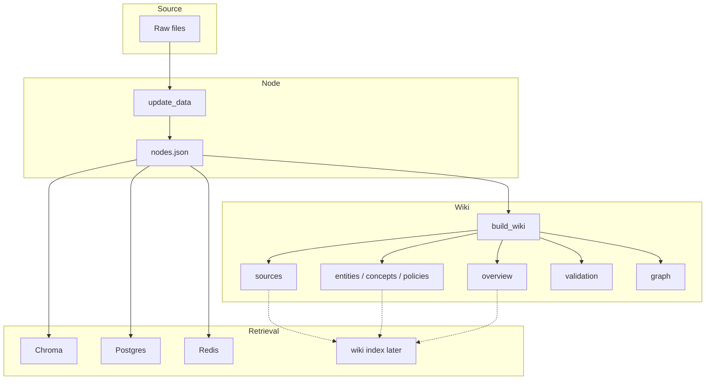
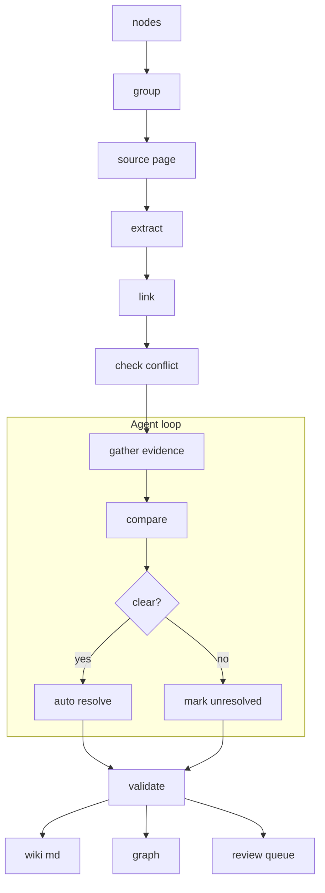

# ChatDKU Wiki Ingestion (Initial Scaffold)

This repository provides an initial, runnable scaffold for the wiki layer described in `WIKI_INGESTION_PLAN.md`.

Current scope:

- Reads normalized `nodes.json` generated by the existing ingestion pipeline.
- Generates a single consolidated wiki document at `wiki/main.md`.
- Stores source references, data paths, source logs, grounded fact blocks, and contradiction notes in that main document.
- Adds basic contradiction notes when simple fact labels disagree across sources.
- Provides a lightweight validator.
- Keeps the wiki layer as plain Markdown documents only.

## Pipeline



## LLM Wiki Workflow



## Quick start

```bash
cd ChatDKU/chatdku
python3 -m ingestion.llm-wiki.build_wiki --nodes-path /path/to/nodes.json
```

By default, outputs are written under:

- `ChatDKU/wiki/main.md`
- `ChatDKU/wiki/validation_report.md`
- `ChatDKU/graph/graph.json` (placeholder link graph)

## Notes

- This is intentionally conservative and deterministic in V1.
- The generated wiki is Markdown-first and does not load into a database.
- It does not replace existing vector ingestion.
- It is designed to sit between `update_data.py` and vector loaders.
- The default output root is the `ChatDKU/` project root.
