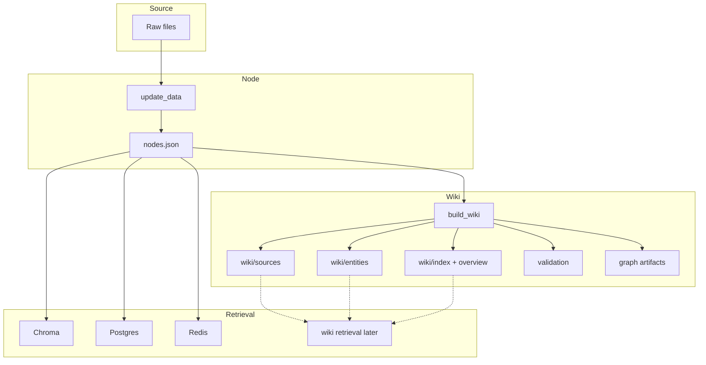

# ChatDKU Wiki Ingestion

This directory contains the ChatDKU-specific implementation of a Karpathy-style LLM wiki layer.

It sits between normalized ingestion output (`nodes.json`) and downstream retrieval/indexing systems. The goal is to compile source-grounded markdown knowledge artifacts that are easier to inspect, link, and maintain than raw chunks alone.

## Current status

Current implementation provides:

- Reads normalized `nodes.json` generated by the existing ingestion pipeline.
- Builds persistent markdown pages under `wiki/sources/` and `wiki/entities/`.
- Generates `wiki/index.md`, `wiki/overview.md`, `wiki/main.md`, and `wiki/validation_report.md`.
- Generates `graph/graph.json` and `graph/pages.json` for downstream graph or agent tooling.
- Extracts deterministic grounded facts from source text.
- Detects simple cross-source fact conflicts and preserves them as unresolved contradictions.
- Keeps the wiki layer Markdown-first and source-traceable.

Current implementation does not yet provide:

- An autonomous ingest/query/lint agent loop.
- LLM-written synthesis pages.
- Rich concept/policy page generation.
- Semantic retrieval over the wiki itself.
- Human review queues or conflict resolution workflows.

## Pipeline



## Quick start

From the repository root:

```bash
python3 chatdku/ingestion/llm-wiki/build_wiki.py \
  --nodes-path /datapool/chat_dku_advising/nodes.json \
  --output-dir /datapool/chat_dku_wiki
```

## Output layout

By default, outputs are written under the configured `wiki_path` root:

- `wiki/index.md`
- `wiki/overview.md`
- `wiki/main.md`
- `wiki/validation_report.md`
- `wiki/sources/*.md`
- `wiki/entities/*.md`
- `graph/graph.json`
- `graph/pages.json`

## Design notes

- This implementation is intentionally conservative and deterministic.
- The generated wiki is Markdown-first and does not require a database.
- It does not replace the existing vector ingestion pipeline.
- It is designed to sit after `update_data.py` and before retrieval/index loaders.
- `AGENTS.md` documents the intended agent workflow for future integration.
