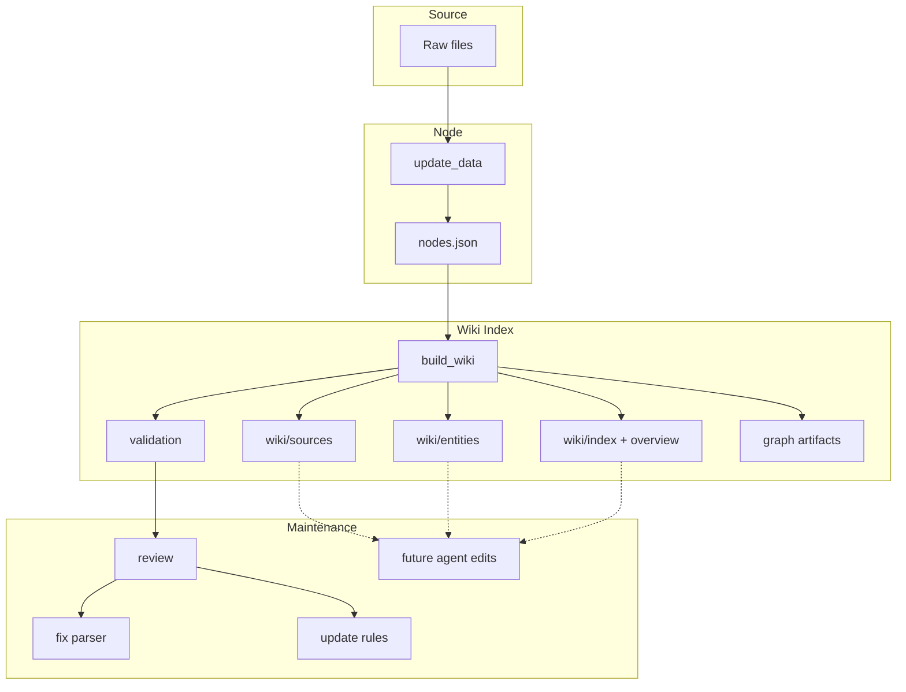

# ChatDKU Wiki Ingestion

This directory contains the ChatDKU-specific implementation of a Karpathy-style LLM wiki layer.

It turns normalized ingestion output (`nodes.json`) into a source-grounded natural-language index. The goal is not to handle retrieval. The goal is to build and maintain a durable wiki surface that is easier to inspect, update, link, and audit than raw chunks alone.

## Current status

Current implementation provides:

- Reads normalized `nodes.json` generated by the existing ingestion pipeline.
- Builds persistent markdown pages under `wiki/sources/` and `wiki/entities/`.
- Generates `wiki/index.md`, `wiki/overview.md`, `wiki/main.md`, and `wiki/validation_report.md`.
- Generates `graph/graph.json` and `graph/pages.json` for maintenance and graph inspection.
- Extracts deterministic grounded facts from source text.
- Detects simple cross-source fact conflicts and preserves them as unresolved contradictions.
- Keeps the wiki layer Markdown-first and source-traceable.

Current implementation does not yet provide:

- An autonomous ingest/query/lint agent loop.
- LLM-written synthesis pages.
- Rich concept/policy page generation.
- Human review queues or conflict resolution workflows.

## Code structure

```text
llm-wiki/
  AGENTS.md
  README.md
  WIKI_INGESTION_PLAN.md
  build_wiki.py
  configs/
    wiki_rules.md
  schemas/
    wiki_page_schema.md
  src/chatdku_ingestion/
    __init__.py
    builder.py
    cli.py
    extractors.py
    io.py
    markdown.py
    models.py
    utils.py
    validator.py
```

### File responsibilities

- `build_wiki.py`
  - Script entrypoint.
  - Adds the repository root and local `src/` to `sys.path`.
  - Calls `chatdku_ingestion.cli.main()`.

- `src/chatdku_ingestion/cli.py`
  - Parses `--nodes-path` and `--output-dir`.
  - Calls `build_wiki(...)`.

- `src/chatdku_ingestion/builder.py`
  - Main orchestration layer.
  - Loads `nodes.json`.
  - Groups nodes by source document.
  - Builds source pages.
  - Derives entity pages from source pages.
  - Adds cross-page links.
  - Detects scoped contradictions.
  - Writes markdown and graph artifacts.
  - Runs validation.

- `src/chatdku_ingestion/models.py`
  - Defines `WikiPage`, `SourceRef`, `GroundedFact`, and `ContradictionNote`.

- `src/chatdku_ingestion/extractors.py`
  - Heuristic fact extraction.
  - Heuristic entity extraction.
  - Filters noisy phone and garbled-text cases.

- `src/chatdku_ingestion/utils.py`
  - Slug generation.
  - Source title cleanup.
  - Domain inference.
  - Summary heuristic.
  - Garbled text detection.

- `src/chatdku_ingestion/markdown.py`
  - Renders source pages, entity pages, index, overview, main report, and validation report.

- `src/chatdku_ingestion/io.py`
  - Loads `nodes.json`.
  - Ensures output layout.
  - Clears generated markdown directories before rebuild.
  - Writes text and JSON artifacts.

- `src/chatdku_ingestion/validator.py`
  - Checks for duplicate page IDs, missing summaries, missing source refs, broken cross refs, duplicate source paths, orphan entity pages, and unresolved contradictions.

- `AGENTS.md`
  - Documents the intended ingest/query/lint workflow for future agent-based maintenance.

## Build flow

The current build pipeline is:

`nodes.json -> source pages -> entity pages -> index/overview/main -> graph json -> validation report`

Concretely:

1. Load normalized `nodes.json`.
2. Group nodes by source path.
3. Build one source page per grouped document.
4. Extract candidate entities from source pages.
5. Build one entity page per merged entity cluster.
6. Add links between related source and entity pages.
7. Detect contradictions inside entity or title-local clusters.
8. Render markdown pages and graph artifacts.
9. Validate the generated wiki.

## Maintenance workflow

This project should treat the wiki as a maintained index, not just a generated dump.

The intended workflow is:

1. Source normalization
   - Update raw source documents through the existing ChatDKU ingestion pipeline.
   - Regenerate `nodes.json`.
2. Wiki rebuild
   - Run `build_wiki.py`.
   - Rebuild source pages, entity pages, index, overview, graph artifacts, and validation outputs.
3. Review pass
   - Check `wiki/validation_report.md`.
   - Inspect low-quality pages, duplicates, and contradiction-heavy clusters.
4. Manual or agent-assisted repair
   - Fix source parsing problems first when extracted text is garbled.
   - Improve page grouping, entity extraction, or contradiction rules when structure is wrong.
   - Reserve LLM synthesis for carefully scoped maintenance tasks later.
5. Publish or snapshot
   - Treat the generated wiki as the natural-language index layer for database-backed knowledge maintenance.
   - Keep it versioned so changes in source truth remain auditable over time.

## What this wiki is for

This wiki is meant to do four jobs well:

- make source-backed knowledge browsable,
- provide a stable natural-language index over database-backed content,
- expose conflicts and low-quality source parsing early,
- give humans and future agents a maintainable surface for updates.

It is not responsible for retrieval orchestration. Retrieval can consume the same upstream data or later consume curated wiki artifacts, but that is outside this component's primary responsibility.

## How summaries are built

Current summaries are not generated with an LLM.

They are built with a deterministic heuristic in `utils.first_sentences(...)`:

- collapse whitespace,
- split text into sentences,
- take the first few sentences,
- truncate to a fixed length.

If the extracted text looks garbled, the summary is replaced with a warning message instead of attempting synthesis.

This means the current summary layer is:

- cheap,
- reproducible,
- source-close,
- but not semantically strong.

## How facts are extracted

Current fact extraction is also heuristic-only, not LLM-based.

`extractors.py` currently:

- matches structured lines such as `deadline: ...`, `policy: ...`, `requirement: ...`,
- extracts emails with regex,
- extracts phone numbers with regex,
- deduplicates repeated values,
- skips low-quality garbled text.

## LLM status

The current implementation does **not** call an LLM during wiki build.

That is deliberate for this stage. The current version is a deterministic artifact builder, not a full Karpathy-style autonomous wiki maintainer yet.

So the answer is:

- `summary`: heuristic only
- `fact extraction`: heuristic only
- `entity extraction`: heuristic only
- `contradiction detection`: heuristic only
- `LLM in build loop`: not yet

The next major step, if desired, is to add an LLM-backed maintenance layer on top of these artifacts rather than replacing them.

## Pipeline



## Quick start

From the repository root:

```bash
python3 chatdku/ingestion/llm-wiki/build_wiki.py \
  --nodes-path /datapool/chat_dku_advising/nodes.json \
  --output-dir /datapool/chat_dku_wiki
```

## Output layout

By default, outputs are written under the configured `wiki_path` root:

- `wiki/index.md`
- `wiki/overview.md`
- `wiki/main.md`
- `wiki/validation_report.md`
- `wiki/sources/*.md`
- `wiki/entities/*.md`
- `graph/graph.json`
- `graph/pages.json`

## Design notes

- This implementation is intentionally conservative and deterministic.
- The generated wiki is Markdown-first and does not require a database.
- It does not replace the existing database or ingestion pipeline.
- It is designed to sit after `update_data.py` as a maintainable natural-language index layer.
- `AGENTS.md` documents the intended agent workflow for future integration.
