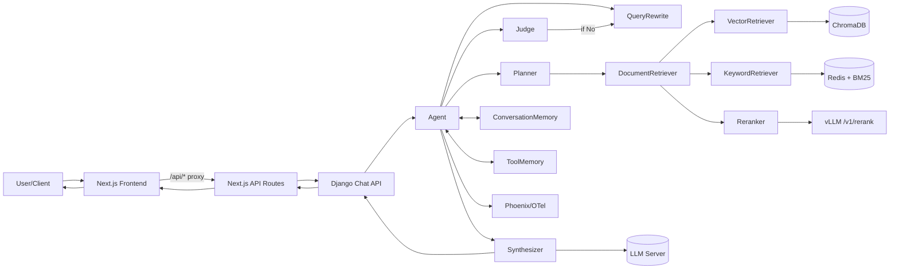
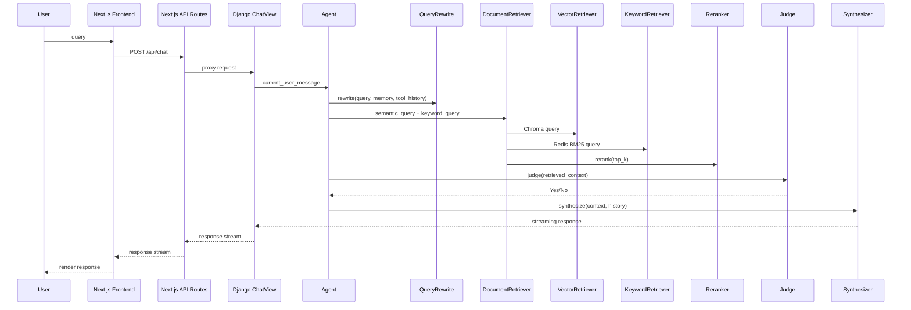
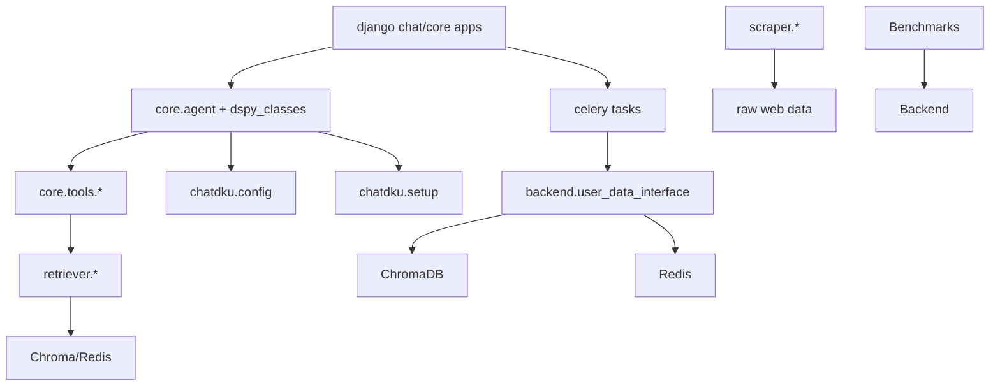

# 技术报告（中文）：ChatDKU Agent RAG 系统

**项目名称**：ChatDKU
**撰写日期**：2026-02-23
**报告范围**：基于 `/Users/glitterc/Desktop/CodeX_codes/ChatDKU_2_23` 代码库的静态分析
**保密说明**：涉及密钥/令牌已统一以 `[REDACTED]` 表示，并在“安全与配置建议”中明确提出“集中到单一密钥管理文件”的改进方向。

---

## 第一章：项目概述与研究动机

ChatDKU 是一个面向杜克昆山大学（Duke Kunshan University, DKU）师生的检索增强生成（Retrieval-Augmented Generation, RAG）系统，目标是将校内政策、课程、学术资源与用户问题进行高质量对齐。系统从工程上要解决的核心问题是：**在多源异构数据、内容更新频繁、以及用户问题高度上下文依赖的情况下，如何在可控延迟内提供高准确度、可引用的回答**。代码显示该系统不仅实现了传统的检索—生成链路，还引入了基于 DSPy 的 Agent 推理控制、记忆压缩、以及混合检索与重排序的组合策略。

前端方面，新增 `chatdku/chatdku/frontend/ChatDKU-web` 的 Next.js 应用作为主要 UI 客户端。开发模式下通过 Next.js rewrites 代理 `/api` 与 `/user` 路径，生产模式使用 `next build` + `output: 'export'` 进行静态导出部署，实现 UI 与 Django API 的解耦。

核心研究问题与工程挑战包括：检索质量与语义覆盖的平衡、混合检索系统的融合策略、长对话记忆的压缩与保真、工具调用的可控性、以及面向真实用户的可运维性（监控、限流、异常处理、用户上传数据的隔离检索）。在 RAG 与 LLM-Agent 研究语境中，本项目处于“**面向真实校园场景的轻量 Agentic RAG**”位置，强调对“检索充分性”的自动判断与迭代式检索，而非多代理自治或复杂的多步计划执行。

与现有工作对比：
1. 相较于 Naive RAG，本项目采用混合检索（向量 + BM25）、重排序、以及检索充分性判断（`Judge`）的闭环。
2. 相较于 Advanced RAG（如 Self-RAG、Adaptive RAG），本项目在检索后引入 `Judge` 决策回路与内部记忆去重，体现“检索—评估—再检索”的迭代逻辑，但尚未实现显式自我反思或证据一致性打分。
3. 相较于典型 Agent-based RAG，本系统采用 DSPy 的 Planner + Tool 调用机制，但工具数量目前有限（主要为 `DocumentRetriever`），多工具协同与多代理通信尚未启用。

**结论**：ChatDKU 是一个强调工程可用性、校园场景对齐与检索充分性判断的 Agentic RAG 原型，具备面向论文与系统扩展的结构性基础。

---

## 第二章：系统总体架构

系统由前端客户端（Next.js 静态站点）、Django API 层、核心 Agent 管线、检索与存储层、LLM/Embedding 服务、以及监控与运维模块构成。前端通过 Next.js API 路由与开发模式 rewrites 代理请求到 Django。核心数据流为：用户查询 → QueryRewrite → 混合检索 → Judge 判断 → Synthesizer 生成 → 对话记忆更新。当前没有多 Agent 协作，所有组件在同一进程内编排。

**高层架构描述（适用于 Mermaid/TikZ）**：



**数据流图**：



**设计模式识别**：
1. Chain-of-Thought：`Planner` 与 `Judge` 采用 `dspy.ChainOfThought`。
2. Tool-Use：`dspy.Tool` 包装 `DocumentRetriever`，由 Planner 生成调用。
3. Plan-and-Execute（弱形式）：Planner 生成调用计划，Agent 执行并迭代。
4. Judge-Gated Retrieval：通过 `Judge` 决策是否继续检索。

**多 Agent 协作**：当前不存在多代理间通信机制，所有决策由单个 Agent 内部完成。Planner 被设计为可扩展，但目前工具数量不足以体现多代理协作策略。

**示例查询端到端流程（来自测试集中）**：
查询 “How often should I visit my advisor?” 经过 `QueryRewrite` 生成更清晰的检索提示；`DocRetrieverOuter` 同步调用 `VectorRetriever` 与 `KeywordRetriever`，并进行 `rerank`；`Judge` 判断是否信息充分，若否则触发二次检索；最终 `Synthesizer` 将检索上下文与对话记忆融合生成答复，并写回 `ConversationMemory`。

---

## 第三章：核心组件深度解析

### 3.1 核心 Agent（`Agent`）
**职责与功能**：集中编排 QueryRewrite、Planner、Retriever、Judge、Synthesizer 与记忆模块，形成完整的检索—推理—生成闭环。`Agent` 还负责内部去重（`internal_memory`）与流式输出。
**接口定义**：`Agent.forward(current_user_message, question_id="", user_id="Chat_DKU", search_mode=0, files=None)`；返回 `dspy.Prediction` 或流式生成器。`search_mode` 支持 0/1/2 三种检索范围。
**内部逻辑**：
```pseudo
init memories, tools
for iter in max_iterations:
  plan = Planner(...)
  for tool_call in plan:
    result = tool(...)
    update ToolMemory + internal_memory
  if Judge says sufficient: break
  if rewrite_query: query = QueryRewrite(...)
response = Synthesizer(...)
update ConversationMemory
return response
```
**关键设计决策**：采用 Judge 触发的迭代式检索，优于固定轮次检索；内部 `ids` 去重避免重复证据。
**依赖关系**：DSPy、OpenTelemetry/Phoenix、Retriever 工具链、Config。
**代码质量评估**：整体结构清晰，但 Planner 工具数量有限；`CustomClient` 等依赖在仓库中缺失，存在运行风险。

### 3.2 Planner（`Planner`）
**职责与功能**：根据当前问题、记忆和工具集合生成工具调用计划。
**接口定义**：`Planner.forward(current_user_message, tools, conversation_memory, tool_memory, max_calls=5)` 输出 `tool_plan: dspy.ToolCalls`。
**内部逻辑**：基于 `dspy.ChainOfThought` 生成计划，并用 `dspy.Refine` 校验工具合法性。
**关键设计决策**：使用 `Refine` 做工具名校验，减少 LLM 生成非法工具的概率。
**依赖关系**：DSPy、ToolMemory、ConversationMemory。
**代码质量评估**：逻辑清晰，可扩展；但当前工具数量少，计划能力未被充分验证。

### 3.3 QueryRewrite（`QueryRewrite`）
**职责与功能**：在检索前进行查询纠错与上下文扩展，避免语义歧义。
**接口定义**：`QueryRewrite.forward(current_user_message, conversation_memory, tool_memory)` → `rewritten_query`。
**内部逻辑**：根据记忆与工具历史拼接输入，执行 DSPy `Predict`。
**关键设计决策**：限制 token 比例并调用 `truncate_tokens_all`，控制输入长度。
**依赖关系**：DSPy、`ConversationMemory`、`ToolMemory`。
**代码质量评估**：模板清晰，记忆使用合理；但依赖 prompt 质量，缺少自动评价机制。

### 3.4 Judge（`Judge`）
**职责与功能**：判断当前检索上下文是否足够回答问题。
**接口定义**：`Judge.forward(current_user_message, conversation_memory, tool_memory)` → `judgement: bool`。
**内部逻辑**：Chain-of-Thought + `Refine` 验证输出必须为 Yes/No；若异常默认返回 False。
**关键设计决策**：将“是否继续检索”外包给 LLM，以减少硬编码阈值。
**依赖关系**：DSPy、工具记忆与对话记忆。
**代码质量评估**：鲁棒性处理合理，但判断标准高度依赖 prompt 与 LLM。

### 3.5 Synthesizer（`Synthesizer` + `ResponseGen`）
**职责与功能**：基于检索上下文与对话历史生成最终回答，支持流式输出与引用规范。
**接口定义**：`Synthesizer.forward(current_user_message, conversation_memory, tool_memory, streaming, final=False)`。
**内部逻辑**：构建输入 → `dspy.Predict` 或 `streamify` → `ResponseGen` 控制流式输出与 span 记录。
**关键设计决策**：严格要求引用格式与 DKU 特定内容优先；禁止暴露内部工具调用。
**依赖关系**：DSPy、OpenInference span、配置中的 LLM 连接。
**代码质量评估**：指令丰富但较长，可能增加延迟；引用规则清晰但未验证来源一致性。

### 3.6 ToolMemory（`ToolMemory`）
**职责与功能**：记录工具调用历史并对超长历史进行摘要压缩。
**接口定义**：`ToolMemory.forward(current_user_message, conversation_memory, call, result, max_history_size)`。
**内部逻辑**：将工具调用追加进 `history`，超过长度时调用 `compressor` 摘要。
**关键设计决策**：用 LLM 压缩历史以节省 token，适合长任务。
**依赖关系**：DSPy、OpenTelemetry、ConversationMemory。
**代码质量评估**：结构明确，但 `max_history_size` 被强行设为 13000，缺少动态策略。

### 3.7 ConversationMemory（`ConversationMemory`）
**职责与功能**：管理对话上下文与摘要，提升多轮对话能力。
**接口定义**：`ConversationMemory.forward(role, content, max_history_size=1000)`。
**内部逻辑**：追加消息并在超长时生成摘要；提供 `history_str()`。
**关键设计决策**：以摘要替代完整对话历史，提升上下文容量。
**依赖关系**：DSPy、OpenTelemetry。
**代码质量评估**：设计合理，但摘要准确性不可控。

### 3.8 文档检索入口（`DocRetrieverOuter`）
**职责与功能**：封装混合检索入口，统一 vector 与 keyword 结果并进行重排序。
**接口定义**：`DocumentRetriever(semantic_query, keyword_query="") -> (list, internal_result)`。
**内部逻辑**：分别调用 `VectorRetriever` 与 `KeywordRetriever`，可选 `rerank`，合并结果并返回 `ids`。
**关键设计决策**：合并两类检索结果以提高覆盖面；失败时返回错误字符串而非异常。
**依赖关系**：Vector/Keyword Retriever、Reranker、timeout。
**代码质量评估**：容错较好，但结果格式混合（Node 与 str）会提高下游复杂度。

### 3.9 向量检索（`VectorRetriever`）
**职责与功能**：调用 ChromaDB + TEI embedding 进行语义检索。
**接口定义**：`VectorRetriever.query(query) -> list[NodeWithScore]`。
**内部逻辑**：通过 `chroma_db_port` 连接 Chroma，使用 `HuggingFaceEmbeddingServer` 嵌入；支持 `search_mode` 过滤。
**关键设计决策**：使用 `chunk_id` 去重；通过 `where` 过滤实现用户文件隔离。
**依赖关系**：ChromaDB、TEI、Config。
**代码质量评估**：过滤逻辑清晰，但对外部服务依赖强，缺少重试。

### 3.10 关键词检索（`KeywordRetriever`）
**职责与功能**：基于 Redis + BM25 完成关键词检索。
**接口定义**：`KeywordRetriever.query(query) -> list[NodeWithScore]`。
**内部逻辑**：NLTK 分词去停用词，生成关键词组合并加权；构造 RediSearch 查询。
**关键设计决策**：通过组合词组提升多关键词匹配质量，属于非标准优化策略。
**依赖关系**：Redis、NLTK、redisvl schema。
**代码质量评估**：策略有效但参数硬编码；`__add_redis_filter` 未被使用。

### 3.11 重排序（`rerank`）
**职责与功能**：调用 vLLM 的 `/v1/rerank` 对候选文档重新打分。
**接口定义**：`rerank(nodes, query, reranker_top_n)`。
**内部逻辑**：构造 query 与 doc 模板，发送 HTTP 请求，按得分排序；失败时回退。
**关键设计决策**：保留 fallback top-n，避免 reranker 服务不可用时完全失败。
**依赖关系**：vLLM 接口、Config。
**代码质量评估**：可用性较强，但未设置超时与重试策略。

### 3.12 基类检索器（`BaseDocRetriever` / `NodeWithScore`）
**职责与功能**：统一检索接口与 OTEL trace 记录。
**接口定义**：`query(query)` 抽象方法，`query_with_tell` 包装输出。
**内部逻辑**：在 span 中记录输入、输出、文档元数据。
**关键设计决策**：把 OpenInference 元信息结构化输出，便于 Phoenix 可视化。
**依赖关系**：OpenTelemetry/OpenInference。
**代码质量评估**：工程性强；异常处理保守。

### 3.13 配置与系统初始化（`config.py`, `setup.py`）
**职责与功能**：集中管理 LLM、Embedding、存储与端口配置，并初始化 LlamaIndex 设置。
**接口定义**：`Config` 提供 `.get/.set/.update`；`setup()` 设置 `Settings.embed_model` 与 `Settings.tokenizer`。
**内部逻辑**：读取环境变量，提供默认值；支持只读视图。
**关键设计决策**：禁止直接 dict mutate，降低配置被无意覆盖的风险。
**依赖关系**：dotenv、LlamaIndex、Transformers。
**代码质量评估**：配置结构清晰，但部分路径硬编码（`/datapool/...`）。

### 3.14 DSPy Patch（`dspy_patch.py`, `dspy_common.py`）
**职责与功能**：修补 DSPy 模板格式与断言逻辑，适配项目的 prompt 格式与回溯策略。
**接口定义**：重写 `Template.guidelines` 与 `Template.__call__`；替换 `backtrack_handler`。
**内部逻辑**：自定义 system/user prompt 拼接；增强 backtrack 行为。
**关键设计决策**：通过 monkey-patch 规避 DSPy 已知问题。
**依赖关系**：DSPy 内部 API。
**代码质量评估**：有效但风险高，未来 DSPy 更新可能破坏兼容性。

### 3.15 数据摄取与索引（`ingestion/*`）
**职责与功能**：实现 PDF/HTML/CSV/XLSX 文档解析、分块、增量更新与向量库构建。
**接口定义**：`update_data.update(data_dir, user_id)`；`load_chroma.load_chroma(...)`；`load_redis.load_redis(...)`。
**内部逻辑**：PDF 使用 `LlamaParse` + `SentenceSplitter(chunk_size=1024, overlap=20)`；非 PDF 使用 `UnstructuredReader` + `IngestionPipeline`。
**关键设计决策**：增量更新（log.json）以减少重复处理；自定义文件类型检测与 HTML 分区。
**依赖关系**：LlamaParse、Unstructured、Chroma、Redis、LlamaIndex。
**代码质量评估**：功能覆盖广，但存在硬编码 API Key（已在报告中脱敏）。

### 3.16 用户上传数据接口（`backend/user_data_interface.py`）
**职责与功能**：为用户文件构建独立索引，支持增量更新与双库同步（Chroma + Redis）。
**接口定义**：`update(data_dir, user_id)`；内部调用 `embed_pdf`、`embed_non_pdf`。
**内部逻辑**：利用 LlamaParse 和 UnstructuredReader 解析用户文件；批量写入向量库。
**关键设计决策**：用 `search_mode` 与 `user_id` 实现用户隔离检索。
**依赖关系**：Chroma、Redis、LlamaParse、Unstructured。
**代码质量评估**：与主 ingestion 重复度高，可考虑抽象复用。

### 3.17 Django 后端（主路径）
**职责与功能**：提供认证、聊天、文件上传、限流、任务队列等服务。
**接口定义**：`/api/chat`、`/api/feedback`、`/user/upload` 等接口；`ChatView` 返回流式回答。
**内部逻辑**：`NetIDMiddleware` 负责认证；`RateLimitMiddleware` 控制访问；`Celery` 处理上传索引更新与定时测试。
**关键设计决策**：使用 Redis 队列 + 锁实现用户上传的并发控制。
**依赖关系**：Django、Celery、Redis、DRF、Prometheus。
**代码质量评估**：工程化完整，但聊天/上传链路较复杂，测试覆盖不足。

### 3.18 Flask 后端（辅助/历史路径）
**职责与功能**：提供旧版本聊天、SocketIO 音频转写与管理界面。
**接口定义**：`/chat`, `/feedback`, `/upload`；SocketIO `audio_data`。
**内部逻辑**：基于 `eventlet`，直接实例化 `Agent`；Whisper 模型部署为独立服务。
**关键设计决策**：保留 Flask 以兼容历史功能（STT）。
**依赖关系**：Flask、Whisper、SocketIO。
**代码质量评估**：功能可用但与 Django 重叠，长期维护成本高。

### 3.19 工具集（Tools）
**职责与功能**：提供搜索、计算、邮件、GraphRAG、SQL 课程查询等扩展能力。
**接口定义**：如 `DuckDuckGo.duckduckgo_search`、`GraphragTool.forward`、`QueryCurriculumDB.forward`。
**内部逻辑**：多数工具封装外部 API 调用，尚未集成到主 Planner。
**关键设计决策**：工具可插拔；但当前仅 `DocumentRetriever` 被启用。
**依赖关系**：第三方 API、外部服务。
**代码质量评估**：工具实现分散，集成程度不足，部分文件缺少依赖或 import。

### 3.20 爬虫与数据采集（`scraper/*`）
**职责与功能**：递归抓取 DKU 网站，生成可用于索引的数据集。
**接口定义**：`scraper.py` CLI；`filter_llm.filter_page` 可选 LLM 过滤。
**内部逻辑**：aiohttp 并发抓取，下载状态持久化，支持 SAML 登录。
**关键设计决策**：使用 LLM 过滤页面，减少噪声内容。
**依赖关系**：aiohttp、BeautifulSoup、OpenAI SDK。
**代码质量评估**：功能全面但有安全风险（禁用 SSL 验证）。

### 3.21 基准测试与监控
**职责与功能**：通过 k6、locust 进行性能测试，Phoenix/Prometheus 进行监控。
**接口定义**：`benchmarks/backend.js`、`locustfile.py`。
**内部逻辑**：周期性执行 load test 并发送邮件报告。
**关键设计决策**：把性能测试纳入周期任务，提高可运维性。
**依赖关系**：k6、locust、Prometheus、Phoenix。
**代码质量评估**：工具链齐全，但测试数据依赖外部文件。

---

### 3.22 前端层（Next.js / ChatDKU-web）
**职责与功能**：提供 ChatDKU 的 Web UI，包括会话管理、聊天展示、文件上传与反馈入口，并通过 Next.js API 路由代理后端请求。
**接口定义**：`app/api/chat/route.ts` 代理聊天请求，`app/api/feedback/route.ts` 代理反馈，`app/api/get_session/route.ts` 与 `app/user/route.ts` 提供开发模式模拟会话/用户。
**内部逻辑**：`ChatPage.tsx` 负责渲染会话与流式消息，使用 `marked` 解析 Markdown 并移除 `<think>` 段；`lib/convosNew.ts` 管理 session 与历史请求；`components/*` 组织 UI 与 shadcn/ui 组件。
**关键设计决策**：生产环境静态导出（`output: 'export'`），开发模式通过 rewrites 或 API 路由处理 SSL/跨域代理。
**依赖关系**：Next.js、React、TypeScript、Tailwind CSS、shadcn/ui、Radix UI、Jest。
**代码质量评估**：结构清晰且测试覆盖开始建立，但前后端接口地址存在硬编码，需配置化。

## 第四章：检索管线

**文档摄入与预处理**：
`update_data.py` 使用 `SentenceSplitter(chunk_size=1024, chunk_overlap=20)` 对 PDF/HTML/CSV/XLSX 进行分块；PDF 由 `LlamaParse` 解析，非 PDF 使用 `UnstructuredReader`。`custom_filetype_detect.py` 和 `custom_partation.py` 修复 HTML 被误判为代码的问题，并将 PDF/图像分区策略改为 hi-res。

**嵌入与索引构建**：
Embedding 模型通过 TEI（Text Embeddings Inference）服务提供，默认模型 `BAAI/bge-m3`。ChromaDB 作为向量存储，Redis 作为 BM25 + 向量索引，用 `custom_schema.yaml` 定义字段。`load_chroma.py` 与 `load_redis.py` 分别构建索引。

**查询处理**：
`QueryRewrite` 进行改写与上下文融合；没有显式的 query decomposition，但 `Judge` 可触发多轮检索。

**检索策略**：
`DocRetrieverOuter` 同时调用 `VectorRetriever` 与 `KeywordRetriever`，并可选择 `rerank`；`KeywordRetriever` 采用关键词组合与权重提升实现半结构化扩展。

**上下文组装**：
返回的 `NodeWithScore` 被转换为 `{text, metadata}` 列表；`internal_memory` 保存已用 `chunk_id`，避免重复上下文进入后续轮次。

**非标准或创新做法**：
1. Keyword 检索的组合权重策略（`BOOST_FACTOR` + `TUPLE_LIMIT`）。
2. Judge 驱动的检索迭代与 `internal_memory` 去重。
3. reranker 失败时回退到向量分数 Top-N。

---

## 第五章：Agent 框架与推理机制

Agent 采用“QueryRewrite → Tool Plan → Retrieval → Judge → Synthesizer”的循环结构。Planner 虽设计为多工具规划，但当前仅启用 `DocumentRetriever`，因此属于单工具计划执行。多步推理通过 Judge 触发的迭代检索实现，属于轻量的 Plan-and-Execute。

**工具/动作集合**：
核心工具为 `DocumentRetriever`，其它工具（搜索、GraphRAG、SQL 课程查询、Email 等）尚未接入 Planner。Planner 支持工具列表扩展，但目前 `max_calls` 设置为 2。

**决策策略**：
`Judge` 输出 Yes/No；Yes 代表检索充分，进入 Synthesizer；No 触发 QueryRewrite 与二次检索。

**记忆管理**：
`ConversationMemory` 保存历史对话并压缩摘要；`ToolMemory` 保存工具调用历史并压缩摘要。短期记忆与长期记忆以“history + summary”形式并存。

---

## 第六章：提示工程

系统内主要 Prompt / Template：
1. `SynthesizerSignature`：系统主指令，包含 DKU 特定约束、引用格式与专业回答策略。
2. `QueryRewriteSignature`：修正拼写、加入上下文并生成检索用 query。
3. `PlannerSignature`：工具调用计划生成。
4. `JudgeSignature`：判断是否需继续检索。
5. `CompressConversationMemorySignature` 与 `CompressToolMemorySignature`：摘要压缩。
6. `FeedbackSignature`（Django 反馈摘要），`TITLE_PROMPT`（标题生成），`PROMPT_TEMPLATE`（爬虫过滤）。
7. SQL Agent prompts（`TableSelectionSignature`、`ColumnSelectionSignature`、`Text2SQLSignature`）。

**变量注入**：
多数 Prompt 通过 `current_user_message`、`conversation_history`、`tool_history`、`summary` 动态注入。Synthesizer 额外注入 `current_date`。

**Prompt Chaining**：
QueryRewrite → Planner → ToolCalls → Judge → Synthesizer 是典型链式结构，Judge 结果决定是否再回到 QueryRewrite。

**优缺点分析**：
优势在于明确的行为约束与引用规范；不足在于 prompt 过长导致延迟上升，且缺少自动评价或 A/B 机制。

---

前端渲染层会在 Markdown 解析前去除 `<think>` 片段，避免将推理过程暴露给最终用户，并作为 UI 侧的安全兜底。

## 第七章：技术栈与基础设施

**核心技术栈（含版本号）**：
1. LlamaIndex `0.13.1`、DSPy `~3.0.3`、ChromaDB `~1.0.15`。
2. 前端：Next.js `^16.1.6`、React `^19`、TypeScript `^5`、Tailwind CSS `^4`、shadcn/ui、Radix UI、Jest/Testing Library、next-themes。
2. Redis 与 redisvl、OpenTelemetry + OpenInference + Phoenix。
3. Django `5.2.3` + DRF + Celery + Django-Redis。
4. Flask `3.0.3` + SocketIO + Whisper。
5. Embedding：TEI 服务；LLM：OpenAI-compatible API（vLLM / SGLang）。

**配置管理**：
`chatdku/chatdku/config.py` 读取 `.env`，并提供可更新的 Config。Django 与 Flask 各自有 settings/config。

**部署方式**：
Django 使用 gunicorn + Apache 代理；Redis/Chroma/TEI 通过 Docker；Phoenix 作为 tracing collector。

**性能优化**：
支持缓存（DSPy cache）、流式输出（`ResponseGen`）、并行抓取（scraper）与异步/批量写入（ingestion）。

---

## 第八章：错误处理与鲁棒性

系统具备多层错误处理：
1. `timeout` 包装检索；超时会抛出 `QueryTimeoutError` 并记录。
2. Reranker 出错时回退到向量分数 Top-N。
3. 多数后端接口有 try/except 并返回 JSON 错误消息。

潜在失败模式：
1. `CustomClient`、`DocumentSummarizer` 在代码中引用但未定义，可能导致运行失败。
2. LlamaParse、LlamaExtract API Key 在代码中硬编码（已脱敏），安全风险高。
3. KeywordRetriever 依赖 NLTK 资源，生产环境需预下载。

Token 预算管理：
`token_limit_ratio_to_count` + `truncate_tokens_all` 控制 Prompt 输入比例；Conversation/Tool memory 在超长时自动摘要。

**结论**：鲁棒性主要依赖 try/except 与 fallback，缺少系统性“检索失败/幻觉检测”机制。

---

## 第九章：评估与实验

现有评估与测试：
1. `chatdku/tests/test_retriever.py` 覆盖检索结果数量与超时机制。
2. 前端使用 Jest 体系（`jest.config.js`、`jest.setup.js`），包含集成测试 `integration/chat-flow.test.tsx` 与组件/工具测试，并通过 `production-readiness-reporter.js` 输出生产就绪评估。
2. `chatdku/tests/test_load_retriever.py` 提供并发检索负载测试。
3. `benchmarks/backend.js`（k6）与 Django `locustfile.py` 用于压力测试。

缺失部分：
1. 缺少自动化的回答正确性/事实一致性评估。
2. 缺少检索指标（Recall@k、nDCG）与生成指标（Faithfulness、Answer Correctness）。

建议评估框架：
引入 RAGAS 或 Phoenix 评估套件，结合自建问答基准，覆盖 relevance、faithfulness、latency、cost。

---

## 第十章：创新点与技术贡献

**创新点 1：Judge 驱动的迭代式检索闭环**
与传统单次检索不同，本系统使用 `Judge` 决策继续检索，并结合 `internal_memory` 去重，实现轻量的自适应检索控制。优势是减少无效上下文与重复证据，提升检索覆盖度。

**创新点 2：混合检索 + 端到端重排序的工程化落地**
向量检索（Chroma）与关键词检索（Redis BM25）并行，随后用 vLLM rerank 统一排序并支持失败回退。相比 Naive RAG，提升了对术语与短查询的鲁棒性。

**创新点 3：记忆压缩与 Prompt 预算控制的系统化实现**
`ConversationMemory` 与 `ToolMemory` 通过 LLM 摘要压缩，并用 token 比例约束输入长度；结合 DSPy Patch 实现可控 Prompt 格式。该设计在长对话/多轮检索下保持上下文稳定。

---

## 第十一章：局限性与未来工作

**局限性**：
1. Planner 尚未充分利用，多工具协作未启用。
2. 评估体系薄弱，缺少系统化指标。
3. 部分工具与类缺失，存在可运行性风险。
4. 硬编码密钥与路径降低安全性和可移植性。

**未来工作**：
1. 引入多工具路由与任务分解（Plan-and-Execute/Toolformer）。
2. 增加事实一致性与引用验证模块。
3. 统一 ingestion 与 user upload 逻辑，减少重复代码。
4. 集中密钥管理到单一配置文件或密钥服务。

---

## 第十二章：相关工作对比

| 维度 | Naive RAG | Advanced RAG | Agent 方法 | 本系统 | 差异点 |
|---|---|---|---|---|---|
| 检索策略 | 单一向量检索 | 自适应/多策略 | 工具调用驱动 | 混合检索 + rerank | 强调向量+BM25融合 |
| 迭代检索 | 否 | 部分 | 是 | 是（Judge回路） | Judge 驱动闭环 |
| 工具使用 | 否 | 少量 | 多工具 | 单工具（可扩展） | 工具扩展性存在但未充分利用 |
| 记忆管理 | 简单 | 记忆压缩 | 长期记忆 | Conversation/Tool Memory + 摘要 | 具备工程化记忆管理 |
| 可运维性 | 低 | 中 | 中 | 高（监控+负载测试） | Phoenix/Prometheus/Locust 集成 |

---

# 附录 / Appendix

## A. 文件级摘要（逐文件，2-3 句话）

以下路径均为绝对路径，确保“无文件遗漏”。

| 文件 | 摘要 |
|---|---|
| `/Users/glitterc/Desktop/CodeX_codes/ChatDKU_2_23/README.md` | 说明仓库为 monorepo，并指向 `chatdku`、`scraper`、`benchmarks`、`utils` 等子项目。为快速导航提供入口，但不包含实现细节。 |
| `/Users/glitterc/Desktop/CodeX_codes/ChatDKU_2_23/TODO.md` | 记录 SQL 课程工具与 Planner 集成的待办事项。展示系统当前的功能缺口与后续重点。 |
| `/Users/glitterc/Desktop/CodeX_codes/ChatDKU_2_23/manage.py` | 仅负责加载 `.env`，为全局环境变量初始化提供入口。功能极简，作为运维脚本的辅助。 |
| `/Users/glitterc/Desktop/CodeX_codes/ChatDKU_2_23/GUIDE.md` | 面向新成员的项目指南，介绍 DSPy、LlamaIndex、Chroma、Redis 与协作流程。提供基础学习路径，但声明文档仍在完善。 |
| `/Users/glitterc/Desktop/CodeX_codes/ChatDKU_2_23/Documentations/Database-Documentation.md` | 描述 Redis 与 ChromaDB 的部署方式与注意事项。包含 Docker 启动示例与版本标注。 |
| `/Users/glitterc/Desktop/CodeX_codes/ChatDKU_2_23/Documentations/Embedding-Server-Documentation.md` | 说明 TEI 服务器与 Nginx 路由方式，列出可用 embedding 路径。为嵌入服务部署提供参考。 |
| `/Users/glitterc/Desktop/CodeX_codes/ChatDKU_2_23/Documentations/Prometheus-Monitoring-Documentation.md` | 详细介绍 Prometheus 监控体系、配置文件位置与告警策略。描述监控端口与常见 PromQL。 |
| `/Users/glitterc/Desktop/CodeX_codes/ChatDKU_2_23/Documentations/Shibboleth.md` | 说明 Shibboleth 认证在 Apache 配置中的位置与用途。提醒修改时需要备份。 |
| `/Users/glitterc/Desktop/CodeX_codes/ChatDKU_2_23/utils/README.md` | 汇总 utils 子目录用途与脚本范围。用于辅助任务说明而非核心逻辑。 |
| `/Users/glitterc/Desktop/CodeX_codes/ChatDKU_2_23/utils/test_backend.sh` | 使用 curl 测试 `/chat` API 的脚本。支持自定义端口与默认问题。 |
| `/Users/glitterc/Desktop/CodeX_codes/ChatDKU_2_23/utils/test_feedback.sh` | 使用 curl 测试反馈接口的脚本。用于快速验证后端是否可用。 |
| `/Users/glitterc/Desktop/CodeX_codes/ChatDKU_2_23/utils/data_count_size.sh` | 统计目录中文件扩展名数量与总大小的 Bash 脚本。常用于检查数据目录规模。 |
| `/Users/glitterc/Desktop/CodeX_codes/ChatDKU_2_23/utils/generate_redis_schema.py` | 生成用于 RedisVectorStore 的示例 schema YAML。用于实验或测试索引结构。 |
| `/Users/glitterc/Desktop/CodeX_codes/ChatDKU_2_23/utils/save_tokenizer.py` | 下载并保存 HuggingFace tokenizer 与 config 到本地路径。用于离线或一致性部署。 |
| `/Users/glitterc/Desktop/CodeX_codes/ChatDKU_2_23/utils/visualization/dataVisualizer.py` | 提供 2D/3D 分布可视化工具类。包含 Matplotlib/Seaborn/Plotly 示例。 |
| `/Users/glitterc/Desktop/CodeX_codes/ChatDKU_2_23/utils/visualization/README.md` | 说明 DataVisualizer 使用方式与示例。定位为教学与辅助分析文档。 |
| `/Users/glitterc/Desktop/CodeX_codes/ChatDKU_2_23/utils/test_redis/bm25_search.py` | Redis BM25 查询的简化测试脚本。展示分组过滤与结果打印。 |
| `/Users/glitterc/Desktop/CodeX_codes/ChatDKU_2_23/utils/test_redis/bm25_search_improved.py` | 改进版 BM25 查询测试，包含关键词组合与高亮展示。用于调试检索权重策略。 |
| `/Users/glitterc/Desktop/CodeX_codes/ChatDKU_2_23/utils/test_redis/chinese.py` | 用于测试 Redis 中文分词与高亮查询。展示 dialect=2 的使用。 |
| `/Users/glitterc/Desktop/CodeX_codes/ChatDKU_2_23/utils/test_redis/load.py` | 构建 RedisVectorStore 的最小示例。使用 TEI 嵌入并创建测试索引。 |
| `/Users/glitterc/Desktop/CodeX_codes/ChatDKU_2_23/utils/test_redis/vector_retriever.py` | 使用 LlamaIndex VectorStoreIndex 进行 Redis 检索的示例。展示 MetadataFilters 的用法。 |
| `/Users/glitterc/Desktop/CodeX_codes/ChatDKU_2_23/benchmarks/README.md` | 说明 k6 与 vLLM 基准测试流程。包含数据来源与脚本用法。 |
| `/Users/glitterc/Desktop/CodeX_codes/ChatDKU_2_23/benchmarks/backend.js` | k6 脚本，针对 `/chat` 接口进行压力测试。支持读取问题集并生成 HTML 报告。 |
| `/Users/glitterc/Desktop/CodeX_codes/ChatDKU_2_23/benchmarks/visualize_vllm.py` | 分析 vLLM benchmark JSON 输出并绘图。输出 TTFT/TPOT 与吞吐曲线。 |
| `/Users/glitterc/Desktop/CodeX_codes/ChatDKU_2_23/benchmarks/nohup.out` | 运行基准或脚本产生的日志文件。属于运行产物，不包含可执行逻辑。 |
| `/Users/glitterc/Desktop/CodeX_codes/ChatDKU_2_23/scraper/README.md` | 爬虫使用说明，涵盖依赖、参数与输出结构。强调异步抓取与进度报告。 |
| `/Users/glitterc/Desktop/CodeX_codes/ChatDKU_2_23/scraper/pyproject.toml` | 爬虫项目的依赖与构建声明。与主项目依赖分离。 |
| `/Users/glitterc/Desktop/CodeX_codes/ChatDKU_2_23/scraper/scraper/__init__.py` | Python 包初始化文件。无具体逻辑，仅用于模块标识。 |
| `/Users/glitterc/Desktop/CodeX_codes/ChatDKU_2_23/scraper/scraper/utils.py` | 定义下载状态枚举与数据结构。提供简易统计打印函数。 |
| `/Users/glitterc/Desktop/CodeX_codes/ChatDKU_2_23/scraper/scraper/report.py` | 读取 CSV 形式的下载信息并输出统计摘要。用于爬虫结果检查。 |
| `/Users/glitterc/Desktop/CodeX_codes/ChatDKU_2_23/scraper/scraper/filter_llm.py` | 使用 LLM 判断网页是否应保留的过滤模块。包含严格 keep/drop prompt。 |
| `/Users/glitterc/Desktop/CodeX_codes/ChatDKU_2_23/scraper/scraper/scraper.py` | 主爬虫逻辑，使用 aiohttp 异步抓取并支持 SAML 登录。包含 URL 解析、延迟与重试策略。 |
| `/Users/glitterc/Desktop/CodeX_codes/ChatDKU_2_23/chatdku/README.md` | ChatDKU 子项目概览与部署说明。强调 embedding/LLM 服务依赖与可观测性。 |
| `/Users/glitterc/Desktop/CodeX_codes/ChatDKU_2_23/chatdku/pyproject.toml` | 主项目依赖清单与版本。包含 Django、Flask、LlamaIndex、DSPy 等。 |
| `/Users/glitterc/Desktop/CodeX_codes/ChatDKU_2_23/chatdku/chatdku/config.py` | 全局 Config 单例与默认参数定义。支持只读视图与安全更新。 |
| `/Users/glitterc/Desktop/CodeX_codes/ChatDKU_2_23/chatdku/chatdku/setup.py` | 初始化 LlamaIndex embedding 与 tokenizer。可选启用 Phoenix tracing。 |
| `/Users/glitterc/Desktop/CodeX_codes/ChatDKU_2_23/chatdku/chatdku/core/README.md` | Core 模块开发指南，描述 Agent 子模块及当前流程。明确 Planner 暂未完全启用。 |
| `/Users/glitterc/Desktop/CodeX_codes/ChatDKU_2_23/chatdku/chatdku/core/agent.py` | 系统核心 Agent，实现多轮检索与生成闭环。支持流式输出与用户检索范围控制。 |
| `/Users/glitterc/Desktop/CodeX_codes/ChatDKU_2_23/chatdku/chatdku/core/compile.py` | DSPy prompt 编译脚本，使用 BootstrapFewShot 进行优化。依赖 `CustomClient`，但其在仓库中缺失。 |
| `/Users/glitterc/Desktop/CodeX_codes/ChatDKU_2_23/chatdku/chatdku/core/utils.py` | 提供 token 截断、模型参数解析与字符串处理工具。用于控制 prompt 长度与参数映射。 |
| `/Users/glitterc/Desktop/CodeX_codes/ChatDKU_2_23/chatdku/chatdku/core/dspy_common.py` | 抽象出 DSPy prompt 生成工具 `get_template`。包含自定义 rationale 字段定义。 |
| `/Users/glitterc/Desktop/CodeX_codes/ChatDKU_2_23/chatdku/chatdku/core/dspy_patch.py` | 对 DSPy 模板与 backtrack 逻辑进行 monkey-patch。用于自定义 prompt 格式与错误处理策略。 |
| `/Users/glitterc/Desktop/CodeX_codes/ChatDKU_2_23/chatdku/chatdku/core/dspy_classes/prompt_settings.py` | 定义 Prompt 统一字段与角色提示。集中管理输入输出字段描述。 |
| `/Users/glitterc/Desktop/CodeX_codes/ChatDKU_2_23/chatdku/chatdku/core/dspy_classes/conversation_memory.py` | ConversationMemory 的实现与摘要压缩逻辑。用于对话历史管理。 |
| `/Users/glitterc/Desktop/CodeX_codes/ChatDKU_2_23/chatdku/chatdku/core/dspy_classes/tool_memory.py` | ToolMemory 的实现与压缩摘要逻辑。记录工具调用历史与结果。 |
| `/Users/glitterc/Desktop/CodeX_codes/ChatDKU_2_23/chatdku/chatdku/core/dspy_classes/query_rewrite.py` | QueryRewrite 模块，生成更可检索的 query。基于对话与工具历史注入上下文。 |
| `/Users/glitterc/Desktop/CodeX_codes/ChatDKU_2_23/chatdku/chatdku/core/dspy_classes/plan.py` | Planner 模块，生成工具调用计划。使用 `Refine` 验证输出合法性。 |
| `/Users/glitterc/Desktop/CodeX_codes/ChatDKU_2_23/chatdku/chatdku/core/dspy_classes/judge.py` | Judge 模块，判断是否需要继续检索。输出 Yes/No 并过滤 `<think>`。 |
| `/Users/glitterc/Desktop/CodeX_codes/ChatDKU_2_23/chatdku/chatdku/core/dspy_classes/synthesizer.py` | Synthesizer 模块，负责回答生成与引用规范。包含流式输出与 span 管理。 |
| `/Users/glitterc/Desktop/CodeX_codes/ChatDKU_2_23/chatdku/chatdku/core/tools/llama_index.py` | DocumentRetriever 外层封装，协调向量与关键词检索及重排序。对外暴露 `DocumentRetriever` 工具接口。 |
| `/Users/glitterc/Desktop/CodeX_codes/ChatDKU_2_23/chatdku/chatdku/core/tools/retriever/base_retriever.py` | 检索器基类，封装 OpenTelemetry 追踪与统一结果结构。`NodeWithScore` 定义标准节点结构。 |
| `/Users/glitterc/Desktop/CodeX_codes/ChatDKU_2_23/chatdku/chatdku/core/tools/retriever/vector_retriever.py` | ChromaDB 语义检索实现。根据 `search_mode` 构造过滤条件。 |
| `/Users/glitterc/Desktop/CodeX_codes/ChatDKU_2_23/chatdku/chatdku/core/tools/retriever/keyword_retriever.py` | Redis BM25 检索实现。包含关键词组合与权重提升策略。 |
| `/Users/glitterc/Desktop/CodeX_codes/ChatDKU_2_23/chatdku/chatdku/core/tools/retriever/reranker.py` | 调用 vLLM `/v1/rerank` 重排序并提供失败回退。支持 OpenTelemetry 追踪。 |
| `/Users/glitterc/Desktop/CodeX_codes/ChatDKU_2_23/chatdku/chatdku/core/tools/utils.py` | 工具层通用函数，包含超时控制与 URL 映射。`get_url` 通过 CSV 进行路径→URL 映射。 |
| `/Users/glitterc/Desktop/CodeX_codes/ChatDKU_2_23/chatdku/chatdku/core/tools/calculator.py` | 算术工具集合，用于加减乘除等。接口返回 JSON 字符串。 |
| `/Users/glitterc/Desktop/CodeX_codes/ChatDKU_2_23/chatdku/chatdku/core/tools/campus_service.py` | 读取 Excel 并按关键词查询校园服务信息。返回结构化字典。 |
| `/Users/glitterc/Desktop/CodeX_codes/ChatDKU_2_23/chatdku/chatdku/core/tools/pythonTool.py` | 提供执行/保存/读取 Python 代码的工具封装。具备潜在安全风险，需权限控制。 |
| `/Users/glitterc/Desktop/CodeX_codes/ChatDKU_2_23/chatdku/chatdku/core/tools/search/duckduckgo.py` | DuckDuckGo 搜索工具封装，返回 JSON 字符串。依赖 `duckduckgo-search` 包。 |
| `/Users/glitterc/Desktop/CodeX_codes/ChatDKU_2_23/chatdku/chatdku/core/tools/search/python_googlesearch.py` | Google 搜索工具封装，使用 `googlesearch-python`。支持语言参数。 |
| `/Users/glitterc/Desktop/CodeX_codes/ChatDKU_2_23/chatdku/chatdku/core/tools/search/api_google_search.py` | Google Custom Search API 封装。返回 LlamaIndex Document 列表。 |
| `/Users/glitterc/Desktop/CodeX_codes/ChatDKU_2_23/chatdku/chatdku/core/tools/search/brave_search.py` | Brave Search API 规范草稿。缺少 import 可能导致运行错误。 |
| `/Users/glitterc/Desktop/CodeX_codes/ChatDKU_2_23/chatdku/chatdku/core/tools/email/email_tool.py` | SMTP 发送邮件工具。支持附件与内嵌图片。 |
| `/Users/glitterc/Desktop/CodeX_codes/ChatDKU_2_23/chatdku/chatdku/core/tools/email/resend_tool.py` | Resend API 邮件工具封装。通过环境变量获取 API Key。 |
| `/Users/glitterc/Desktop/CodeX_codes/ChatDKU_2_23/chatdku/chatdku/core/tools/graphrag.py` | GraphRAG 工具封装，执行全局搜索并解析结果。依赖 `DocumentSummarizer`，但仓库未提供。 |
| `/Users/glitterc/Desktop/CodeX_codes/ChatDKU_2_23/chatdku/chatdku/core/tools/redis_listener/redis_listener.py` | 监听 Redis key 删除/过期事件并发送邮件告警。包含缓冲与汇总策略。 |
| `/Users/glitterc/Desktop/CodeX_codes/ChatDKU_2_23/chatdku/chatdku/core/tools/redis_listener/redis_hanging_detector.py` | 检测 Redis 挂起与慢响应并报警。实现连续慢响应阈值逻辑。 |
| `/Users/glitterc/Desktop/CodeX_codes/ChatDKU_2_23/chatdku/chatdku/core/tools/syllabi_tool/sql_agent.py` | 使用 DSPy 生成 SQL 的核心逻辑。包含 table/column 选择与 SQL 清理。 |
| `/Users/glitterc/Desktop/CodeX_codes/ChatDKU_2_23/chatdku/chatdku/core/tools/syllabi_tool/query_curriculum_db.py` | 连接 PostgreSQL 并执行 SQL 课程查询。输出自然语言结果并清理 `<think>`。 |
| `/Users/glitterc/Desktop/CodeX_codes/ChatDKU_2_23/chatdku/chatdku/core/tools/syllabi_tool/local_ingest.py` | 本地 PDF/DOCX ingest 工具，使用 SGLang + Qwen3 抽取结构化数据。支持日志与 schema 验证。 |
| `/Users/glitterc/Desktop/CodeX_codes/ChatDKU_2_23/chatdku/chatdku/core/tools/syllabi_tool/update_db.py` | 使用 LlamaExtract 解析 PDF 并写入 PostgreSQL。包含批量插入与错误处理。 |
| `/Users/glitterc/Desktop/CodeX_codes/ChatDKU_2_23/chatdku/chatdku/core/tools/syllabi_tool/get_schema.py` | 从数据库读取 classes 表结构并打印。用于调试或 schema 同步。 |
| `/Users/glitterc/Desktop/CodeX_codes/ChatDKU_2_23/chatdku/chatdku/core/tools/syllabi_tool/create_table.sql` | 建表 SQL 脚本，定义课程数据库结构。作为 ingestion 与 SQL agent 的 schema 基础。 |
| `/Users/glitterc/Desktop/CodeX_codes/ChatDKU_2_23/chatdku/chatdku/core/tools/syllabi_tool/classes_schema.json` | JSON 形式的课程 schema。要求与数据库结构同步。 |
| `/Users/glitterc/Desktop/CodeX_codes/ChatDKU_2_23/chatdku/chatdku/core/tools/syllabi_tool/run_local_ingest.sh` | 本地 ingest 的 shell 启动脚本。封装运行参数与环境。 |
| `/Users/glitterc/Desktop/CodeX_codes/ChatDKU_2_23/chatdku/chatdku/core/tools/syllabi_tool/syllabi-dev.zip` | 压缩包形式的示例或开发数据。属于二进制资源。 |
| `/Users/glitterc/Desktop/CodeX_codes/ChatDKU_2_23/chatdku/chatdku/ingestion/README.md` | 描述 ingestion 流程与运行方式。涵盖 update_data、load_chroma、load_redis。 |
| `/Users/glitterc/Desktop/CodeX_codes/ChatDKU_2_23/chatdku/chatdku/ingestion/update_data.py` | 增量检测文件变更并生成 nodes.json。包含 PDF/非 PDF 分块与元数据生成。 |
| `/Users/glitterc/Desktop/CodeX_codes/ChatDKU_2_23/chatdku/chatdku/ingestion/load_chroma.py` | 将 nodes.json 写入 ChromaDB。支持指定 collection 与批量写入。 |
| `/Users/glitterc/Desktop/CodeX_codes/ChatDKU_2_23/chatdku/chatdku/ingestion/load_redis.py` | 将 nodes.json 写入 RedisVectorStore。定义自定义 schema 并支持 reset。 |
| `/Users/glitterc/Desktop/CodeX_codes/ChatDKU_2_23/chatdku/chatdku/ingestion/custom_filetype_detect.py` | 修复 unstructured 文件类型检测，避免 HTML 被误判。增强 MIME 识别逻辑。 |
| `/Users/glitterc/Desktop/CodeX_codes/ChatDKU_2_23/chatdku/chatdku/ingestion/custom_partation.py` | 改造 unstructured 分区策略，启用 hi-res，并跳过 HTML header/footer。提高解析质量。 |
| `/Users/glitterc/Desktop/CodeX_codes/ChatDKU_2_23/chatdku/chatdku/ingestion/documents_reprocess.py` | 对已解析文档重新清洗与补齐 URL 元数据。当前引用 `Config` 可能不一致。 |
| `/Users/glitterc/Desktop/CodeX_codes/ChatDKU_2_23/chatdku/chatdku/ingestion/menu2doc.ipynb` | Jupyter Notebook，用于实验性数据处理或转换。非核心流水线。 |
| `/Users/glitterc/Desktop/CodeX_codes/ChatDKU_2_23/chatdku/chatdku/custom_schema.yaml` | Redis 向量索引 schema 文件。定义字段与向量维度。 |
| `/Users/glitterc/Desktop/CodeX_codes/ChatDKU_2_23/chatdku/chatdku/hash.pkl` | 二进制哈希缓存文件。用于加速或标记处理状态。 |
| `/Users/glitterc/Desktop/CodeX_codes/ChatDKU_2_23/chatdku/tests/test_retriever.py` | 检索功能测试，包括返回数量与超时机制验证。依赖外部向量/Redis 服务。 |
| `/Users/glitterc/Desktop/CodeX_codes/ChatDKU_2_23/chatdku/tests/test_load_retriever.py` | 并发检索压测脚本，包含性能统计输出。用于评估吞吐与延迟。 |
| `/Users/glitterc/Desktop/CodeX_codes/ChatDKU_2_23/chatdku/chatdku/backend/readme.md` | Flask 后端使用说明，包含 DB 初始化与部署建议。强调 Whisper 与 HTTPS 配置。 |
| `/Users/glitterc/Desktop/CodeX_codes/ChatDKU_2_23/chatdku/chatdku/backend/main.py` | Flask 开发入口，用于启动 Agent 及 SocketIO。标注为非生产用途。 |
| `/Users/glitterc/Desktop/CodeX_codes/ChatDKU_2_23/chatdku/chatdku/backend/agent_app_parellel.py` | 并行版本 Flask 应用，集成 Whisper 与 Agent。用于实验或历史部署。 |
| `/Users/glitterc/Desktop/CodeX_codes/ChatDKU_2_23/chatdku/chatdku/backend/stt_app.py` | 独立的 SocketIO 语音转写服务，支持 HTTPS。将音频转发至 Whisper 模型。 |
| `/Users/glitterc/Desktop/CodeX_codes/ChatDKU_2_23/chatdku/chatdku/backend/whisper_model.py` | Whisper 模型推理服务，提供 `/process_audio` 与 `/transcribe`。使用临时文件处理音频。 |
| `/Users/glitterc/Desktop/CodeX_codes/ChatDKU_2_23/chatdku/chatdku/backend/config.py` | Flask 应用配置，定义数据库与密钥。与 Django 配置并行存在。 |
| `/Users/glitterc/Desktop/CodeX_codes/ChatDKU_2_23/chatdku/chatdku/backend/user_data_interface.py` | 用户数据 ingestion 实现，支持上传文件索引构建。与 Django 任务队列集成。 |
| `/Users/glitterc/Desktop/CodeX_codes/ChatDKU_2_23/chatdku/chatdku/backend/user_data_interface_readme.md` | 说明 user_data_interface 的使用方式与参数。强调 search_mode 与 docs 的作用。 |
| `/Users/glitterc/Desktop/CodeX_codes/ChatDKU_2_23/chatdku/chatdku/backend/app/__init__.py` | Flask 应用初始化，配置 SocketIO、数据库与 Agent。包含日志与 admin 初始化。 |
| `/Users/glitterc/Desktop/CodeX_codes/ChatDKU_2_23/chatdku/chatdku/backend/app/routes.py` | Flask 路由定义，包含 `/chat`、`/feedback`、`/upload` 与音频处理。负责 Agent 请求处理。 |
| `/Users/glitterc/Desktop/CodeX_codes/ChatDKU_2_23/chatdku/chatdku/backend/app/models.py` | Flask SQLAlchemy 数据模型，包含 Feedback、Request、UserModel、UploadedFile。支持简单统计。 |
| `/Users/glitterc/Desktop/CodeX_codes/ChatDKU_2_23/chatdku/chatdku/backend/app/admin.py` | Flask-Admin 配置与 Plotly 统计图生成。用于后台管理展示。 |
| `/Users/glitterc/Desktop/CodeX_codes/ChatDKU_2_23/chatdku/chatdku/backend/app/utils.py` | Flask 辅助函数，包含 Shibboleth header 读取与文件扩展名验证。 |
| `/Users/glitterc/Desktop/CodeX_codes/ChatDKU_2_23/chatdku/chatdku/backend/app/templates/admin.html` | Flask-Admin 的 Plotly 页面模板。用于展示请求统计图。 |
| `/Users/glitterc/Desktop/CodeX_codes/ChatDKU_2_23/chatdku/chatdku/backend/migrations/README` | Alembic 迁移说明文件。用于数据库迁移流程说明。 |
| `/Users/glitterc/Desktop/CodeX_codes/ChatDKU_2_23/chatdku/chatdku/backend/migrations/alembic.ini` | Alembic 配置文件，定义迁移设置。与 Flask ORM 结合。 |
| `/Users/glitterc/Desktop/CodeX_codes/ChatDKU_2_23/chatdku/chatdku/backend/migrations/env.py` | Alembic 环境配置，加载应用上下文。控制迁移运行。 |
| `/Users/glitterc/Desktop/CodeX_codes/ChatDKU_2_23/chatdku/chatdku/backend/migrations/script.py.mako` | Alembic 迁移脚本模板。生成版本脚本时使用。 |
| `/Users/glitterc/Desktop/CodeX_codes/ChatDKU_2_23/chatdku/chatdku/backend/migrations/versions/ef34fed121b6_initial_migration.py` | 初始化数据库迁移脚本。创建核心数据表结构。 |
| `/Users/glitterc/Desktop/CodeX_codes/ChatDKU_2_23/chatdku/chatdku/backend/migrations/versions/72e7656c297a_request_table.py` | 新增/调整 Request 表结构的迁移。用于请求统计支持。 |
| `/Users/glitterc/Desktop/CodeX_codes/ChatDKU_2_23/chatdku/chatdku/backend/migrations/versions/225612aaf33f_date_removed.py` | 迁移脚本，处理字段或日期相关调整。用于兼容旧数据。 |
| `/Users/glitterc/Desktop/CodeX_codes/ChatDKU_2_23/chatdku/chatdku/backend/migrations/versions/ae3073ac5fd4_time.py` | 迁移脚本，调整时间字段相关结构。改进时间统计准确性。 |
| `/Users/glitterc/Desktop/CodeX_codes/ChatDKU_2_23/chatdku/chatdku/backend/migrations/versions/cb48e322485c_.py` | 迁移脚本，文件名不完整但为数据库 schema 变更。需要结合 Alembic 历史使用。 |
| `/Users/glitterc/Desktop/CodeX_codes/ChatDKU_2_23/chatdku/chatdku/django/readme.md` | Django 后端完整使用文档。包含环境变量、部署与 Celery 运行说明。 |
| `/Users/glitterc/Desktop/CodeX_codes/ChatDKU_2_23/chatdku/chatdku/django/chatdku_django/manage.py` | Django 项目入口脚本。用于运行 server 与管理命令。 |
| `/Users/glitterc/Desktop/CodeX_codes/ChatDKU_2_23/chatdku/chatdku/django/chatdku_django/chatdku_django/__init__.py` | Django 项目包初始化文件。无业务逻辑。 |
| `/Users/glitterc/Desktop/CodeX_codes/ChatDKU_2_23/chatdku/chatdku/django/chatdku_django/chatdku_django/asgi.py` | Django ASGI 配置。用于异步部署。 |
| `/Users/glitterc/Desktop/CodeX_codes/ChatDKU_2_23/chatdku/chatdku/django/chatdku_django/chatdku_django/wsgi.py` | Django WSGI 配置。用于同步部署。 |
| `/Users/glitterc/Desktop/CodeX_codes/ChatDKU_2_23/chatdku/chatdku/django/chatdku_django/chatdku_django/settings.py` | Django 全局设置，涵盖数据库、缓存、Celery、限流与国际化。生产与开发配置分离。 |
| `/Users/glitterc/Desktop/CodeX_codes/ChatDKU_2_23/chatdku/chatdku/django/chatdku_django/chatdku_django/urls.py` | Django 路由配置，包含 `/api/`、`/user/`、Prometheus 与 Swagger。负责主路径映射。 |
| `/Users/glitterc/Desktop/CodeX_codes/ChatDKU_2_23/chatdku/chatdku/django/chatdku_django/chatdku_django/views.py` | 空视图文件，未定义具体逻辑。可能作为占位文件使用。 |
| `/Users/glitterc/Desktop/CodeX_codes/ChatDKU_2_23/chatdku/chatdku/django/chatdku_django/chatdku_django/celery.py` | Celery 配置与周期任务调度。使用 Redis 作为 broker。 |
| `/Users/glitterc/Desktop/CodeX_codes/ChatDKU_2_23/chatdku/chatdku/django/chatdku_django/locustfile.py` | Locust 负载测试脚本，模拟聊天请求并验证回复长度。支持随机查询与用户文档。 |
| `/Users/glitterc/Desktop/CodeX_codes/ChatDKU_2_23/chatdku/chatdku/django/chatdku_django/locust_daily.conf` | Locust 日常测试配置。定义用户数、并发与时长。 |
| `/Users/glitterc/Desktop/CodeX_codes/ChatDKU_2_23/chatdku/chatdku/django/chatdku_django/locust_weekly.conf` | Locust 周度测试配置，包含 CSV 输出。用于周报生成。 |
| `/Users/glitterc/Desktop/CodeX_codes/ChatDKU_2_23/chatdku/chatdku/django/chatdku_django/start_locust_bg.sh` | 启动 Locust master/worker 的后台脚本。用于分布式负载测试。 |
| `/Users/glitterc/Desktop/CodeX_codes/ChatDKU_2_23/chatdku/chatdku/django/chatdku_django/schema.yml` | OpenAPI/Schema 配置文件。配合 drf-spectacular 使用。 |
| `/Users/glitterc/Desktop/CodeX_codes/ChatDKU_2_23/chatdku/chatdku/django/chatdku_django/core/__init__.py` | Core Django app 初始化文件。用于模块标识。 |
| `/Users/glitterc/Desktop/CodeX_codes/ChatDKU_2_23/chatdku/chatdku/django/chatdku_django/core/apps.py` | Core app 启动时初始化 DSPy 与 Phoenix。启用缓存以提升性能。 |
| `/Users/glitterc/Desktop/CodeX_codes/ChatDKU_2_23/chatdku/chatdku/django/chatdku_django/core/admin.py` | Django Admin 中注册 UserModel 与 UploadedFile。限制非超级用户权限。 |
| `/Users/glitterc/Desktop/CodeX_codes/ChatDKU_2_23/chatdku/chatdku/django/chatdku_django/core/models.py` | Django 用户与上传文件模型。包含 NetID hash 与文件清理逻辑。 |
| `/Users/glitterc/Desktop/CodeX_codes/ChatDKU_2_23/chatdku/chatdku/django/chatdku_django/core/serializers.py` | 文件上传序列化器与校验逻辑。限制 PDF 和最大 10MB。 |
| `/Users/glitterc/Desktop/CodeX_codes/ChatDKU_2_23/chatdku/chatdku/django/chatdku_django/core/views.py` | 提供上传与健康检查 API。上传触发 Celery 队列任务。 |
| `/Users/glitterc/Desktop/CodeX_codes/ChatDKU_2_23/chatdku/chatdku/django/chatdku_django/core/urls.py` | Core app 的路由入口，暴露 `/upload` 和 `/health`。为上层 urls 提供挂载。 |
| `/Users/glitterc/Desktop/CodeX_codes/ChatDKU_2_23/chatdku/chatdku/django/chatdku_django/core/utils.py` | slugify 与管理员邮箱查询工具。用于文件命名与通知。 |
| `/Users/glitterc/Desktop/CodeX_codes/ChatDKU_2_23/chatdku/chatdku/django/chatdku_django/core/middleware.py` | NetID 认证中间件，强制 UID header 存在。并在请求中注入用户信息。 |
| `/Users/glitterc/Desktop/CodeX_codes/ChatDKU_2_23/chatdku/chatdku/django/chatdku_django/core/rate_limit_middleware.py` | 自定义滑动窗口限流中间件。区分 API/严格路径并返回限流响应头。 |
| `/Users/glitterc/Desktop/CodeX_codes/ChatDKU_2_23/chatdku/chatdku/django/chatdku_django/core/set_enqueue.py` | 将用户上传任务放入 Redis 队列并触发 Celery。防止并发冲突。 |
| `/Users/glitterc/Desktop/CodeX_codes/ChatDKU_2_23/chatdku/chatdku/django/chatdku_django/core/set_lock.py` | Redis 分布式锁封装。用于用户上传与索引更新的互斥控制。 |
| `/Users/glitterc/Desktop/CodeX_codes/ChatDKU_2_23/chatdku/chatdku/django/chatdku_django/core/tasks.py` | Celery 任务定义，包括用户索引更新、locust 测试与清理任务。部分任务尚未启用。 |
| `/Users/glitterc/Desktop/CodeX_codes/ChatDKU_2_23/chatdku/chatdku/django/chatdku_django/core/signals.py` | 预留信号处理文件。当前未实现具体逻辑。 |
| `/Users/glitterc/Desktop/CodeX_codes/ChatDKU_2_23/chatdku/chatdku/django/chatdku_django/core/tests.py` | Django Core app 的测试占位文件。未包含实际测试。 |
| `/Users/glitterc/Desktop/CodeX_codes/ChatDKU_2_23/chatdku/chatdku/django/chatdku_django/core/migrations/0001_initial.py` | 创建 UserModel 与 UploadedFile 的初始迁移。反映核心数据模型结构。 |
| `/Users/glitterc/Desktop/CodeX_codes/ChatDKU_2_23/chatdku/chatdku/django/chatdku_django/core/migrations/0002_activelm.py` | 迁移脚本，增加 ActiveLM 或相关模型。用于 LLM 切换逻辑。 |
| `/Users/glitterc/Desktop/CodeX_codes/ChatDKU_2_23/chatdku/chatdku/django/chatdku_django/core/migrations/0003_delete_activelm_usermodel_email.py` | 迁移脚本，删除 ActiveLM 并调整 UserModel 字段。与模型演化相关。 |
| `/Users/glitterc/Desktop/CodeX_codes/ChatDKU_2_23/chatdku/chatdku/django/chatdku_django/core/migrations/__init__.py` | 迁移包初始化文件。无业务逻辑。 |
| `/Users/glitterc/Desktop/CodeX_codes/ChatDKU_2_23/chatdku/chatdku/django/chatdku_django/chat/__init__.py` | Chat app 初始化文件。用于模块标识。 |
| `/Users/glitterc/Desktop/CodeX_codes/ChatDKU_2_23/chatdku/chatdku/django/chatdku_django/chat/apps.py` | Chat app 配置，声明 AppConfig。无复杂逻辑。 |
| `/Users/glitterc/Desktop/CodeX_codes/ChatDKU_2_23/chatdku/chatdku/django/chatdku_django/chat/models.py` | Chat 相关模型，包括 UserSession、ChatMessages、Feedback。支持 Prometheus 统计。 |
| `/Users/glitterc/Desktop/CodeX_codes/ChatDKU_2_23/chatdku/chatdku/django/chatdku_django/chat/serializer.py` | 序列化与请求校验，解析 sources 与 search_mode。确保 session 合法。 |
| `/Users/glitterc/Desktop/CodeX_codes/ChatDKU_2_23/chatdku/chatdku/django/chatdku_django/chat/views.py` | Chat API 实现，使用 Agent 流式响应并写入 DB。支持 search_mode 与用户文件。 |
| `/Users/glitterc/Desktop/CodeX_codes/ChatDKU_2_23/chatdku/chatdku/django/chatdku_django/chat/utils.py` | 反馈摘要、标题生成与 load test 相关工具。含 OpenAI API 调用。 |
| `/Users/glitterc/Desktop/CodeX_codes/ChatDKU_2_23/chatdku/chatdku/django/chatdku_django/chat/tasks.py` | Chat app 的 Celery 任务，执行 load test 与邮件报告。包含失败阈值逻辑。 |
| `/Users/glitterc/Desktop/CodeX_codes/ChatDKU_2_23/chatdku/chatdku/django/chatdku_django/chat/urls.py` | Chat app 路由入口，暴露 `/chat` 与 `/feedback`。支持 session 管理路由。 |
| `/Users/glitterc/Desktop/CodeX_codes/ChatDKU_2_23/chatdku/chatdku/django/chatdku_django/chat/tests.py` | Chat app 的测试占位文件。未包含实际测试逻辑。 |
| `/Users/glitterc/Desktop/CodeX_codes/ChatDKU_2_23/chatdku/chatdku/django/chatdku_django/chat/admin.py` | Chat 模型的 Django Admin 展示与只读设置。限制新增/编辑。 |
| `/Users/glitterc/Desktop/CodeX_codes/ChatDKU_2_23/chatdku/chatdku/django/chatdku_django/chat/mail.py` | 邮件发送工具封装。支持 HTML 内容与内嵌 logo。 |
| `/Users/glitterc/Desktop/CodeX_codes/ChatDKU_2_23/chatdku/chatdku/django/chatdku_django/chat/migrations/0001_initial.py` | 创建 Chat 模型的初始迁移。包含 UserSession、ChatMessages、Feedback。 |
| `/Users/glitterc/Desktop/CodeX_codes/ChatDKU_2_23/chatdku/chatdku/django/chatdku_django/chat/migrations/0002_alter_feedback_question_id.py` | 迁移脚本，调整 Feedback 字段。用于修正数据模型。 |
| `/Users/glitterc/Desktop/CodeX_codes/ChatDKU_2_23/chatdku/chatdku/django/chatdku_django/chat/migrations/0003_usersession_chatmessages.py` | 迁移脚本，新增或调整 ChatMessages 与 UserSession 关系。 |
| `/Users/glitterc/Desktop/CodeX_codes/ChatDKU_2_23/chatdku/chatdku/django/chatdku_django/chat/migrations/0004_alter_usersession_user.py` | 迁移脚本，修改 UserSession 的 user 字段。用于外键一致性。 |
| `/Users/glitterc/Desktop/CodeX_codes/ChatDKU_2_23/chatdku/chatdku/django/chatdku_django/chat/migrations/__init__.py` | 迁移包初始化文件。无业务逻辑。 |
| `/Users/glitterc/Desktop/CodeX_codes/ChatDKU_2_23/chatdku/chatdku/django/chatdku_django/chat/templates/email/weekly_report.html` | Weekly report 的 HTML 邮件模板。用于 load test 报告。 |
| `/Users/glitterc/Desktop/CodeX_codes/ChatDKU_2_23/chatdku/chatdku/django/chatdku_django/chat/templates/images/edge-intelligence.png` | 邮件内嵌 logo 图像。二进制资源文件。 |


| /Users/glitterc/Desktop/CodeX_codes/ChatDKU_2_23/chatdku/chatdku/frontend/ChatDKU-web/.gitignore | Next.js 前端相关文件，提供 UI、配置或静态资源。用于构建 ChatDKU Web 客户端。 |
| /Users/glitterc/Desktop/CodeX_codes/ChatDKU_2_23/chatdku/chatdku/frontend/ChatDKU-web/README.md | 前端开发文档，说明技术栈、开发流程与部署步骤。强调静态导出与发布前测试。 |
| /Users/glitterc/Desktop/CodeX_codes/ChatDKU_2_23/chatdku/chatdku/frontend/ChatDKU-web/app/about/page.tsx | 前端 About 页面路由。用于展示项目与团队信息。 |
| /Users/glitterc/Desktop/CodeX_codes/ChatDKU_2_23/chatdku/chatdku/frontend/ChatDKU-web/app/api/chat/route.test.ts | 前端测试文件，用于验证 route 的功能或交互逻辑。覆盖 UI 或 API 路由行为。 |
| /Users/glitterc/Desktop/CodeX_codes/ChatDKU_2_23/chatdku/chatdku/frontend/ChatDKU-web/app/api/chat/route.ts | Next.js API 路由，代理聊天请求到后端服务。用于绕过浏览器 SSL 限制并统一请求入口。 |
| /Users/glitterc/Desktop/CodeX_codes/ChatDKU_2_23/chatdku/chatdku/frontend/ChatDKU-web/app/api/feedback/route.test.ts | 前端测试文件，用于验证 route 的功能或交互逻辑。覆盖 UI 或 API 路由行为。 |
| /Users/glitterc/Desktop/CodeX_codes/ChatDKU_2_23/chatdku/chatdku/frontend/ChatDKU-web/app/api/feedback/route.ts | Next.js API 路由，校验反馈参数并转发到后端。失败时返回结构化错误信息。 |
| /Users/glitterc/Desktop/CodeX_codes/ChatDKU_2_23/chatdku/chatdku/frontend/ChatDKU-web/app/api/get_session/route.ts | 开发环境模拟会话数据的 API 路由。用于本地前端测试而不依赖后端。 |
| /Users/glitterc/Desktop/CodeX_codes/ChatDKU_2_23/chatdku/chatdku/frontend/ChatDKU-web/app/dev/page.tsx | 开发模式页面路由，用于内部调试或测试界面。 |
| /Users/glitterc/Desktop/CodeX_codes/ChatDKU_2_23/chatdku/chatdku/frontend/ChatDKU-web/app/favicon-small.png | 前端静态资源文件，用于界面展示或品牌标识。该文件为二进制图片/文档资源，不包含可执行逻辑。 |
| /Users/glitterc/Desktop/CodeX_codes/ChatDKU_2_23/chatdku/chatdku/frontend/ChatDKU-web/app/favicon.ico | 前端静态资源文件，用于界面展示或品牌标识。该文件为二进制图片/文档资源，不包含可执行逻辑。 |
| /Users/glitterc/Desktop/CodeX_codes/ChatDKU_2_23/chatdku/chatdku/frontend/ChatDKU-web/app/globals.css | 全局样式文件，设置基础样式与 Tailwind 层级。影响整个前端界面。 |
| /Users/glitterc/Desktop/CodeX_codes/ChatDKU_2_23/chatdku/chatdku/frontend/ChatDKU-web/app/icon.ico | 前端静态资源文件，用于界面展示或品牌标识。该文件为二进制图片/文档资源，不包含可执行逻辑。 |
| /Users/glitterc/Desktop/CodeX_codes/ChatDKU_2_23/chatdku/chatdku/frontend/ChatDKU-web/app/landing/page.tsx | 前端 Landing 页面路由。通常用于条款/引导进入聊天。 |
| /Users/glitterc/Desktop/CodeX_codes/ChatDKU_2_23/chatdku/chatdku/frontend/ChatDKU-web/app/layout.tsx | 全局布局组件，定义元数据、字体与主题 Provider。为所有页面提供统一布局。 |
| /Users/glitterc/Desktop/CodeX_codes/ChatDKU_2_23/chatdku/chatdku/frontend/ChatDKU-web/app/page.tsx | 前端主入口页面，渲染 `ChatPage` 组件。作为聊天体验的默认路由。 |
| /Users/glitterc/Desktop/CodeX_codes/ChatDKU_2_23/chatdku/chatdku/frontend/ChatDKU-web/app/team-credits/page.tsx | 团队致谢页面路由。用于展示贡献者与鸣谢内容。 |
| /Users/glitterc/Desktop/CodeX_codes/ChatDKU_2_23/chatdku/chatdku/frontend/ChatDKU-web/app/user/route.ts | 开发环境模拟用户信息的 API 路由。支持 GET/POST 更新 mock 资料。 |
| /Users/glitterc/Desktop/CodeX_codes/ChatDKU_2_23/chatdku/chatdku/frontend/ChatDKU-web/components.json | shadcn/ui 组件配置文件，定义组件路径与生成约定。用于统一 UI 组件组织方式。 |
| /Users/glitterc/Desktop/CodeX_codes/ChatDKU_2_23/chatdku/chatdku/frontend/ChatDKU-web/components/ChatPage.test.tsx | React 组件，实现 ChatPage.test 对应的前端界面模块。封装该区域的布局与交互逻辑。 |
| /Users/glitterc/Desktop/CodeX_codes/ChatDKU_2_23/chatdku/chatdku/frontend/ChatDKU-web/components/ChatPage.tsx | 核心聊天 UI 组件，负责会话初始化、消息渲染与流式展示。使用 Markdown 解析并去除 `<think>` 内容。 |
| /Users/glitterc/Desktop/CodeX_codes/ChatDKU_2_23/chatdku/chatdku/frontend/ChatDKU-web/components/UploadSheet.tsx | React 组件，实现 UploadSheet 对应的前端界面模块。封装该区域的布局与交互逻辑。 |
| /Users/glitterc/Desktop/CodeX_codes/ChatDKU_2_23/chatdku/chatdku/frontend/ChatDKU-web/components/UserUploadSheet.tsx | React 组件，实现 UserUploadSheet 对应的前端界面模块。封装该区域的布局与交互逻辑。 |
| /Users/glitterc/Desktop/CodeX_codes/ChatDKU_2_23/chatdku/chatdku/frontend/ChatDKU-web/components/WelcomeBanner.tsx | React 组件，实现 WelcomeBanner 对应的前端界面模块。封装该区域的布局与交互逻辑。 |
| /Users/glitterc/Desktop/CodeX_codes/ChatDKU_2_23/chatdku/chatdku/frontend/ChatDKU-web/components/about.tsx | React 组件，实现 about 对应的前端界面模块。封装该区域的布局与交互逻辑。 |
| /Users/glitterc/Desktop/CodeX_codes/ChatDKU_2_23/chatdku/chatdku/frontend/ChatDKU-web/components/chatdku_remark.tsx | React 组件，实现 chatdku remark 对应的前端界面模块。封装该区域的布局与交互逻辑。 |
| /Users/glitterc/Desktop/CodeX_codes/ChatDKU_2_23/chatdku/chatdku/frontend/ChatDKU-web/components/doc-manager.tsx | React 组件，实现 doc manager 对应的前端界面模块。封装该区域的布局与交互逻辑。 |
| /Users/glitterc/Desktop/CodeX_codes/ChatDKU_2_23/chatdku/chatdku/frontend/ChatDKU-web/components/dynamic-logo.tsx | React 组件，实现 dynamic logo 对应的前端界面模块。封装该区域的布局与交互逻辑。 |
| /Users/glitterc/Desktop/CodeX_codes/ChatDKU_2_23/chatdku/chatdku/frontend/ChatDKU-web/components/feedback.test.tsx | React 组件，实现 feedback.test 对应的前端界面模块。封装该区域的布局与交互逻辑。 |
| /Users/glitterc/Desktop/CodeX_codes/ChatDKU_2_23/chatdku/chatdku/frontend/ChatDKU-web/components/hooks/use-auto-resize-textarea.tsx | React 组件，实现 use auto resize textarea 对应的前端界面模块。封装该区域的布局与交互逻辑。 |
| /Users/glitterc/Desktop/CodeX_codes/ChatDKU_2_23/chatdku/chatdku/frontend/ChatDKU-web/components/hooks/use-media-query.ts | React 组件，实现 use media query 对应的前端界面模块。封装该区域的布局与交互逻辑。 |
| /Users/glitterc/Desktop/CodeX_codes/ChatDKU_2_23/chatdku/chatdku/frontend/ChatDKU-web/components/hooks/useUpload.ts | React 组件，实现 useUpload 对应的前端界面模块。封装该区域的布局与交互逻辑。 |
| /Users/glitterc/Desktop/CodeX_codes/ChatDKU_2_23/chatdku/chatdku/frontend/ChatDKU-web/components/hooks/user.ts | React 组件，实现 user 对应的前端界面模块。封装该区域的布局与交互逻辑。 |
| /Users/glitterc/Desktop/CodeX_codes/ChatDKU_2_23/chatdku/chatdku/frontend/ChatDKU-web/components/navbar.tsx | React 组件，实现 navbar 对应的前端界面模块。封装该区域的布局与交互逻辑。 |
| /Users/glitterc/Desktop/CodeX_codes/ChatDKU_2_23/chatdku/chatdku/frontend/ChatDKU-web/components/prompt_recs.tsx | React 组件，实现 prompt recs 对应的前端界面模块。封装该区域的布局与交互逻辑。 |
| /Users/glitterc/Desktop/CodeX_codes/ChatDKU_2_23/chatdku/chatdku/frontend/ChatDKU-web/components/side.tsx | React 组件，实现 side 对应的前端界面模块。封装该区域的布局与交互逻辑。 |
| /Users/glitterc/Desktop/CodeX_codes/ChatDKU_2_23/chatdku/chatdku/frontend/ChatDKU-web/components/starter-buttons.tsx | React 组件，实现 starter buttons 对应的前端界面模块。封装该区域的布局与交互逻辑。 |
| /Users/glitterc/Desktop/CodeX_codes/ChatDKU_2_23/chatdku/chatdku/frontend/ChatDKU-web/components/starter.tsx | React 组件，实现 starter 对应的前端界面模块。封装该区域的布局与交互逻辑。 |
| /Users/glitterc/Desktop/CodeX_codes/ChatDKU_2_23/chatdku/chatdku/frontend/ChatDKU-web/components/theme-provider.tsx | React 组件，实现 theme provider 对应的前端界面模块。封装该区域的布局与交互逻辑。 |
| /Users/glitterc/Desktop/CodeX_codes/ChatDKU_2_23/chatdku/chatdku/frontend/ChatDKU-web/components/ui/aboutModel.tsx | shadcn/ui 组件封装，提供 aboutModel 的基础 UI 原语。用于全站统一风格与可访问性。 |
| /Users/glitterc/Desktop/CodeX_codes/ChatDKU_2_23/chatdku/chatdku/frontend/ChatDKU-web/components/ui/ai-input.test.tsx | shadcn/ui 组件封装，提供 ai input.test 的基础 UI 原语。用于全站统一风格与可访问性。 |
| /Users/glitterc/Desktop/CodeX_codes/ChatDKU_2_23/chatdku/chatdku/frontend/ChatDKU-web/components/ui/ai-input.tsx | shadcn/ui 组件封装，提供 ai input 的基础 UI 原语。用于全站统一风格与可访问性。 |
| /Users/glitterc/Desktop/CodeX_codes/ChatDKU_2_23/chatdku/chatdku/frontend/ChatDKU-web/components/ui/alert.tsx | shadcn/ui 组件封装，提供 alert 的基础 UI 原语。用于全站统一风格与可访问性。 |
| /Users/glitterc/Desktop/CodeX_codes/ChatDKU_2_23/chatdku/chatdku/frontend/ChatDKU-web/components/ui/badge.tsx | shadcn/ui 组件封装，提供 badge 的基础 UI 原语。用于全站统一风格与可访问性。 |
| /Users/glitterc/Desktop/CodeX_codes/ChatDKU_2_23/chatdku/chatdku/frontend/ChatDKU-web/components/ui/button.test.tsx | shadcn/ui 组件封装，提供 button.test 的基础 UI 原语。用于全站统一风格与可访问性。 |
| /Users/glitterc/Desktop/CodeX_codes/ChatDKU_2_23/chatdku/chatdku/frontend/ChatDKU-web/components/ui/button.tsx | shadcn/ui 组件封装，提供 button 的基础 UI 原语。用于全站统一风格与可访问性。 |
| /Users/glitterc/Desktop/CodeX_codes/ChatDKU_2_23/chatdku/chatdku/frontend/ChatDKU-web/components/ui/card.tsx | shadcn/ui 组件封装，提供 card 的基础 UI 原语。用于全站统一风格与可访问性。 |
| /Users/glitterc/Desktop/CodeX_codes/ChatDKU_2_23/chatdku/chatdku/frontend/ChatDKU-web/components/ui/checkbox.tsx | shadcn/ui 组件封装，提供 checkbox 的基础 UI 原语。用于全站统一风格与可访问性。 |
| /Users/glitterc/Desktop/CodeX_codes/ChatDKU_2_23/chatdku/chatdku/frontend/ChatDKU-web/components/ui/combobox.tsx | shadcn/ui 组件封装，提供 combobox 的基础 UI 原语。用于全站统一风格与可访问性。 |
| /Users/glitterc/Desktop/CodeX_codes/ChatDKU_2_23/chatdku/chatdku/frontend/ChatDKU-web/components/ui/command.tsx | shadcn/ui 组件封装，提供 command 的基础 UI 原语。用于全站统一风格与可访问性。 |
| /Users/glitterc/Desktop/CodeX_codes/ChatDKU_2_23/chatdku/chatdku/frontend/ChatDKU-web/components/ui/dialog.tsx | shadcn/ui 组件封装，提供 dialog 的基础 UI 原语。用于全站统一风格与可访问性。 |
| /Users/glitterc/Desktop/CodeX_codes/ChatDKU_2_23/chatdku/chatdku/frontend/ChatDKU-web/components/ui/drawer.tsx | shadcn/ui 组件封装，提供 drawer 的基础 UI 原语。用于全站统一风格与可访问性。 |
| /Users/glitterc/Desktop/CodeX_codes/ChatDKU_2_23/chatdku/chatdku/frontend/ChatDKU-web/components/ui/dropdown-menu.tsx | shadcn/ui 组件封装，提供 dropdown menu 的基础 UI 原语。用于全站统一风格与可访问性。 |
| /Users/glitterc/Desktop/CodeX_codes/ChatDKU_2_23/chatdku/chatdku/frontend/ChatDKU-web/components/ui/input.test.tsx | shadcn/ui 组件封装，提供 input.test 的基础 UI 原语。用于全站统一风格与可访问性。 |
| /Users/glitterc/Desktop/CodeX_codes/ChatDKU_2_23/chatdku/chatdku/frontend/ChatDKU-web/components/ui/input.tsx | shadcn/ui 组件封装，提供 input 的基础 UI 原语。用于全站统一风格与可访问性。 |
| /Users/glitterc/Desktop/CodeX_codes/ChatDKU_2_23/chatdku/chatdku/frontend/ChatDKU-web/components/ui/label.tsx | shadcn/ui 组件封装，提供 label 的基础 UI 原语。用于全站统一风格与可访问性。 |
| /Users/glitterc/Desktop/CodeX_codes/ChatDKU_2_23/chatdku/chatdku/frontend/ChatDKU-web/components/ui/mode-toggle.tsx | shadcn/ui 组件封装，提供 mode toggle 的基础 UI 原语。用于全站统一风格与可访问性。 |
| /Users/glitterc/Desktop/CodeX_codes/ChatDKU_2_23/chatdku/chatdku/frontend/ChatDKU-web/components/ui/navigation-menu.tsx | shadcn/ui 组件封装，提供 navigation menu 的基础 UI 原语。用于全站统一风格与可访问性。 |
| /Users/glitterc/Desktop/CodeX_codes/ChatDKU_2_23/chatdku/chatdku/frontend/ChatDKU-web/components/ui/popover.tsx | shadcn/ui 组件封装，提供 popover 的基础 UI 原语。用于全站统一风格与可访问性。 |
| /Users/glitterc/Desktop/CodeX_codes/ChatDKU_2_23/chatdku/chatdku/frontend/ChatDKU-web/components/ui/progress.tsx | shadcn/ui 组件封装，提供 progress 的基础 UI 原语。用于全站统一风格与可访问性。 |
| /Users/glitterc/Desktop/CodeX_codes/ChatDKU_2_23/chatdku/chatdku/frontend/ChatDKU-web/components/ui/scroll-area.tsx | shadcn/ui 组件封装，提供 scroll area 的基础 UI 原语。用于全站统一风格与可访问性。 |
| /Users/glitterc/Desktop/CodeX_codes/ChatDKU_2_23/chatdku/chatdku/frontend/ChatDKU-web/components/ui/sheet.tsx | shadcn/ui 组件封装，提供 sheet 的基础 UI 原语。用于全站统一风格与可访问性。 |
| /Users/glitterc/Desktop/CodeX_codes/ChatDKU_2_23/chatdku/chatdku/frontend/ChatDKU-web/components/ui/terms.tsx | shadcn/ui 组件封装，提供 terms 的基础 UI 原语。用于全站统一风格与可访问性。 |
| /Users/glitterc/Desktop/CodeX_codes/ChatDKU_2_23/chatdku/chatdku/frontend/ChatDKU-web/components/ui/textarea.tsx | shadcn/ui 组件封装，提供 textarea 的基础 UI 原语。用于全站统一风格与可访问性。 |
| /Users/glitterc/Desktop/CodeX_codes/ChatDKU_2_23/chatdku/chatdku/frontend/ChatDKU-web/components/ui/tooltip.tsx | shadcn/ui 组件封装，提供 tooltip 的基础 UI 原语。用于全站统一风格与可访问性。 |
| /Users/glitterc/Desktop/CodeX_codes/ChatDKU_2_23/chatdku/chatdku/frontend/ChatDKU-web/components/utils.tsx | React 组件，实现 utils 对应的前端界面模块。封装该区域的布局与交互逻辑。 |
| /Users/glitterc/Desktop/CodeX_codes/ChatDKU_2_23/chatdku/chatdku/frontend/ChatDKU-web/deploy.sh | 前端部署脚本，依次执行测试、构建、备份与 rsync 发布。包含交互式确认步骤。 |
| /Users/glitterc/Desktop/CodeX_codes/ChatDKU_2_23/chatdku/chatdku/frontend/ChatDKU-web/eslint.config.mjs | ESLint 配置文件，统一前端代码规范。覆盖 TS/TSX 文件的检查规则。 |
| /Users/glitterc/Desktop/CodeX_codes/ChatDKU_2_23/chatdku/chatdku/frontend/ChatDKU-web/hooks/use-auto-resize-textarea.tsx | 自定义 React Hook，用于 use auto resize textarea 行为封装。为前端组件提供可复用逻辑。 |
| /Users/glitterc/Desktop/CodeX_codes/ChatDKU_2_23/chatdku/chatdku/frontend/ChatDKU-web/integration/chat-flow.test.tsx | 前端测试文件，用于验证 chat flow 的功能或交互逻辑。覆盖 UI 或 API 路由行为。 |
| /Users/glitterc/Desktop/CodeX_codes/ChatDKU_2_23/chatdku/chatdku/frontend/ChatDKU-web/jest.config.js | 前端 Jest 测试配置，使用 jsdom 环境。定义转换、覆盖率与路径映射规则。 |
| /Users/glitterc/Desktop/CodeX_codes/ChatDKU_2_23/chatdku/chatdku/frontend/ChatDKU-web/jest.setup.js | Jest 初始化脚本，加载 DOM 匹配器并模拟 Next.js Request/Response。支持 API 路由与 UI 测试。 |
| /Users/glitterc/Desktop/CodeX_codes/ChatDKU_2_23/chatdku/chatdku/frontend/ChatDKU-web/lib/constants.ts | 前端常量与 API 端点配置文件。为请求与路由提供统一入口。 |
| /Users/glitterc/Desktop/CodeX_codes/ChatDKU_2_23/chatdku/chatdku/frontend/ChatDKU-web/lib/convos.ts | 旧版会话工具库，提供聊天/会话辅助函数。用于兼容或历史逻辑。 |
| /Users/glitterc/Desktop/CodeX_codes/ChatDKU_2_23/chatdku/chatdku/frontend/ChatDKU-web/lib/convosNew.test.ts | 前端测试文件，用于验证 convosNew 的功能或交互逻辑。覆盖 UI 或 API 路由行为。 |
| /Users/glitterc/Desktop/CodeX_codes/ChatDKU_2_23/chatdku/chatdku/frontend/ChatDKU-web/lib/convosNew.ts | 前端会话与对话工具库，包含 cookie 与历史请求管理。封装 API 调用与存储逻辑。 |
| /Users/glitterc/Desktop/CodeX_codes/ChatDKU_2_23/chatdku/chatdku/frontend/ChatDKU-web/lib/markdown-streaming.test.ts | 前端测试文件，用于验证 markdown streaming 的功能或交互逻辑。覆盖 UI 或 API 路由行为。 |
| /Users/glitterc/Desktop/CodeX_codes/ChatDKU_2_23/chatdku/chatdku/frontend/ChatDKU-web/lib/utils.test.ts | 前端测试文件，用于验证 utils 的功能或交互逻辑。覆盖 UI 或 API 路由行为。 |
| /Users/glitterc/Desktop/CodeX_codes/ChatDKU_2_23/chatdku/chatdku/frontend/ChatDKU-web/lib/utils.ts | 前端通用工具函数集合，用于样式合并与常用逻辑封装。被多个组件复用。 |
| /Users/glitterc/Desktop/CodeX_codes/ChatDKU_2_23/chatdku/chatdku/frontend/ChatDKU-web/lib/utils.tsx | 前端通用工具函数集合，用于样式合并与常用逻辑封装。被多个组件复用。 |
| /Users/glitterc/Desktop/CodeX_codes/ChatDKU_2_23/chatdku/chatdku/frontend/ChatDKU-web/next.config.ts | Next.js 配置文件，生产模式启用静态导出，开发模式配置 rewrites 代理。并禁用图片优化以适配静态部署。 |
| /Users/glitterc/Desktop/CodeX_codes/ChatDKU_2_23/chatdku/chatdku/frontend/ChatDKU-web/package-lock.json | 锁定 npm 依赖版本以保证可复现安装。由 npm 自动生成，不建议手工编辑。 |
| /Users/glitterc/Desktop/CodeX_codes/ChatDKU_2_23/chatdku/chatdku/frontend/ChatDKU-web/package.json | 定义前端包信息、脚本与依赖。控制 Next.js 应用的开发、构建与测试流程。 |
| /Users/glitterc/Desktop/CodeX_codes/ChatDKU_2_23/chatdku/chatdku/frontend/ChatDKU-web/postcss.config.mjs | PostCSS 配置文件，用于 Tailwind 与构建流程的 CSS 处理。定义样式编译管线。 |
| /Users/glitterc/Desktop/CodeX_codes/ChatDKU_2_23/chatdku/chatdku/frontend/ChatDKU-web/production-readiness-reporter.js | 自定义 Jest 报告器，根据测试通过率与覆盖率评估生产就绪性。用于部署前质量门禁。 |
| /Users/glitterc/Desktop/CodeX_codes/ChatDKU_2_23/chatdku/chatdku/frontend/ChatDKU-web/public/ChatDKU-1.0_Introduction.pdf | 前端静态资源文件，用于界面展示或品牌标识。该文件为二进制图片/文档资源，不包含可执行逻辑。 |
| /Users/glitterc/Desktop/CodeX_codes/ChatDKU_2_23/chatdku/chatdku/frontend/ChatDKU-web/public/avatars/Anar.jpg | 前端静态资源文件，用于界面展示或品牌标识。该文件为二进制图片/文档资源，不包含可执行逻辑。 |
| /Users/glitterc/Desktop/CodeX_codes/ChatDKU_2_23/chatdku/chatdku/frontend/ChatDKU-web/public/avatars/Bing.jpg | 前端静态资源文件，用于界面展示或品牌标识。该文件为二进制图片/文档资源，不包含可执行逻辑。 |
| /Users/glitterc/Desktop/CodeX_codes/ChatDKU_2_23/chatdku/chatdku/frontend/ChatDKU-web/public/avatars/Chenshuhao.jpg | 前端静态资源文件，用于界面展示或品牌标识。该文件为二进制图片/文档资源，不包含可执行逻辑。 |
| /Users/glitterc/Desktop/CodeX_codes/ChatDKU_2_23/chatdku/chatdku/frontend/ChatDKU-web/public/avatars/Haroon.jpg | 前端静态资源文件，用于界面展示或品牌标识。该文件为二进制图片/文档资源，不包含可执行逻辑。 |
| /Users/glitterc/Desktop/CodeX_codes/ChatDKU_2_23/chatdku/chatdku/frontend/ChatDKU-web/public/avatars/Jingxuan.jpg | 前端静态资源文件，用于界面展示或品牌标识。该文件为二进制图片/文档资源，不包含可执行逻辑。 |
| /Users/glitterc/Desktop/CodeX_codes/ChatDKU_2_23/chatdku/chatdku/frontend/ChatDKU-web/public/avatars/Mingxi.jpg | 前端静态资源文件，用于界面展示或品牌标识。该文件为二进制图片/文档资源，不包含可执行逻辑。 |
| /Users/glitterc/Desktop/CodeX_codes/ChatDKU_2_23/chatdku/chatdku/frontend/ChatDKU-web/public/avatars/Munish.jpg | 前端静态资源文件，用于界面展示或品牌标识。该文件为二进制图片/文档资源，不包含可执行逻辑。 |
| /Users/glitterc/Desktop/CodeX_codes/ChatDKU_2_23/chatdku/chatdku/frontend/ChatDKU-web/public/avatars/Ningyuan.jpg | 前端静态资源文件，用于界面展示或品牌标识。该文件为二进制图片/文档资源，不包含可执行逻辑。 |
| /Users/glitterc/Desktop/CodeX_codes/ChatDKU_2_23/chatdku/chatdku/frontend/ChatDKU-web/public/avatars/RuihanYin.jpg | 前端静态资源文件，用于界面展示或品牌标识。该文件为二进制图片/文档资源，不包含可执行逻辑。 |
| /Users/glitterc/Desktop/CodeX_codes/ChatDKU_2_23/chatdku/chatdku/frontend/ChatDKU-web/public/avatars/Sean.jpg | 前端静态资源文件，用于界面展示或品牌标识。该文件为二进制图片/文档资源，不包含可执行逻辑。 |
| /Users/glitterc/Desktop/CodeX_codes/ChatDKU_2_23/chatdku/chatdku/frontend/ChatDKU-web/public/avatars/Temuulen.jpg | 前端静态资源文件，用于界面展示或品牌标识。该文件为二进制图片/文档资源，不包含可执行逻辑。 |
| /Users/glitterc/Desktop/CodeX_codes/ChatDKU_2_23/chatdku/chatdku/frontend/ChatDKU-web/public/avatars/Youran.jpg | 前端静态资源文件，用于界面展示或品牌标识。该文件为二进制图片/文档资源，不包含可执行逻辑。 |
| /Users/glitterc/Desktop/CodeX_codes/ChatDKU_2_23/chatdku/chatdku/frontend/ChatDKU-web/public/avatars/Yuxiang.jpeg | 前端静态资源文件，用于界面展示或品牌标识。该文件为二进制图片/文档资源，不包含可执行逻辑。 |
| /Users/glitterc/Desktop/CodeX_codes/ChatDKU_2_23/chatdku/chatdku/frontend/ChatDKU-web/public/avatars/Zeyu.jpg | 前端静态资源文件，用于界面展示或品牌标识。该文件为二进制图片/文档资源，不包含可执行逻辑。 |
| /Users/glitterc/Desktop/CodeX_codes/ChatDKU_2_23/chatdku/chatdku/frontend/ChatDKU-web/public/avatars/Zhiwei.jpg | 前端静态资源文件，用于界面展示或品牌标识。该文件为二进制图片/文档资源，不包含可执行逻辑。 |
| /Users/glitterc/Desktop/CodeX_codes/ChatDKU_2_23/chatdku/chatdku/frontend/ChatDKU-web/public/favicon-small.png | 前端静态资源文件，用于界面展示或品牌标识。该文件为二进制图片/文档资源，不包含可执行逻辑。 |
| /Users/glitterc/Desktop/CodeX_codes/ChatDKU_2_23/chatdku/chatdku/frontend/ChatDKU-web/public/file.svg | 前端静态资源文件，用于界面展示或品牌标识。该文件为二进制图片/文档资源，不包含可执行逻辑。 |
| /Users/glitterc/Desktop/CodeX_codes/ChatDKU_2_23/chatdku/chatdku/frontend/ChatDKU-web/public/globe.svg | 前端静态资源文件，用于界面展示或品牌标识。该文件为二进制图片/文档资源，不包含可执行逻辑。 |
| /Users/glitterc/Desktop/CodeX_codes/ChatDKU_2_23/chatdku/chatdku/frontend/ChatDKU-web/public/logos/BL_Edge Intelligence Lab_04.png | 前端静态资源文件，用于界面展示或品牌标识。该文件为二进制图片/文档资源，不包含可执行逻辑。 |
| /Users/glitterc/Desktop/CodeX_codes/ChatDKU_2_23/chatdku/chatdku/frontend/ChatDKU-web/public/logos/BL_Edge Intelligence Lab_06.png | 前端静态资源文件，用于界面展示或品牌标识。该文件为二进制图片/文档资源，不包含可执行逻辑。 |
| /Users/glitterc/Desktop/CodeX_codes/ChatDKU_2_23/chatdku/chatdku/frontend/ChatDKU-web/public/logos/Dark-Logo-ChatDKU.png | 前端静态资源文件，用于界面展示或品牌标识。该文件为二进制图片/文档资源，不包含可执行逻辑。 |
| /Users/glitterc/Desktop/CodeX_codes/ChatDKU_2_23/chatdku/chatdku/frontend/ChatDKU-web/public/logos/Dark-Logo-ChatDKU.svg | 前端静态资源文件，用于界面展示或品牌标识。该文件为二进制图片/文档资源，不包含可执行逻辑。 |
| /Users/glitterc/Desktop/CodeX_codes/ChatDKU_2_23/chatdku/chatdku/frontend/ChatDKU-web/public/logos/Dark-Logo.png | 前端静态资源文件，用于界面展示或品牌标识。该文件为二进制图片/文档资源，不包含可执行逻辑。 |
| /Users/glitterc/Desktop/CodeX_codes/ChatDKU_2_23/chatdku/chatdku/frontend/ChatDKU-web/public/logos/Dark-Logo.svg | 前端静态资源文件，用于界面展示或品牌标识。该文件为二进制图片/文档资源，不包含可执行逻辑。 |
| /Users/glitterc/Desktop/CodeX_codes/ChatDKU_2_23/chatdku/chatdku/frontend/ChatDKU-web/public/logos/Light-Logo-ChatDKU.png | 前端静态资源文件，用于界面展示或品牌标识。该文件为二进制图片/文档资源，不包含可执行逻辑。 |
| /Users/glitterc/Desktop/CodeX_codes/ChatDKU_2_23/chatdku/chatdku/frontend/ChatDKU-web/public/logos/Light-Logo-ChatDKU.svg | 前端静态资源文件，用于界面展示或品牌标识。该文件为二进制图片/文档资源，不包含可执行逻辑。 |
| /Users/glitterc/Desktop/CodeX_codes/ChatDKU_2_23/chatdku/chatdku/frontend/ChatDKU-web/public/logos/Light-Logo.png | 前端静态资源文件，用于界面展示或品牌标识。该文件为二进制图片/文档资源，不包含可执行逻辑。 |
| /Users/glitterc/Desktop/CodeX_codes/ChatDKU_2_23/chatdku/chatdku/frontend/ChatDKU-web/public/logos/Light-Logo.svg | 前端静态资源文件，用于界面展示或品牌标识。该文件为二进制图片/文档资源，不包含可执行逻辑。 |
| /Users/glitterc/Desktop/CodeX_codes/ChatDKU_2_23/chatdku/chatdku/frontend/ChatDKU-web/public/logos/edge-intelligence.png | 前端静态资源文件，用于界面展示或品牌标识。该文件为二进制图片/文档资源，不包含可执行逻辑。 |
| /Users/glitterc/Desktop/CodeX_codes/ChatDKU_2_23/chatdku/chatdku/frontend/ChatDKU-web/public/logos/new_logo.svg | 前端静态资源文件，用于界面展示或品牌标识。该文件为二进制图片/文档资源，不包含可执行逻辑。 |
| /Users/glitterc/Desktop/CodeX_codes/ChatDKU_2_23/chatdku/chatdku/frontend/ChatDKU-web/public/mdtest.md | 前端使用的 Markdown 内容或测试素材。作为静态内容或渲染示例。 |
| /Users/glitterc/Desktop/CodeX_codes/ChatDKU_2_23/chatdku/chatdku/frontend/ChatDKU-web/public/window.svg | 前端静态资源文件，用于界面展示或品牌标识。该文件为二进制图片/文档资源，不包含可执行逻辑。 |
| /Users/glitterc/Desktop/CodeX_codes/ChatDKU_2_23/chatdku/chatdku/frontend/ChatDKU-web/tailwind.config.ts | Tailwind CSS 配置文件，定义扫描路径与设计变量。控制工具类生成策略。 |
| /Users/glitterc/Desktop/CodeX_codes/ChatDKU_2_23/chatdku/chatdku/frontend/ChatDKU-web/tsconfig.json | 前端 TypeScript 编译配置文件。规定模块解析与类型检查策略。 |

## B. 模块依赖图（Mermaid）



## C. 术语表

- RAG：检索增强生成，将外部知识作为 LLM 输入。  
- DSPy：用于构建与优化 LLM 程序的框架。  
- TEI：Text Embeddings Inference，HuggingFace 提供的嵌入服务。  
- BM25：经典关键词检索排名算法。  
- Phoenix/OpenTelemetry：用于可观测性与 trace 记录。  
- vLLM：提供 OpenAI compatible 推理与重排序接口。  
- LlamaIndex：检索与索引构建框架。  
- LlamaParse：PDF/文档解析服务。  
- SGLang：LLM 推理服务，用于结构化抽取。  

## D. 关键配置参数表

**核心配置（`/Users/glitterc/Desktop/CodeX_codes/ChatDKU_2_23/chatdku/chatdku/config.py`）**

| 参数 | 默认值 | 作用 |
|---|---|---|
| `llm` | `Qwen/Qwen3-30B-A3B-Instruct-2507` | 主 LLM 模型名 |
| `llm_url` | `http://localhost:18085/v1` | LLM API 端点 |
| `embedding` | `BAAI/bge-m3` | Embedding 模型 |
| `tei_url` | `http://localhost:18080` | TEI 端点 |
| `context_window` | `32000` | 上下文长度 |
| `reranker_base_url` | `http://localhost:6767` | reranker 端点 |
| `data_dir` | `/datapool/chat_dku_advising` | 数据目录 |
| `nodes_path` | `/datapool/chat_dku_advising/nodes.json` | 节点存储 |
| `chroma_collection` | `dku_html_pdf` | Chroma collection 名 |
| `index_name` | `chat_dku_advising` | Redis 索引名 |

**Django 配置要点（`/Users/glitterc/Desktop/CodeX_codes/ChatDKU_2_23/chatdku/chatdku/django/chatdku_django/chatdku_django/settings.py`）**

| 参数 | 默认值 | 作用 |
|---|---|---|
| `DATABASES` | 环境变量 | PostgreSQL 配置 |
| `CACHES` | Redis | 缓存与限流计数 |
| `RATE_LIMIT_DEFAULT` | 60/min | 默认限流 |
| `MEDIA_ROOT` | 环境变量 | 用户文件存储路径 |
| `CELERY_RESULT_BACKEND` | django-db | Celery 结果后端 |

**Flask 配置要点（`/Users/glitterc/Desktop/CodeX_codes/ChatDKU_2_23/chatdku/chatdku/backend/config.py`）**

| 参数 | 默认值 | 作用 |
|---|---|---|
| `SQLALCHEMY_DATABASE_URI` | sqlite 或环境变量 | Flask 数据库 |
| `SECRET_KEY` | 本地默认值 | 会话密钥（需集中管理） |

---

**安全与配置建议**：所有密钥与敏感配置应集中存放在单一密钥管理文件（例如 `.env` 或专用 Secret Manager），并避免硬编码。当前代码中出现的密钥均已在报告中脱敏处理。
